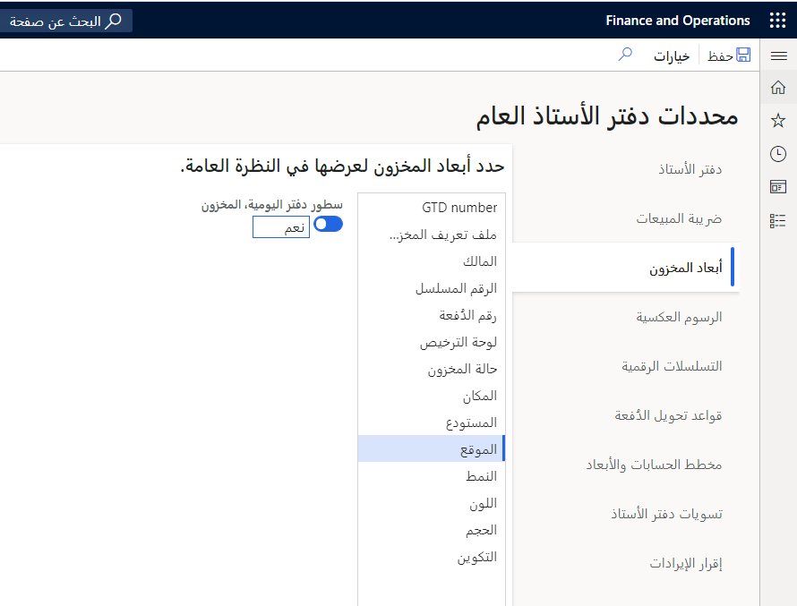

عند تخصيص إعداد أبعاد المخزون في إحدى الصفحات، ضع في حسبانك الإعدادات التي تم إنشاؤها باستخدام الخيار **أبعاد العرض**. 

على سبيل المثال، تستخدم التخصيص لإخفاء عمود "بُعد مخزون رقم الدُفعة"، ولكن يظهر العمود في المرة القادمة التي يتم فيها فتح الصفحة. ويحدث هذا السلوك لأن إعدادات **عرض البُعد** تتحكم في أعمدة أبعاد المخزون التي يتم عرضها.

ويتم تطبيق إعدادات **عرض البُعد** عبر كافة الصفحات ويتم تجاوز أي إعداد مخصص لحقول بُعد المخزون في الصفحات الفردية.

ونتيجة لذلك، ففي المثال السابق، إذا كنت لا ترغب في ظهور عمود "بُعد مخزون رقم الدُفعة"، فيجب عليك إلغاء تحديد ذلك البعد كجزء من الخيار **أبعاد العرض** للجدول الموجود في الصفحة **دفتر الأستاذ العام > إعداد دفتر الأستاذ > معلمات دفتر الأستاذ العام**. وأخيراً، لن يتم تطبيق هذا التغيير في صفحة واحدة محددة فحسب، بل في جميع الصفحات.

 