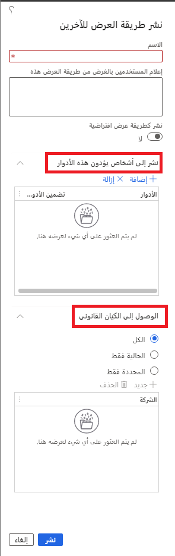

ويقوم التخصيص بتشغيل دور هام في السماح للمستخدمين والمؤسسات بتحسين تجربة المستخدم لتلبية احتياجاتهم.Personalization plays an important role in allowing users and organizations to optimize the user experience to meet their needs. باستخدام وظيفة **طرق العرض المحفوظة**، يمكن للمستخدمين حفظ مجموعات متعددة من التخصيص.By using the **Saved views** functionality, users can save multiple sets of personalization.

على سبيل المثال، يجب على مدير المستودع عرض صفحة قائمة **كل الشحنات** حسب **الموقع** و **المستودع**.For example, a Warehouse manager needs to view the **All shipments** list page by **Site** and **Warehouse**. وبدلاً من تصفية البيانات يومياً، يقوم مدير المستودع بحفظ كل قائمة تمت تصفيتها كطريقة عرض، لتسهيل الوصول إليها.Instead of filtering the data daily, the Warehouse manager saves each filtered list as a view, for easy access.

تمتد **طرق العرض المحفوظة** على التخصيص التقليدي بطرق متعددة، بما في ذلك ما يلي:**Saved views** expands on the traditional personalization in several ways, including the following:

- على عكس التخصيص التقليدي، فإن طرق العرض لا تحفظ تلقائيا عندما يقوم المستخدم بتخصيص قائمة أو لتصفيتها.Unlike traditional personalization, views aren't automatically saved when a user performs personalization or filters a list. 

- تسمح طرق العرض للمستخدمين بالحصول على مجموعات مسماة متعددة من التخصيص للتبديل السريع بينها حسب الحاجة.Views allow users to have multiple named sets of personalization to quickly switch between as needed. 

- يمكن أن تتضمن طرق العرض عوامل تصفية أو فرز تمت إضافتها من قبل المستخدم، تسمح للمستخدمين بالعودة إلى مجموعات البيانات المصفاة بشكل شائع.Views can include user-added filters or sorting, allowing users to return to commonly filtered datasets quickly. 

- يمكن نشر طرق العرض إلى المستخدمين في أدوار الأمان والكيانات القانونية.Views can be published to users in security roles and legal entities. لذلك، يمكن لأي مستخدم لديه دور محدد وصلاحية الوصول إلى كيان قانوني الوصول إلى طريقة العرض هذه واستخدامها، حتى وإن لم يكن لديه الإذن بتخصيصها.Therefore, any user who has a specific role and access to a legal entity can access and use that view, even if they don't have permission to personalize it.

- يمكن إضافة طرق العرض إلى مساحات العمل كإطارات متجانبة أو قوائم أو ارتباطات.Views can be added to workspaces as tiles, lists, or links. 

## إنشاء طرق عرض وتعديلهاCreating and modifying views

عند تمكين ميزة **طرق العرض المحفوظة** من خلال مساحة عمل **إدارة الميزات**، يمكن للمستخدمين البدء في إنشاء طرق عرض مخصصة لهم وحفظها، للوصول اليها لاحقاً.When the **Saved views** feature has been enabled through the **Feature management** workspace, users can begin creating their personalized views and saving them, to access later. 

لا يتم حفظ طرق العرض تلقائياً عندما يقوم المستخدم بتخصيص الصفحة، أو عندما يقوم مستخدم بتطبيق عامل تصفية على قائمة أو فرزه.Views aren't automatically saved when a user personalizes the page, or when a user applies a filter to a list or sorts it. مطلوب اجراء لحفظ هذه التغييرات في إحدى **طرق العرض**.An action is required to save these changes to a **View**. يمنح هذا المتطلب للمستخدمين المرونة في إنشاء طريقة عرض قبل القيام بالتغييرات المرتبطة بطريقة العرض أو بعدها.This requirement gives users the flexibility to create a view before or after the changes that are associated with that view have been made. 

لضمان أن الحالة الحالية لطريقة العرض معروفة، عند البدء في تغيير طريقة عرض عن طريق تخصيصها أو تصفيتها، تظهر علامة النجمة (\*) بجانب اسم **طريقه العرض** الحالية.To ensure that the current state of the view is known, when you start to change a view by personalizing or filtering it, an asterisk (\*) appears next to the current **View** name. يشير هذا الرمز إلى أنك تنظر إلى إصدار غير محفوظ تم تعديله من طريقة العرض هذه.This symbol indicates that you're looking at an unsaved, modified version of that view.

لإنشاء طريقة عرض جديدة:To create a new view:

1.  حدد **حفظ باسم**.Select **Save as**.
2.  أدخل اسم **طريقة العرض** و **وصف** (اختياريا).Enter a view **Name** and (optionally) a **Description**.
3.  حدد **حفظ**.Select **Save**.

    
  

## التبديل بين طرق العرضSwitching between views

يتضمن أعلى أية صفحة تدعم **طرق العرض** يوجد عنصر تحكم محدد طريقة العرض المطوي الذي يعرض اسم طريقة العرض الحالية.The top of any page that supports **Views** includes a collapsed view selector control that shows the current view's name. إذا قمت بتحديد اسم طريقة العرض، سيفتح محدد العرض ويعرض قائمة بطرق العرض المتوفرة للصفحة.If you select the view name, the view selector opens and displays the list of available views for the page.        
  
- **طريقة العرض القياسية** - طريقة العرض الجاهزة للصفحة، حيث لا يتم تطبيق إضفاء طابع شخصي.**Standard view** - The out-of-box view of the page, where no personalization is applied.
- **طرق العرض الشخصية** - طرق العرض التي لا تحتوي على أقفال تمثل طرق العرض الشخصية.**Personal views** – The views without padlocks represent your personal views. هذه هي طرق العرض التي قمت بإنشائها أو التي قدمها المسؤول.These are views that either you created or that an administrator has given to you.
- **طرق العرض المؤمنة** – تحتوي بعض طرق العرض (مثل طريقة العرض القياسية وأية طرق عرض تم نشرها على دورك) على رمز قفل مجاور لها في محدد طريقة العرض.**Locked views** – Some views (such as the Standard view and any views published to your role) have a padlock symbol next to them in the view selector. يشير هذا الرمز إلى أنه لا يمكنك تحرير طرق العرض هذه.This symbol indicates that you can't edit those views. ومع ذلك، يتم حفظ التغييرات التي تعكس استخدام الصفحة تلقائياً.However, changes that reflect page usage are automatically saved. إذا كانت لديك امتيازات تخصيص، فيمكنك استخدام الاجراء **حفظ باسم** لإنشاء طريقة عرض شخصية استناداً إلى طريقة عرض مؤمنة.If you have personalization privileges, you can use the **Save as** action to make a personal view based on a locked view.
- **طرق عرض جديدة** - تحتوي طرق العرض المنشورة التي تم إصدارها حديثاً على رمز الشرارة على يسار اسم طريقه العرض.**New views** – Newly released published views have a spark symbol to the left of the view name.

للتبديل إلى طريقة عرض مختلفة، قم بفتح "محدد طريقة العرض"، وحدد طريقة العرض التي ترغب في تحميلها.To switch to a different view, open the view selector, and select the view you want to load.

 
## تغيير طريقة عرض افتراضيةChange a default view

طريقة العرض الافتراضية هي طريقة العرض التي يحاول النظام فتحها عند فتح الصفحة لأول مرة.The default view is the view that the system tries to open when you first open the page. 

لتغيير طريقة العرض الافتراضية لإحدى الصفحات، اتبع الخطوات التالية:To change the default view for a page, follow these steps:

1.  قم بالتبديل إلى طريقة العرض التي تستخدمها كطريقة افتراضية.Switch to the view that you use as the default.
2.  حدد اسم طريقة العرض لفتح محدد طريقة العرض.Select the view name to open the view selector.
3.  حدد **المزيد** ثم حدد **التثبيت كافتراضي**.Select **More** and then **Pin as default**.

بدلاً من ذلك، عند إنشاء طريقة عرض جديدة (باستخدام الإجراء **حفظ باسم**)، يمكنك جعل طريقة العرض الجديدة طريقة العرض الافتراضية بتعيين الخيار **التثبيت كخيار افتراضي** قبل حفظ طريقة العرض.Alternatively, when you create a new view (by using the **Save as** action), you can make that new view the default view by setting the **Pin as default** option before you save the view.

    
## طرق العرض القياسية المحفوظة لـ Supply Chain ManagementSupply Chain Management standard saved views
يوفر Dynamics 365 Supply Chain Management طرق عرض إضافية محفوظة يمكن تشغيلها باستخدام إدارة الميزات.Dynamics 365 Supply Chain Management offers additional saved views that can be turned on with Feature management. تحتوي طرق العرض هذه على عوامل تصفية تعتمد على إحصائيات الاستخدام التي تشير إلى خيارات التصفية الأكثر شيوعا من قبل مستخدمي التطبيق.These views contain filters based on usage statistics that indicate the most popular filtering options by users of the application. تسمح طرق العرض المصفاة هذه للمستخدم بالتركيز على المعلومات المطلوبة لوظيفته وعدم تقديم التفاصيل المربكة غير الضرورية له.These filtered views allow the user to focus on the information needed for their job and not provide distracting details that are not necessary for them. 

يمكنك تخصيص طرق العرض هذه بشكل أكبر كما هو موضح أعلاه.You can further personalize these views as described above. ومع ذلك، نوصي بحفظ التخصيص باسم مختلف.However, we recommended that you save the personalization under a different name. عند تحديث Supply Chain Management، ستتم الكتابة فوق التخصيص الخاص بك لطرق العرض هذه إذا لم يتم حفظها تحت اسم مختلف.When Supply Chain Management is updated, your personalization of these views will be overwritten if they are not saved under a different name.

راجع [طرق العرض القياسية المحفوظة لـ Supply Chain Management](https://docs.microsoft.com/dynamics365/supply-chain/get-started/saved-views-scm/?azure-portal=true) لرؤية القائمة الكاملة لطرق العرض المحفوظة المتوفرة.See for [Standard saved views for Supply Chain Management](https://docs.microsoft.com/dynamics365/supply-chain/get-started/saved-views-scm/?azure-portal=true) to see the full list of saved views that are available.

