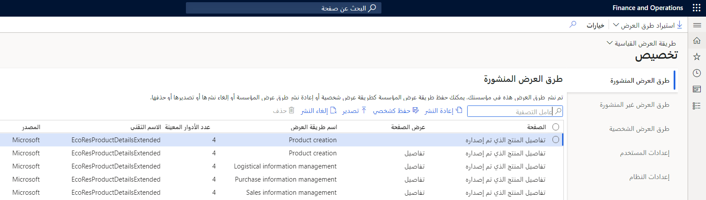

إن صفحة **إضفاء الطابع الشخصي** هي لوحة الوصل لإدارة إضفاء الطابع الشخصي على مستوى تنظيمي بواسطة مسؤولي النظام ومسؤولي طريقة العرض المحفوظة. وبعد أن يقوم المستخدم بإضفاء الطابع الشخصي على صفحة ما، يقوم بحفظ طريقة العرض ونشرها، يمكن للمسؤولين إدارة طرق عرض النظام من خلال الصفحة **إضفاء طابع شخصي**. 

على سبيل المثال، يفي مدير الحسابات الدائنة بالفريق الخاص به أسبوعياً ليتم تحديثه على أي موردين بالميزانية بعد 90 يوماً أو أكثر من تاريخ الاستحقاق. بحيث يقوم كافة حضور الاجتماع بمشاهدة صفحة قائمة **الموردون الذين تجاوزوا تاريخ الاستحقاق** والتي تمت تصفيتها بنفس الطريقة، يقوم المدير بإضفاء الطابع الشخصي على صفحة القوائم الخاصة بهم، ومن ثم يضمن أن يقوم مسؤول النظام بنشر طريقة العرض هذه للمستخدمين في موظف المدفوعات للحسابات الدائنة في دور الأمان. 

تحتوي صفحة **إضفاء الطابع الشخصي** على خمس علامات تبويب سريعة لإدارة طرق العرض، ويمكن العثور عليها في **إدارة النظام > إعداد > إضفاء طابع شخصي**.

- **طرق العرض المنشورة** – سرد كافة طرق العرض التي تم نشرها للمؤسسة الخاصة بك. من هنا، يمكنك إعادة نشر إحدى طرق العرض بعد قيامك بتعديل أدوار الأمان أو الكيانات القانونية التي تستهدفها طريقة العرض. يمكنك أيضاً تصدير طرق العرض أو حذفها أو إلغاء نشرها. 

    

- **طرق عرض غير المنشورة** – سرد كافة طرق عرض المؤسسة في النظام والتي لم يتم نشرها حالياً. غالباً ما تكون طرق العرض هذه موجودة في النظام من خلال إمكانية الاستيراد. يمكنك أيضاً نشر طرق العرض أو تصديرها أو حذفها. 

- **طرق العرض الشخصية** – تسرد كافة طرق العرض التي تم إنشاؤها بواسطة المستخدمين في النظام. من هنا، يمكنك نشر طريقة عرض شخصية للمؤسسة، أو نسخ طريقة عرض واحدة أو أكثر من طرق العرض هذه إلى مستخدمين آخرين. يمكنك أيضاً تصدير طرق العرض أو حذفها حسب الحاجة.

- **إعدادات المستخدم** - حدد مستخدماً لعرض أو ضبط قدرة المستخدم على استخدام إضفاء الطابع الشخصي إما للنظام بالكامل أو لصفحات محددة قام المستخدم بزيارتها. يمكنك عرض إضفاء الطابع الشخصي للمستخدم والتعامل معه في النظام. يمكنك أيضاً حذف كافة التخصيص لذلك المستخدم أو إعادة تعيين وسائل الشرح الخاصة بالميزات للمستخدم. 

- **إعدادات النظام** – يمكنك إيقاف تشغيل إضفاء الطابع الشخصي مؤقتاً لكافة المستخدمين في النظام. في هذه الحالة، لا يتم تطبيق إضفاء طابع شخصي على أي مستخدم، وتتم إعادة تعيين كافة الصفحات إلى حالتها الافتراضية. عند تشغيل إضفاء الطابع الشخصي مره أخرى، تتم إعادة تطبيق كافة التخصيصات. يمكنك أيضاً حذف كافة التخصيصات بشكل دائم لكافة المستخدمين في النظام. ولا يمكن استرداد عمليات التخصيص التي تم حذفها. لذلك، قبل تنفيذ هذه المهمة، تأكد من تصدير أي إضفاء طابع شخصي قد ترغب فيه لاحقاً.
 
 
يتيح الزر **استيراد طرق العرض** الموجودة في جزء الإجراءات لمسؤول النظام استيراد كل من طريقتي العرض **الشخصية** و **المؤسسية** التي تم تصديرها سابقاً.

 
    

