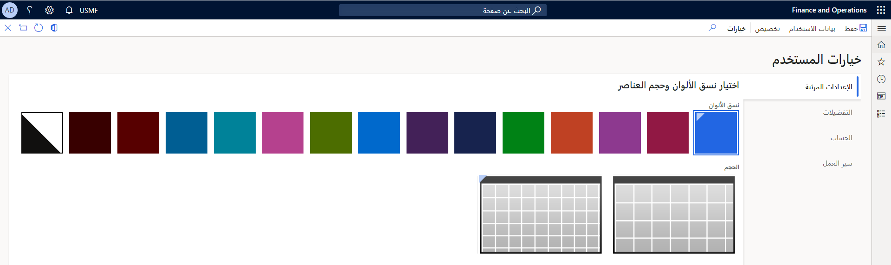
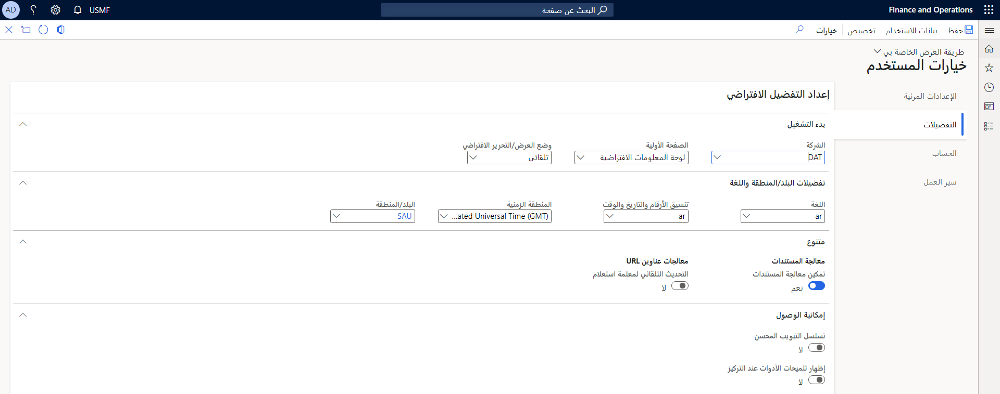
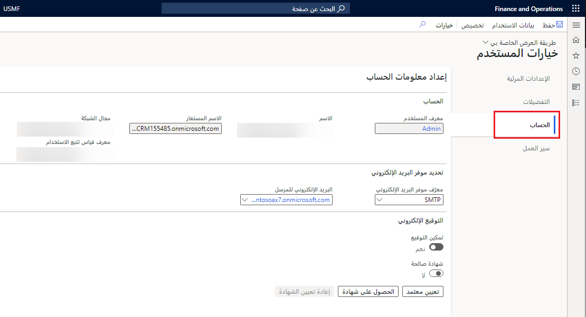
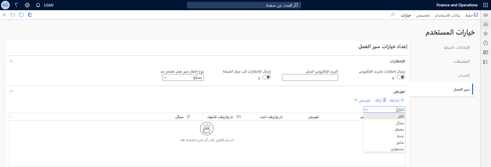
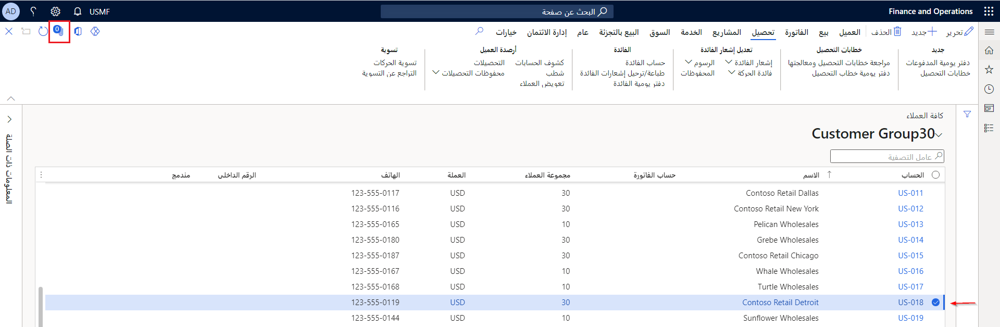

تقدم تطبيقات Finance and Operations بعض سمات الألوان وأحجام العناصر المختلفة لإنشاء واجهة مبهجة من الناحية الجمالية. يمكنك استخدام صفحة **خيارات المستخدم** للتحكم في الميزات الأساسية وسلوك بيئتك الخاصة بك كمستخدم. يمكن لمسؤول النظام التحكم في خيارات المستخدم هذه من صفحة **المستخدمين** في وحدة **إدارة النظام**.

شاهد هذا الفيديو لمعرفة كيفية التعامل مع خيارات المستخدم في تطبيقات Finance and Operations.

 > [!VIDEO https://www.microsoft.com/videoplayer/embed/RE4ag6n] 

## خيارات المرئيات

في شريط التنقل، ستجد رمز عجلة الترس الذي يصل إلى قائمة **الإعدادات**. سيؤدي فتح قائمة **الإعدادات** إلى عرض خيارات عديدة. سيؤدي تحديد **خيارات المستخدم** إلى فتح صفحة **خيارت المستخدم**. ستجد هناك أربع علامات تبويب للخيارات، إحداها تسمى **مرئي**. يمكنك تخصيص العديد من الخيارات مثل سمة اللون والمنطقة الزمنية لكل مستخدم.

باستخدام علامة التبويب **مرئي**، يمكنك تحديد سمة لونية لتطبيقها على النظام وتحديد ما إذا كنت تريد أحجام عناصر أكبر أو أصغر على صفحاتك. 
 

## التفضيلات 

في علامة التبويب **التفضيلات** في صفحة **خيارات الستخدم**، لديك مجموعة متنوعة من الخيارات التي يمكنك تحديدها. يمكنك تحديد القيم الافتراضية التي يتم استخدامها في كل مرة تفتح فيها تطبيقات Finance and Operations. 

تتضمن هذه القيم الشركة والصفحة الأولية ووضع العرض/التحرير الافتراضي.  يحدد وضع العرض/التحرير ما إذا كانت الصفحة مؤمنة للعرض أو يتم فتحها للتحرير في كل مرة تفتحها.

تتضمن علامة التبويب **التفضيلات** أيضاً خيارات للغة والمنطقة الزمنية والتاريخ والوقت وتنسيق الأرقام. تتضمن علامة التبويب هذه أيضاً العديد من التفضيلات المتنوعة التي تختلف من إصدار إلى آخر.
 

- **الشركة** - يتيح لك هذا تحديد الشركة التي تقوم بتسجيل الدخول إليها عند الوصول إلى تطبيقات Finance and Operations. يمكنك دائماً تغيير الشركة التي تتصل بها باستخدام شريط التنقل. 
- **الصفحة الأولية** - هناك مجموعة متنوعة من الخيارات التي يمكنك تحديدها هنا لتحديد الصفحة التي سيتم فتحها عند تشغيل تطبيقات Finance and Operations لأول مرة.
    - **لوحة المعلومات الافتراضية** - تشير إلى الصفحة الرئيسية التي رأيتها في معظم العروض التوضيحية لتطبيقات Finance and Operations.
    - **إدارة النظام** - سيؤدي هذا الخيار افتراضياً إلى دخول المستخدم إلى مساحة عمل إدارة النظام. هذا الخيار مفيد لمسؤولي النظام.
    - **لوحة معلومات الأساسيات** - يُعيِّن هذا الخيار المستخدم افتراضياً على مساحة عمل أساسيات البيع بالتجزئة، والتي لها تخطيط مختلف يستهدف ويُصمم لعمال البيع بالتجزئة في المكاتب الخلفية.
    - **لوحة معلومات الخدمة الذاتية للموظف** - تم تصميم هذا الخيار للعامل أو المدير النموذجي الذي يستخدم فقط مناطق قليلة من النظام بشكل منتظم.
    - **تسجيل الموردين المحتملين** - تم تصميم هذه الصفحة للموردين المحتملين لإكمال طلباتهم وعملية الإعداد. لا يتم تحديد هذا الخيار عادةً لمستخدم عادي.
- **طريقة العرض الافتراضية**/**وضع التحرير** - يتيح لك هذا الخيار التحديد من بين **تلقائي**، و **عرض**، و **تحرير**. الخيار الافتراضي هو **تلقائي**. وعند تغيير هذا الخيار إلى **عرض**، سيتم فتح جميع النماذج افتراضياً في وضع **عرض** فقط. هذا مفيد للمستخدمين الذين لا يقومون عادة بإجراء تغييرات على النظام، مثل مسؤولي النظام. يجب على المستخدمين بعد ذلك النقر فوق الزر **تحرير** لإجراء أي تغييرات. يتم استخدام الخيار **تحرير** لفرض فتح جميع الصفحات في وضع التحرير بحيث يمكن للمستخدمين إجراء تعديلات دون الحاجة إلى النقر فوق الزر تحرير في جزء الإجراءات. هذا مفيد للمستخدمين الذين يقومون دائماً بتعديل البيانات في كل صفحة يفتحونها. يمكنك التحكم في هذا الإعداد بناءً على الصفحات، والتي تتجاوز الخيار الذي تحدده هنا.
- **اللغة والبلد**/**تفضيلات المنطقة** - في علامة التبويب السريعة هذه، يمكنك التحكم في إعدادات اللغة والتاريخ والوقت وتنسيق الأرقام والمنطقة الزمنية والبلد/المنطقة التي سيعمل المستخدمون معها. سيؤدي تغيير هذه التحديدات إلى تغيير كيفية ظهور واجهة المستخدم للمستخدم المحدد فقط، وليس كيفية تخزين البيانات في قاعدة البيانات.
- **تم تمكين معالجة المستندات** - يحدد هذا الخيار ما إذا كان رمز مشبك الورق مع معالجة المستندات قد تم تنشيطه للمستخدم المحدد. عند تمكين الخيار، يمكنك رؤية رقم على رمز مشبك الورق يشير إلى عدد المرفقات للمستند المحدد. يمكن أن يكون لهذا تأثير على الأداء إذا تم استخدام المرفقات بكثافة.
- **تحديث معلمة الاستعلام تلقائياً** - عند تشغيل هذا الخيار، سيقوم النظام تلقائياً بحفظ أي عوامل تصفية قمت بإنشائها في نموذج عند إضافة عنوان URL إلى المفضلة أو مشاركة URL من علامة التبويب "خيارات" في الجزء.
- **تسلسل علامات التبويب المحسّن** - في الاستخدام اليومي للنظام، ليس كل حقل مطلوباً لأداء المهام المعتادة. لذلك، بشكل افتراضي، يتم تحسين تسلسل علامات التبويب. يتم تعيين علامات الجدولة فقط إلى تلك الحقول الضرورية للسيناريوهات النموذجية. ومع ذلك، قد تجد أن بعض الحقول التي تستخدمها غالباً لأداء المهام غير مضمنة في تسلسل علامة التبويب الافتراضي. في هذه الحالة، إذا كنت تستخدم Windows Narrator، فيمكنك استخدام إجراءات لوحة مفاتيح Windows Narrator للوصول إلى هذه الحقول وفحص محتواها. بدلاً من ذلك، يمكنك تمكين الخيار **تسلسل علامة التبويب المحسّن** في صفحة **خيارات المستخدم**، مما يجعل جمي الحقول القابلة للتعديل والقراءة فقط جزءاً من تسلسل علامات التبويب. يمكنك بعد ذلك استخدام تخصيص الصفحة لإنشاء تسلسل علامات تبويب مخصص وحذف الحقول من تسلسل علامات التبويب.

## إعداد معلومات الحساب 

تحتوي علامة التبويب **الحساب** في صفحة **خيارات المستخدم** على مجموعة متنوعة من الخيارات التي تتحكم في وظائف الحساب، مثل الحساب في Active Directory يرتبط به، وكيف يتم التحكم في البريد الإلكتروني والتوقيعات الإلكترونية لحسابات المستخدمين. يتحكم المسؤول في هذه الإعدادات عادةً. يمكنك أيضاً ضبط اسم المستخدم والخيارات الأخرى المتعلقة بالحساب في هذه الصفحة.
 

## سير العمل 

تتيح لك علامة التبويب **سير العمل** في صفحة **خيارات المستخدم** التحكم في كيفية تسليم الإخطارات الخاصة بسير العمل. يمكنك أيضاً استخدام علامة التبويب السريعة **تفويض** للتحكم بالضبط في مهام سير العمل والفترات الزمنية التي تريد استخدامها لتفويض مهام سير العمل والموافقات.
 

## معالجة المستندات
قد تحتاج إلى إضافة مرفقات إلى سجل في النظام، وقد يتضمن ذلك فاتورة من المورد، أو إيصالات العميل، أو تفاصيل المنتج لطلب الشراء، أو إيصالات المصروفات، تماماً مثل بعض الأمثلة. يمكنك بسهولة إضافة مرفقات إلى السجلات التي تسمح بمعالجة المستندات في تطبيقات Finance and Operations. يمكنك أيضاً عرض المرفقات من كافة الجداول الموجودة على الصفحات المرتبطة بالسجل النشط. 

لإضافة مرفق إلى سجل، اتبع هذه الخطوات؛

1.  حدد السجل الذي ترغب في إرفاق مستند به (مثل عميل أو فاتورة أو مورد).
1.  حدد رمز مشبك الورق في الزاوية اليمنى العليا من الصفحة. 
 
    

1.  في صفحة **المرفق**، حدد **جديد** في جزء الإجراءات، ثم حدد نوع المستند الذي تريد إرفاقه. 
1.  تصفح إلى الملف الذي ترغب في إرفاقه. سيتم تحميل الملف وإرفاقه بالسجل. 
1.  يمكنك إضافة ملاحظات وتفاصيل إضافية إلى المرفق في الصفحة.  