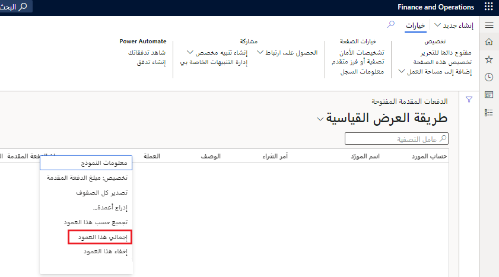
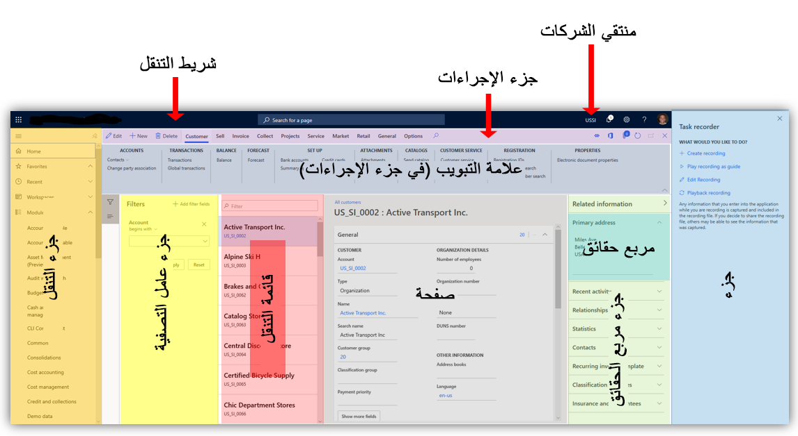
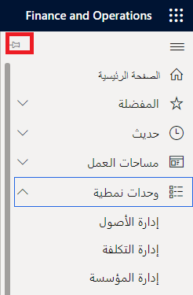

تتبع تطبيقات Finance and Operations عرض أعمدة الشبكة إذا قمت بضبطها، والحالة الموسعة أو المطوية لعلامات التبويب السريعة. هذا النوع من التخصيص يُسمى التخصيص الضمني.
على سبيل المثال، إذا قمت بضبط عرض العمود داخل شبكة، أو توسيع أو طي علامات التبويب السريعة ومربعات الحقائق، فسيتم اعتبار ذلك تخصيصاً ضمنياً.

وعند فتح نفس الشبكة مرة أخرى، تسترد تطبيقات Finance and Operations التخصيص الذي تم على الأعمدة وعلامات التبويب السريعة ومربعات الحقائق استناداً إلى آخر تفاعل مع الشبكة.

ضع في اعتبارك عناصر التحكم التالية عند إنشاء تخصيص ضمني:

- **أعمدة الشبكة** - يمكنك ضبط عرض عمود في شبكة عن طريق تحديد شريط تغيير الحجم إلى يسار أو يمين رأس العمود ثم تمريره إلى اليسار أو إلى اليمين حتى يصل العمود إلى العرض المطلوب. تخزن تطبيقات Finance and Operations العرض الذي قمت بتعيينه لعمود. بعد ذلك، تقوم بتغيير حجم العمود إلى هذا العرض في كل مرة تفتح فيها الصفحة التي تتضمن تلك الشبكة. 
- **تجميد الأعمدة** – عند العمل باستخدام أعمدة الشبكة، قد تصادف عموداً يحتوي على معلومات مهمة بالنسبة لك، وتريد الاستمرار في رؤيتها أثناء تنقلك عبر الشبكة. يمكنك تجميد عمود في مكانه لتتمكن من رؤية تلك المعلومات في جميع الأوقات، أثناء تحركك عبر شبكة المعلومات.
    - لتجميد عمود، انقر بزر الماوس الأيمن فوق رأس العمود وحدد **تجميد العمود** من القائمة. عند إكمال هذه الخطوة لأول مرة، يصبح العمود المحدد العمود الأول ولا يتم تمريره خارج العرض.
    - لإلغاء تجميد عمود، انقر بزر الماوس الأيمن فوق رأس العمود المجمد، ثم حدد **إلغاء تجميد العمود**.
    

- **QuickFilters** - يظهر *QuickFilters* أعلى العديد من الشبكات. يسمح لك QuickFilter بتصفية الشبكة، استناداً إلى عمود تحدده. تخزن تطبيقات Finance and Operations العمود الذي قمت بتصفيته.  
- **عوامل التصفية في رأس العمود** - عندما تقوم بتصفية شبكة باستخدام عوامل التصفية في رأس العمود، يمكنك تغيير عامل التصفية كما تريد للبحث عن البيانات التي تريدها. على سبيل المثال، يمكنك تغيير عامل التشغيل من **يبدأ بـ** إلى **تحديداً**. في كل مرة تقوم فيها باستخدام عامل تصفية رأس العمود وتغيير عامل التصفية، فستقوم تطبيقات Finance and Operations بتخزين التغيير. 
- **عمود التمييز المثبت** - يتم تثبيت عمود التمييز في الشبكة على اليسار، ويكون دائماً مرئياً ومتاحاً بغض النظر عن عرض العمود.
- **الصيغ الرياضية** - يمكنك إدخال صيغ رياضية في خلايا رقمية في شبكة. على سبيل المثال، يمكنك إدخال **=15*4** ثم الضغط على المفتاح **Tab** للانتقال خارج الحقل. يقوم النظام بتقييم التعبير وحفظ قيمة **60** للحقل.

    > [!NOTE]
    > ليتعرف النظام على قيمة كتعبير، ابدأ القيمة بعلامة يساوي (=). للحصول على مزيد من المعلومات حول بناء الجملة وعوامل التشغيل المدعومة، راجع [رموز الرياضيات المدعومة](http://bugwheels94.github.io/math-expression-evaluator/#supported-maths-symbols/?azure-portal=true).
- **حساب الإجماليات** - يمكنك رؤية إجماليات الأعمدة الرقمية في شبكات جدولية. على سبيل المثال، يمكن للمستخدمين العاملين في المجال المالي عرض الإجماليات لمجموعة مصفاة من الحركات لعميل معين. يتم عرض الإجماليات في قسم التذييل أسفل الشبكة. انقر بزر الماوس الأيمن فوق العمود وحدد **إجمالي هذا العمود**، كما هو موضح في لقطة الشاشة أدناه.

    

    > [!NOTE]
    > تكون مجموعة البيانات بالكامل مطلوبة لهذه الوظيفة، لذلك قد يستغرق الأمر وقتاً لحساب الإجماليات لمجموعات البيانات الكبيرة.

- **الإدخال السريع للبيانات** - استخدم هذه الميزة لإدخال البيانات في شبكة قبل الخادم. تُقلل هذه الميزة من حاجة المستخدمين إلى الانتظار حتى يقوم الخادم بالتحقق من صحة صف واحد في الشبكة قبل الانتقال إلى صف آخر. يمكن للمستخدمين أيضاً لصق الجداول المنسوخة من Microsoft Excel مباشرةً في الشبكات في النظام.
- **أعمدة العرض SizeToAvailable** - يمكن للمطورين تعيين WidthMode=SizeToAvailable في الأعمدة الموجودة داخل الشبكات. تبدأ هذه الأعمدة بنفس عرض إعدادات وضع العرض **SizeToContent**، ولكنها تمتد لاستخدام أي عرض إضافي متاح داخل الشبكة. إذا تم تعيين عدة أعمدة على **SizeToAvailable**، فيمكن مشاركة أي مساحة إضافية متاحة في الشبكة.
- **‏‏إعادة ترتيب الأعمدة** - يمكنك إعادة ترتيب الأعمدة عن طريق سحبها. مرر مؤشر الماوس فوق رأس العمود ثم اسحب عنصر تحكم المقبض الذي يظهر على الجانب الأيسر من العمود.

للمزيد من المعلومات، راجع [قدرات الشبكة](https://docs.microsoft.com/dynamics365/fin-ops-core/fin-ops/get-started/grid-capabilities/?azure-portal=true).

## عناصر واجهة المستخدم (UI)

فيما يلي بعض العناصر التي تشكّل الواجهة:

- **علامة التبويب السريعة** - تحتوي بعض الصفحات على أقسام قابلة للتوسيع تسمى *علامات التبويب السريعة*. تخزن تطبيقات Finance and Operations معلومات حول علامات التبويب السريعة التي قمت بتوسيعها وطيها. في المرة التالية التي تفتح فيها الصفحة، سيتم توسيع علامات التبويب السريعة نفسها أو طيها، استناداً إلى آخر تفاعل لك مع الصفحة. وفي بعض الحالات، يمكنك المساعدة في تحسين أداء النظام عن طريق طي علامة التبويب السريعة، لأن تطبيقات Finance and Operations لن تحتاج إلى استرداد المعلومات لعلامة التبويب السريعة هذه حتى يتم توسيع علامة التبويب السريعة.
- **مربع الحقائق** - تشتمل بعض الصفحات على جزء يُعرف باسم *جزء مربع الحقائق* يحتوي هذا الجزء على معلومات للقراءة فقط متعلقة بالموضوع الحالي للصفحة. يُعرف كل قسم في جزء مربع الحقائق باسم *مربع حقائق*. يمكنك إخفاء أو عرض جزء مربع الحقائق الكامل، ويمكنك أيضاً توسيع أو طي مربعات حقائق فردية. وتقوم تطبيقات Finance and Operations بتخزين تفضيلاتك. في المرة التالية التي تفتح فيها الصفحة، ستتم استعادة حالة جزء مربع الحقائق ومربعات الحقائق الفردية، استناداً إلى آخر تفاعل لك مع الصفحة. وفي بعض الحالات، يمكنك المساعدة في تحسين أداء النظام عن طريق طي مربع حقائق، لأن تطبيقات Finance and Operations لن تحتاج إلى استرداد المعلومات لمربع الحقائق هذا هذه حتى يتم توسيع مربع الحقائق.
- **جزء الإجراءات** - يظهر *جزء الإجراءات* بالقرب من الجزء العلوي لمعظم الصفحات. يحتوي جزء الإجراءات على أزرار للعديد من الإجراءات التي يمكنك تنفيذها على الصفحة الحالية. غالباً ما يتم تنظيم هذه الأزرار في علامات تبويب. يمكنك تثبيت جزء الإجراءات المفتوح بأكمله، أو يمكنك طيه افتراضياً. في المرة التالية التي تفتح فيها الصفحة، ستستعيد تطبيقات Finance and Operations الحالة المثبتة لجزء الإجراءات. إذا تم تثبيت جزء الإجراءات على حالة مفتوح، فسوف تعرض تطبيقات Finance and Operations أيضاً علامة تبويب الإجراءات التي استخدمتها مؤخراً.
- **جزء التنقل** - يمكنك فتح *جزء التنقل* عن طريق تحديد زر **عرض جزء التنقل** في الجزء الأيمن من أي صفحة. يمكنك تثبيت جزء التنقل على حالة مفتوح، أو يمكنك إبقائه في حالة الطي بشكل افتراضي. بعد أن قمت بتثبيت جزء التنقل على حالة مفتوح، فسوف تبقيه تطبيقات Finance and Operations مفتوحاً حتى تقوم بطيه.

    