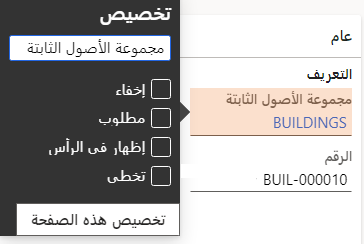

يمكنك تعديل مظهر الصفحة عن طريق تغيير طريقة ظهور عنصر ما أو سلوكه في هذه الصفحة، وذلك غالباً من خلال وضع تخصيص تفاعلي. ويُسمي هذا التخصيص *التخصيص الواضح*. التخصيص الواضح هو التخصيص الذي تقوم به بشكل صريح، بواسطة تغيير مظهر عنصر أو صفحة أو سلوكهما.
 
يمكنك تخصيص عنصر تخصيصاً واضحاً بالطرق التالية:

- تغيير تسمية حقل.
- إخفاء حقل.
- تضمين معلومات الحقل في ملخص علامة التبويب السريعة. 
- تخطي حقل عند الضغط على Tab.
- وضع علامة غير قابل للتحرير على عامل تصفية.

وحسب عنصر التحكم الذي تريد تخصيصه تخصيصاً واضحاً، يمكن أن تختلف الخيارات.

على سبيل المثال، يمكنك إضافة العناصر إلى الصفحة أو إخفاؤها منها أو إعادة ترتيبها.
 

في تطبيقات التمويل والعمليات، يمكنك تفصيل طريقة طلب معلوماتك والتفاعل معها. ويمكنك أيضاً تحديد أن تكون بعض المعلومات مخفية. وتعد هذه الإمكانيات مفتاحاً لتجربة شخصية وإنتاجية، كما أنها أمثلة تبين التخصيص الواضح. 

## خيارات القائمة المختصرة 

توفر القوائم المختصرة، المعروفة أيضاً بقائمة النقر بزر الماوس الأيمن أو القائمة السياقية، بعض الطرق لتغيير صفحة ما بشكل صريح لتتناسب مع متطلباتك أو متطلبات الشركة على نحو أفضل. تتوفر بعض التغييرات النموذجية والمهمة التي يمكن إجراؤها على صفحة مباشرة كخيارات تحويها قائمة مختصرة. على سبيل المثال، إذا أردت إضافة أعمدة أو إخفاءها في شبكة، انقر بزر الماوس الأيمن فوق رأس عمود شبكة، ثم حدد **إضافة أعمدة** أو **إخفاء هذا العمود**.

## نافذة خصائص عنصر التحكم 

تتوفر أيضاً أنواع التخصيص الواضح الأكثر أساسية بواسطة النقر بزر الماوس الأيمن فوق أحد العناصر ثم تحديد **تخصيص**.

يمكنك استخدام نافذة الخاصية لتخصيص عنصر بالطرق التالية:

- تغيير تسمية العنصر.
- إخفاء العنصر حتى لا يظهر في الصفحة. لا يتم حذف البيانات الموجودة في الحقل أو تعديلها. ولا تظهر المعلومات في الصفحة بعد ذلك مباشرة.
- تضمين المعلومات الموجودة في قسم مخلص علامة تبويب سريعة (إذا كان العنصر موجوداً على علامة تبويب سريعة).
- تخطي الحقل عند الضغط على Tab للانتقال بين الحقول الموجودة في الصفحة.
- منع تحرير البيانات الموجودة في الحقل (لأي سجل).

قد تتضمن نافذة الخصائص قدرات تخصيص أخرى، استناداً إلى العنصر. على سبيل المثال، قد تتيح لك نافذة الخصائص الخاصة بإحدى اللوحات ترقية هذه اللوحة إلى لوحة معلومات، كما قد تتيح لك نافذة الخصائص الخاصة بلوحة معلومات إنشاء مساحة عمل جديدة على لوحة المعلومات هذه.