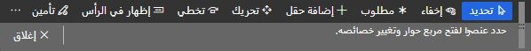

عندما تريد نقل عناصر أو إخفائها أو اجراء عدة تغييرات، يمكنك استخدام شريط أدوات التخصيص. عند النقر فوق زر تخصيص هذا النموذج، سيتوفر لديك العديد من الخيارات. يمكن إجراء أي تخصيص من خلال شريط أدوات **إضفاء الطابع الشخصي**. 

إذا كنت تريد إجراء تغييرات متعددة على صفحة ما أو إجراء تغييرات غير متاحة من خلال آليات أخرى (مثل إعادة ترتيب العناصر)، فيمكنك استخدام شريط أدوات **إضفاء الطابع الشخصي**. لفتح شريط أدوات **إضفاء الطابع الشخصي**، حدد **إضفاء الطابع الشخصي على هذا النموذج** في نافذة خاصية العنصر. يمكنك أيضاً تحديد **إضفاء الطابع الشخصي على هذا النموذج** في مجموعة التخصيص في علامة تبويب **الخيارات** في جزء الإجراءات لكل صفحة.

يمكن استخدام شريط أدوات **إضفاء الطابع الشخصي** في أي صفحة في تطبيقات التمويل والعمليات. فهو يسمح للمستخدمين أو المسؤولين تخصيص شكل الصفحة وأسلوب عرضها. 

تتوفر الأدوات التالية في شريط أدوات **إضفاء الطابع الشخصي**:

- أداة **تحديد** - تتيح لك تحديد خصائص العنصر وتغييرها. حدد أداة **تحديد**، ثم حدد العنصر لتعديل خصائص ذلك العنصر. سيظهر مربع منبثق يتضمن الخيارات التي يمكن العثور عليها أيضاً في شريط الأدوات، مثل **إخفاء** و **مطلوب** و **إظهار في العنوان** و **تخطي**. يمكنك تكرار العملية للعناصر الأخرى التي يمكن تخصيصها في تلك الصفحة. ومع ذلك، نظراً للطريقة التي يتم بها استخدام بعض العناصر، فلن تسمح لك تطبيقات التمويل والعمليات بتغيير بعض خصائصها. لذلك، عند تحديد عنصر، قد ترى أن بعض خصائصه لا يمكن تعديلها أو أنها غير متاحة. على سبيل المثال، لا يمكنك إخفاء حقل مطلوب.
- أداة **إخفاء** - تخفي عنصراً موجوداً في الصفحة. حدد أداة **إخفاء**، ثم حدد العنصر الذي تريد إخفاءه. عندما تقوم بتحديد أداة **إخفاء**، تصبح جميع العناصر المخفية مرئية وتظهر في حاوية مظللة. ومن ثم يمكنك إظهارها. من خلال تحديد أداة **تحديد**، يمكنك رؤية كيف ستبدو الصفحة عندما تكون العناصر المحددة مخفية. على سبيل المثال، قد يسمح لك هذا بإنشاء تجربة مبسطة للعرض عن طريق إخفاء الحقول المطلوبة الافتراضية داخل النظام، كما يتم إظهار الحقول المطلوبة المخفية مؤقتاً إذا كانت فارغة عند محاولة الحفظ.
- أداة **يتطلب** – تجعل إدخال البيانات في عنصر الصفحة أحد المتطلبات. عند تحديد **يتطلب**، ستظهر كافة العناصر المخصصة التي تم تعيينها على أنها مطلوبة في حاوية مظللة. 
- زر **إضافة حقل** – يسمح لك بمشاهدة قائمة بالعناصر التي يمكن إدراجها في الصفحة.  حدد أداة **حقل** ضمن **إدراج** لإضافة حقل إلى صفحتك. عند استخدام أداة **حقل**، يمكنك فقط إضافة الحقول التي تعد جزءاً من تعريف الصفحة ولكنها غير معروضة حالياً على الصفحة. بعد تحديد أداة **إضافة حقل**، يجب عليك أولاً تحديد المجموعة أو المنطقة التي تريد إضافة حقل إليها. يعرض مربع الحوار قائمة الحقول المتعلقة بالمجموعة أو المنطقة المحددة. في مربع الحوار، حدد حقلاً أو أكثر لإضافته، ثم حدد إدراج. لإزالة حقل أضفته مسبقاً، كرر العملية، ولكن امسح تحديد الحقل في مربع الحوار.
- أداة **نقل** - تقوم بنقل عنصر إلى موقع مختلف ضمن مجموعة العناصر الحالية. (لا يمكنك نقل عنصر خارج مجموعته الرئيسية). حدد أداة **نقل**، ثم حدد العنصر الذي سيتم نقله. عند تحديد عنصر، تفحص تطبيقات التمويل والعمليات الصفحة لتحديد المكان الذي يمكن نقل العنصر إليه. ثم تقوم بإنشاء سلسلة من "مناطق الإفلات". عند قيامك بسحب العنصر داخل المجموعة الحالية، تظهر كل "منطقة إفلات" على هيئة خط غامق ملون بجوار المنطقة التي يمكن فيها إسقاط العنصر.
- أداة **تخطي** - تزيل هذه الأداة عنصراً من تسلسل علامة تبويب لوحة المفاتيح للصفحة. عندما تقوم بتحديد أداة **تخطي**، تظهر جميع العناصر التي تم تخطيها حالياً في حاوية مظللة. يمكنك بعد ذلك جعلها جزءاً من تسلسل علامات التبويب مرة أخرى.
- أداة **إظهار في العنوان** – عندما تريد أن يظهر حقل معين في قسم **الملخص** الخاص بعلامة التبويب السريعة. عند تحديد عنصر باستخدام **أداة إظهار في العنوان**، فإنه يمكن تحديده وسيؤدي ذلك إلى ظهوره في قسم **الملخص** الخاص بعلامة التبويب السريعة. 
- أداة **قفل** – تعيين عنصر كقابل للتحرير أو غير قابل للتحرير.  عند تحديد **قفل**، ستحتوي العناصر غير القابلة للتحرير على حاوية مظللة حولها. بعد ذلك، سيتوفر لديك الخيار لجعلها قابلة للتحرير. سيظهر رمز القفل بجوار الحقول المعينة على أنها غير قابلة للتحرير. 

يوجد أيضاً في شريط أدوات **إضفاء الطابع الشخصي** العلامة “. . .” زر (المزيد). فيما يلي الإجراءات التي يمكنك استخدامها عند تحديد ". . .” زر (المزيد): 

- **إضافة PowerApp‎** – يقوم بتضمين تطبيق تم إنشاءه باستخدام Microsoft Power Apps في الصفحة. 
- **مسح** - يقوم هذا الخيار بإعادة تعيين الصفحة إلى الحالة الافتراضية المثبتة. يتم مسح كافة التخصيصات على الصفحة الحالية. لا يوجد إجراء تراجع. لذلك، استخدم هذا الخيار فقط إذا كنت متاكداً من رغبتك في إعادة تعيين الصفحة.
- **استيراد** – استخدم هذا لتحميل تخصيص من ملف أنشأته أنت أو أي شخص آخر مسبقاً للصفحة. يتم استبدال كافة التخصيصات الحالية للصفحة بالتخصيص الوارد في الملف المحدد.
- **تصدير** – استخدم هذا الخيار لحفظ التخصيص الخاص بك للصفحة في ملف. يمكنك مشاركة التخصيص الخاص بك مع مستخدمين آخرين. يقوم هؤلاء المستخدمون فقط باستيراد الملف الذي يحتوي على التخصيص الخاص بك للصفحة.
- **إغلاق** -يغلق هذا الخيار شريط أدوات **التخصيص** ويعيد الصفحة إلى حالتها التفاعلية السابقة.
عند استخدام شريط أدوات التخصيص، يتم حفظ التغييرات على الفور. يسري التخصيص الخاص بك بمجرد إجرائه، ولا يتعين عليك تحديد الزر حفظ. في بعض الحالات، عند تحديد أداة، يظهر رمز قفل بجوار العنصر. يشير هذا الرمز إلى أنه لا يمكنك تعديل خصائص العنصر المرتبطة بالأداة المحددة، لأن التغييرات في تلك الخصائص ستمنع الصفحة من العمل بشكل صحيح.

## التنقل في صفحة شريط أدوات التخصيص 

عندما يكون شريط أدوات **تخصيص** مفتوحاً، تكون الصفحة الحالية للقراءة فقط ولكنها تفاعلية أكثر. على وجه التحديد، يمكنك توسيع جزء "مربع الحقائق" أو طيه، وتبديل علامات التبويب، وتوسيع الأقسام أو طيها أثناء فتح شريط أدوات **تخصيص** بنفس الطريقة المعتادة على الصفحة. لتطبيق تغيير التخصيص على قسم أو علامة تبويب قابلة للطي (مثل إخفاء علامة تبويب سريعة)، ستقوم بالنقر فوق الزر الذي يظهر بجوار القسم أو علامة التبويب القابلة للطي عند التركيز على لوحة المفاتيح أو عند المرور فوقها.

