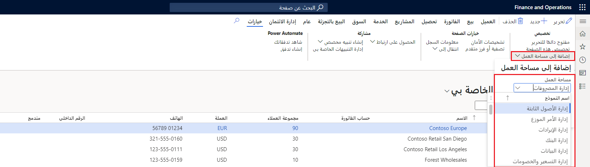
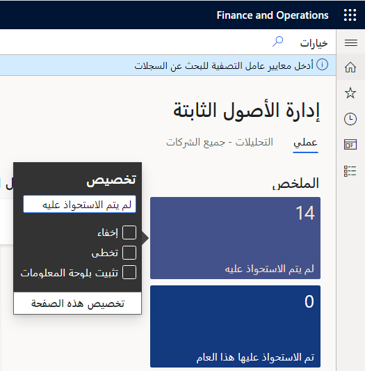

تتوفر ميزة إضفاء طابع شخصي إضافي لبعض الصفحات التي تتضمن قوائم.For some pages that include lists, an additional personalization feature is available. يتيح الزر **إضافة إلى مساحة العمل** في مجموعة **تخصيص** في علامة التبويب **خيارات** في جزء الإجراءات إظهار المعلومات من القائمة الحالية في مساحة عمل محددة.The **Add to workspace** button in the **Personalize** group on the **Options** tab of the Action Pane lets you show the information from the current list in a specific workspace. 
 

يمكنك إظهار طريقة عرض تمت تصفيتها وفرزها للمعلومات في مساحة العمل، أو يمكنك إظهار طريقة العرض الافتراضية.You can show a filtered and sorted view of the information in the workspace, or you can show the default view. يمكنك أيضاً تحديد ما إذا كانت المعلومات ستظهر في مساحة العمل كقائمة، أو ملخص في إطار متجانب يمكنه إظهار عدد الأصناف في القائمة، أو كارتباط.You can also specify whether the information appears in the workspace as a list, as a summary tile that can show the number of items in the list, or as a link.

## إضافة قائمة إلى مساحة العملAdd a list to a workspace 

لإضافة قائمة إلى مساحة عمل، قم أولاً بفرز أو تصفية القائمة الموجودة على الصفحة بحيث تعرض المعلومات بالشكل الذي تريد أن تظهر به في مساحة العمل.To add a list to a workspace, first sort or filter the list on the page so that it shows the information as you want it to appear in the workspace. ثم حدد **إضافة إلى مساحة العمل**.Then select **Add to workspace**. حدد مساحة عمل، ثم في الحقل **عرض تقديمي**، حدد **قائمة**.Select a workspace, and then, in the **Presentation** field, select **List**. بعد تحديد **تكوين**، يظهر مربع حوار، حيث يمكنك تحديد الأعمدة التي يجب أن تظهر في القائمة في مساحة العمل.After you select **Configure**, a dialog box appears, where you can select the columns that should appear in the list in the workspace. يمكنك أيضاً تحديد التسمية المراد استخدامها للقائمة الموجودة في مساحة العمل.You can also specify the label to use for the list in the workspace.

## إضافة إطار متجانب إلى مساحة العملAdd a tile to a workspace 

لإضافة إطار متجانب إلى مساحة عمل، قم أولاً بتصفية القائمة على الصفحة بحيث تعرض البيانات التي تريد تلخيصها أو التي تريد الوصول السريع إليها.To add a tile to a workspace, first filter the list on the page so that it shows the data that you want to be summarized or that want quick access to. ثم حدد **إضافة إلى مساحة العمل**.Then select **Add to workspace**. حدد مساحة عمل، ثم في الحقل **عرض تقديمي**، حدد **إطار متجانب**.Select a workspace, and then, in the **Presentation** field, select **Tile**. بعد تحديد **تكوين**، يظهر مربع حوار، حيث يمكنك تحديد التسمية المراد استخدامها للإطار المتجانب في مساحة العمل.After you select **Configure**, a dialog box appears, where you can specify the label to use for tile in the workspace. يمكنك أيضاً تحديد ما إذا كان يتعين على الإطار المتجانب عرض عدد أم لا.You can also specify whether the tile should show a count. بعد إضافة الإطار المتجانب إلى مساحة العمل، يمكنك تحديده لفتح الصفحة الحالية من مساحة العمل وعرض القائمة المصفاة المرتبطة بالإطار المتجانب.After the tile is added to the workspace, you can select it to open the current page from the workspace and view the filtered list that is associated with the tile.

## إضافة ارتباطاً إلى مساحة العملAdd a link to a workspace ##

لإضافة ارتباط إلى مساحة عمل، قم أولاً بتصفية القائمة على الصفحة بحيث تعرض البيانات التي تهتم بها.To add a link to a workspace, first filter the list on the page so that it shows the data that you're interested in. ثم حدد **إضافة إلى مساحة العمل**.Then select **Add to workspace**. حدد مساحة عمل، ثم في الحقل **عرض تقديمي**، حدد **ارتباط**.Select a workspace, and then, in the **Presentation** field, select **Link**. بعد تحديد **تكوين**، يظهر مربع حوار، حيث يمكنك تحديد التسمية المراد استخدامها للارتباط.After you select **Configure**, a dialog box appears, where you can specify the label to use for the link. يمكنك أيضاً تحديد تسمية لقسم جديد يحتوي على هذا الارتباط بشكل اختياري.You can also optionally specify a label for a new section that will contain this link.

بعد إضافة قائمتك أو الإطار المتجانب أو ارتباطك إلى مساحة العمل، يمكنك فتح مساحة العمل هذه وإعادة ترتيب العناصر فيها، حسب الحاجة.After your list, tile, or link has been added to a workspace, you can open that workspace and reorder the elements in it, as needed.

## إضافة ملخصاً من مساحة العمل إلى لوحة المعلوماتAdd a summary from a workspace to a dashboard 

تحتوي بعض مساحات العمل على الإطارات المتجانبة للعدد (أي الإطارات المتجانبة التي تعرض أرقاماً)، وقد ترغب في ظهور تلك الإطارات المتجانبة على لوحة المعلومات أيضاً.Some workspaces contain count tiles (that is, tiles that have numbers on them), and you might want those tiles to appear on your dashboard too. في مساحة العمل، انقر بزر الماوس الأيمن فوق الإطار المتجانب للعدد، ثم حدد **‏‫تخصيص**.In a workspace, right-click a count tile, and then select **Personalize**. ثم في نافذه خاصية الإطار المتجانب، حدد **تثبيت في لوحة المعلومات**.Then, in the tile's property window, select **Pin to dashboard**. 

في المرة التالية التي تقوم فيها بفتح (وتحديث) لوحة المعلومات المحددة، سيظهر العدد أسفل إطار التنقل المتجانب لمساحة العمل تلك.The next time that you open (and refresh) the selected dashboard, the count will appear below the navigation tile for that workspace. يمكنك تحديد هذا العدد للانتقال مباشرة إلى البيانات التي تمثلها.You can select that count to go directly to the data that it represents.

