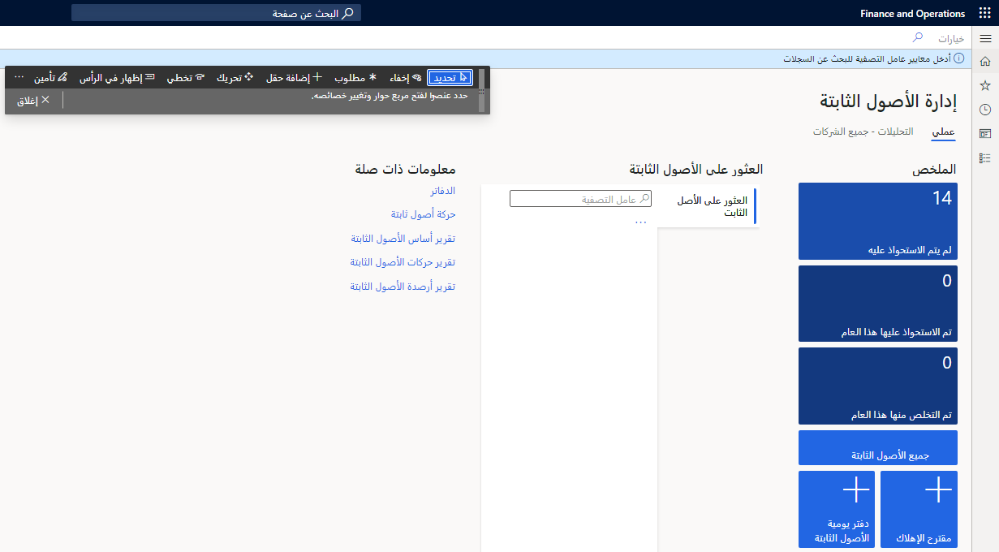

 غالباً ما تكون لوحة المعلومات هي الصفحة الأولى التي تراها عند فتح تطبيقات Finance and Operations. يمكنك تخصيص لوحة المعلومات بحيث تعرض فقط مربعات مساحة العمل التي تريد رؤيتها. ويمكنك أيضاً إعادة ترتيب المربعات بحيث تكون بالترتيب الذي تفضل رؤيتها به، أو إعادة تسمية مربعات التنقل في مساحة العمل، أو إضافة مربع جديد تماماً لمساحة العمل.

لتخصيص لوحة المعلومات، انقر بزر الماوس الأيمن فوق أي إطار متجانب، ثم حدد **تخصيص** لفتح نافذة خاصية الإطار المتجانب.

- إذا كنت تريد إخفاء الإطار المتجانب المحدد أو إعادة تسميته، فيمكنك إجراء هذا التغيير مباشرةً في نافذة الخاصية.
- لإعادة ترتيب مربعات مساحة العمل، في نافذة الخاصية، حدد **تخصيص هذا النموذج** لفتح شريط أدوات **التخصيص**. يمكنك عندئذ استخدام أداة **تحريك** لترتيب الإطارات المتجانبة كما تريد.
- لإنشاء إطار مساحة عمل متجانب جديد، في نافذة الخاصية، حدد **إضافة مساحة عمل**. يتم إنشاء إطار مساحة عمل متجانب جديد أسفل لوحة المعلومات. يمكنك إعادة تسمية إطار مساحة عمل المتجانب الجديد هذا إذا لزم الأمر. ويمكنك أيضاً إضافة قوائم وإطارات متجانبة وروابط لمساحة العمل كما هو موضح في الوحدة السابقة.

