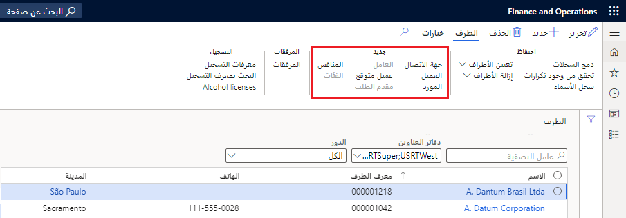

يُعد دفتر العناوين العمومي (GAB) مستودعاً مركزياً للبيانات الرئيسية التي يجب تخزينها لجميع الأشخاص والمؤسسات الداخلية والخارجية التي تتفاعل معها الشركة. عند تغيير أحد العناوين، يتعين إجراء التحديث في مكان واحد فقط. ويتم تحديث جميع السجلات المرتبطة الأخرى تلقائياً.

يتم تضمين دفتر العناوين العمومي بشكل جاهز مع جميع تطبيقات Finance and Operations.

تتضمن البيانات المرتبطة بسجلات الطرف اسم الطرف وعنوانه ومعلومات الاتصال الخاصة به. تختلف التفاصيل الأخرى، اعتماداً على ما إذا كان الطرف شخصاً أو مؤسسة. 

يتم تعيين كل سجل طرف إلى طرف، ويمكن ربط كل طرف بواحد أو أكثر من أدوار الطرف في الشركة. تشمل أدوار الطرف العميل والعميل المتوقع والعامل والمستخدم والمورد والمنافس ومقدم الطلب وجهة الاتصال. 

## أدوار الأطراف

يشار إلى الأدوار المرتبطة بسجلات الأطراف على أنها أدوار الأطراف. هناك العديد من أدوار الأطراف، ويمكن تعيينها لكل من أنواع الأطراف والشخص والمؤسسة. فيما يلي تعريفات لكل دور طرف:

- **العميل** - الأفراد أو الشركات أو الكيانات الأخرى الذين يشترون السلع والخدمات التي ينتجها أفراد أو شركات أو كيانات أخرى.
- **العميل المتوقع** - طرف قد يقدم خدمة أو ميزة لكيان قانوني.
- **العامل** - شخص يتولى دور موظف أو مقاول ويتقاضى أجره مقابل الخدمات.
- **المورد** - طرف يقوم بتوريد المنتجات إلى كيان قانوني واحد أو أكثر مقابل الدفع.
- **المنافس** - شخص أو مؤسسة تقدم سلعاً أو خدمات تشبه السلع أو الخدمات التي يوفرها عملك.
- **مقدم الطلب** - الشخص الذي يقدم طلباً رسمياً مكتوباً أو إلكترونياً للعمل لدى مؤسسة أو لشغل منصب فيها.
- **جهة الاتصال** - شخص، سواء داخل مؤسستك أو خارجها، قمت بإنشاء إدخال له. في هذا الإدخال، يمكنك حفظ معلومات مثل شارع الشخص وعناوين بريده الإلكتروني وأرقام الهاتف والفاكس وعناوين URL لصفحات الويب.

**عام > عام > دفتر عناوين عمومي** 

