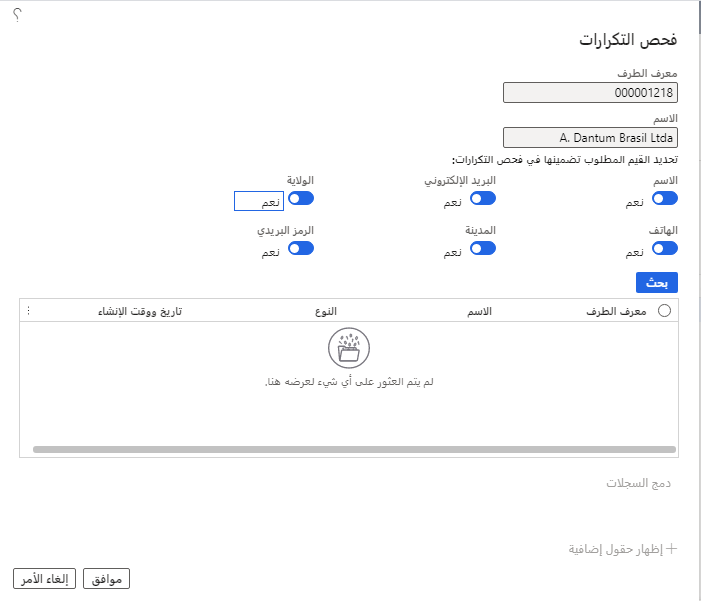

يمكن أن ينتمي سجل الطرف إلى دفتر عناوين واحد أو أكثر. يمكن لكل سجل طرف تخزين موقع أو عنوان واحد أو أكثر، ويتم تعيين دور طرف فيه. يمكن أن يكون للدور الذي تم تعيينه لسجل الطرف أنواع حركات محددة مرتبطة به. توفر الأقسام التالية مزيداً من المعلومات حول أدوار الأطراف والمواقع وأنواع الحركات. 

يمكن أن يساعدك دفتر العناوين العمومي في فهم العلاقات بين الأشخاص والمؤسسات المرتبطة بمؤسستك. 

على سبيل المثال، يمكن أن يكون العميل أيضاً مورداً في حملة تسويقية، أو يمكن أيضاً أن يكون عامل في مؤسستك مورداً.

## إنشاء سجلات أطراف جديدة

توجد طريقتان لإدخال سجلات الأطراف في دفتر العناوين العمومي:

- **إنشاء سجل طرف عندما لا تعرف الدور** - عندما تقوم بإنشاء سجل طرف ولا تعرف نوع الدور (على سبيل المثال، لا تعرف ما إذا كان الطرف عميلاً أم فرصة)، فإنك تنشئ السجل في دفتر العناوين العمومي. يمكنك تحديد نوع الدور فيما بعد.
- **إنشاء سجل طرف عندما تعرف الدور** - إذا كنت تعرف نوع الدور للطرف، يمكنك إنشاء سجل على الصفحة المناسبة لهذا النوع. على سبيل المثال، إذا كان الطرف عميلاً، يمكنك إنشاء سجل في صفحة **العميل**. عند إنشاء سجل وحفظه باستخدام الصفحة لنوع دور الطرف، يتم إنشاء السجل تلقائياً في دفتر العناوين العمومي.

بالنسبة للمعاملات التي تعد جزءاً من عمليات الأعمال، قد ترتبط أطراف متعددة بكل حركة. مثال على ذلك هو العميل الذي يحتاج إلى الإشارة إليه في عروض أسعار المشروع.

تتم مشاركة عناوين ومواقع ومعلومات الاتصال الخاصة بكل سجل طرف عبر جميع أدوار الأطراف المرتبطة بهذا الطرف. لذلك، عند تغيير أي من هذه المعلومات، يتم تحديث جميع السجلات الأخرى المرتبطة وفقاً لذلك. عندما يتم تضمين دور طرف في إحدى الحركات، يمكن الوصول إلى الموقع أو العنوان أو معلومات الاتصال الخاصة بالطرف عند إدخال تفاصيل الحركة.

يمكنك التحقق من وجود سجلات مكررة مباشرةً من صفحة قائمة **دفتر العناوين العمومي**. في **جزء الإجراءات**، في علامة التبويب **الطرف**، في مجموعة **الصيانة**، انقر على **التحقق من التكرارات**. ثم حدد القيم المطلوب تضمينها في التحقق من التكرارات.
 

لإضافة سجلات أطراف متعددة إلى دفتر عناوين، في صفحة قائمة **دفتر العناوين العمومي**، حدد الأطراف في القائمة. وبعد ذلك، في **جزء الإجراءات**، في علامة التبويب **الطرف**، في مجموعة **الصيانة**، انقر على **تعيين الأطراف**. حدد دفاتر العناوين لإضافة سجلات المجموعة المحددة إليها، ثم انقر على **موافق**. تتم إضافة جميع سجلات الأطراف المحددة إلى دفاتر العناوين التي حددتها.

لإزالة سجلات أطراف متعددة من دفتر عناوين، في صفحة قائمة **دفتر العناوين العمومي**، حدد الأطراف في القائمة. وبعد ذلك، في **جزء الإجراءات**، في علامة التبويب **الطرف**، في مجموعة **الصيانة**، انقر على **إزالة الأطراف**. حدد دفاتر العناوين لإزالة الأطراف منها، ثم انقر على **موافق**. تتم إزالة جميع سجلات الأطراف المحددة من دفاتر العناوين التي حددتها.

في بعض الأحيان، قد تضطر إلى تغيير نوع سجل الطرف من شخص إلى مؤسسة أو من مؤسسة إلى شخص. لتغيير سجل طرف من نوع طرف إلى آخر، يجب عليك أولاً إنشاء سجل طرف جديد من النوع الصحيح في دفتر العناوين العمومي. تقوم بعد ذلك بربط سجل الطرف القديم بهذا السجل الجديد. بعد إجراء اقتران الطرف الجديد، احذف سجل الطرف الأصلي الذي يحتوي على نوع السجل غير الصحيح.

لتحديث اسم سجل الطرف، افتح سجل الطرف، ثم في **جزء الإجراءات**، انقر على **تحرير**. في علامة التبويب السريعة **عام**، أدخل الاسم الجديد للطرف، ثم احفظ السجل.

لتحديث عنوان لسجل الطرف، افتح سجل الطرف، ثم في علامة التبويب السريعة **العناوين**، حدد العنوان المراد تحديثه. انقر على **تحرير**، ثم في صفحة **تحرير العنوان**، قم بإجراء التغييرات المطلوبة على العنوان أو معلمات العنوان. 

في بعض الأحيان، قد ترغب في دمج اثنين أو أكثر من سجلات الأطراف في سجل واحد. يمكن أن يحدث هذا إذا أنشأت سجلاً مكرراً واحداً أو أكثر، إما عن قصد أو عن غير قصد. عندما تقوم بدمج سجلات الأطراف، فإنك تحدد سجلاً واحداً للاحتفاظ به. 

يتم بعد ذلك دمج المعلومات الواردة من السجلات الأخرى في هذا السجل. لا يمكنك دمج سجلات الأطراف المرتبطة بدور الطرف نفسه، مثل العميل أو المورد، في نفس الكيان القانوني. لا يمكنك دمج سجلات مؤسسات الأطراف الداخلية في نفس الكيان القانوني أو الفريق أو وحدة التشغيل.

يمكنك إدخال سجلات الأطراف إما في دفتر العناوين العمومي أو في صفحة الكيان المناسبة. عند إضافة سجل في موقع ما، تتم دائماً إضافة نفس السجل في الموقع الآخر. على سبيل المثال، إذا أضفت سجل طرف لعميل في دفتر العناوين العمومي، فستتم أيضاً إضافة السجل إلى صفحة **العميل**. وبالمثل، إذا أضفت سجل طرف لعميل في صفحة **العميل**، تتم إضافة السجل أيضاً في دفتر العناوين العمومي.

إذا كنت بحاجة إلى إنشاء سجل طرف ولكنك لا تعرف نوع الكيان (على سبيل المثال، لا تعرف ما إذا كان الكيان عميلاً أم فرصة)، فقم بإنشاء السجل في دفتر العناوين العمومي. يمكنك تحديد نوع الكيان فيما بعد.

إذا كنت تعرف نوع الكيان للطرف، فيمكنك إنشاء سجل على الصفحة المناسبة لهذا النوع. على سبيل المثال، قم بإنشاء سجل لعميل في صفحة **العميل**. عند إنشاء سجل وحفظه باستخدام صفحة الكيان المناسبة، يتم إنشاء السجل تلقائياً في دفتر العناوين العمومي.

يمكنك إعداد ترجمات لمعلومات العناوين، بحيث تظهر المعلومات بلغة المستخدم الخاصة بك (لغة النظام) في تطبيقات التمويل والعمليات من Microsoft ولكن بلغة أخرى في المستندات مثل أوامر المبيعات. يمكنك إدخال ترجمات لأسماء البلدان/المناطق والعناوين وتسلسلات الأسماء. 

على سبيل المثال، لغة النظام هي الإيطالية، ويمكنك إنشاء أمر مبيعات لعميل في ألمانيا. في هذه الحالة، يمكنك عرض سجل العميل باللغة الإيطالية في تطبيقات التمويل والعمليات لكن اعرض معلومات العنوان باللغة الألمانية في أمر المبيعات المطبوع. 

عند إعداد الترجمات، يجب إدخال ترجمة لكل صنف في القائمة. ستظهر أي أصناف لم تُدخل ترجمة لها في لغة النظام. 

على سبيل المثال، لغة نظامك هي الفرنسية، ويمكنك إرسال مستند إلى عميل في إسبانيا. إذا لم تكن قد أدخلت الترجمات الإسبانية (ESP) لمعلومات العنوان، فستظهر هذه المعلومات باللغة الفرنسية في كلٍّ من تطبيقات التمويل والعمليات والمستند المطبوع.