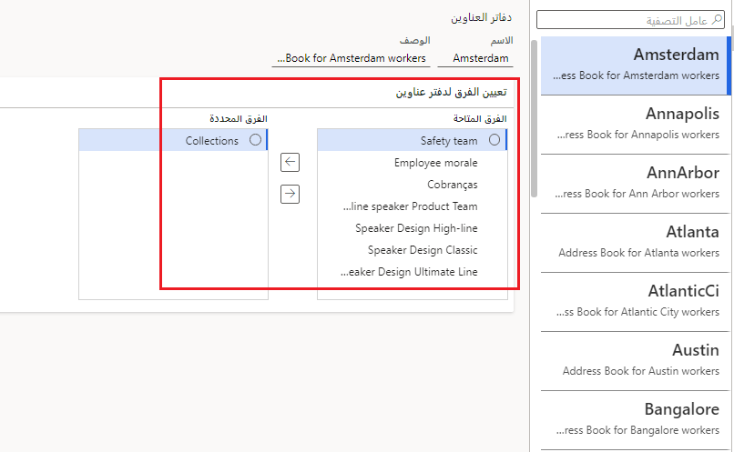

تحتاج إلى التفكير في العديد من السيناريوهات عند اتخاذ قرارات أثناء عملية التخطيط، قبل إعداد وتكوين دفتر العناوين العام وأي دفاتر عناوين إضافية في تطبيقات Finance and Operations.You need to consider many scenarios when you make decisions during the planning process, before you set up and configure the global address book and any additional address books in Finance and Operations apps. ستتطلب بعض القرارات تأكيد القرارات التي تم اتخاذها لمناطق أخرى من المنتج، مثل التدرج الهرمي للمؤسسات.Some of the decisions will require that you confirm the decisions that have been made for other areas of the product, such as the organization hierarchy.

قبل أن تبدأ في العمل مع دفتر العناوين العام، يجب عليك تحديد القيم الافتراضية له.Before you begin to work with the global address book, you must determine the default values for it. ثم يتم استخدام هذه القيم الافتراضية لأي دفاتر عناوين إضافية تقوم بإنشائها.These default values are then used for any additional address books that you create.

فيما يلي بعض الأمثلة على القرارات التي يتعين عليك اتخاذها:The following are some examples of the decisions that you need to make:

- ما التسلسل الذي يجب عرض الأسماء به لسجلات الحزب الخاصة بنوع الشخص؟What sequence should names be displayed in for party records of the person type? على سبيل المثال، تسلسل واحد هو الاسم الأخير والاسم الأوسط والاسم الأول.For example, one sequence is last name, middle name, first name.
- هل يجب حذف سجلات الحزب من دفتر العناوين عند حذف سجل الدور؟Should party records be deleted from the address book when the role record is deleted? على سبيل المثال، إذا تم حذف سجل عميل، فهل يجب أيضاً حذف سجل الطرف؟For example, if a customer record is deleted, should the party record also be deleted?
- عند إنشاء سجل جديد، هل يجب إخطار المستخدمين إذا تم العثور على سجل مكرر في دفتر العناوين العمومي؟When a new record is created, should users be notified if a duplicate record is found in the global address book?
- هل ينبغي تضمين رقم نظام ترقيم البيانات العالمي (DUNS) في معلومات سجل الطرف؟Should the Data Universal Numbering System (DUNS) number be included in a party record’s information?
- إذا تم تضمين رقم DUNS في سجل الطرف، فهل يجب التحقق من تفرد الرقم؟If the DUNS number is included in a party record, should the uniqueness of the number be checked?
- عندما يتم إنشاء سجل مجموعة في دفتر العناوين العمومية، هل تريد نوع الطرف الافتراضي أو الشخص أو المؤسسة؟When a party record is created in the global address book, do you want a default party type, person, or organization?
- ما أدوار المستخدم التي يجب أن يكون لها حق الوصول إلى العناوين الخاصة ومعلومات الاتصال الخاصة بسجلات الطرف؟Which user roles should have access to the private addresses and contact information of party records?

بعد إنشاء دفتر العناوين العمومي، يمكنك إنشاء دفاتر عناوين إضافية إذا لزم الأمر، مثل دفتر عناوين منفصل لكل شركة في مؤسستك أو لكل خط أعمال.After you create the global address book, you can create additional address books if needed, such as a separate address book for each company in your organization or for each line of business.

لإنشاء دفاتر عناوين إضافية، انتقل إلى **إدارة المؤسسة > دفتر العناوين العمومي > دفاتر العناوين**.To create additional address books, go to **Organization administration > Global address book > Address books**. 

عند إنشاء دفتر عناوين جديد، فإنه لديك أولاً فرصة لتحديد **Teams** لملء دفتر العناوين بأعضاء Teams الذين تم إنشاؤهم.When you create a new address book, you first have an opportunity to select **Teams** to populate the address book with members of Teams that have been created.
 

لإعداد **Teams**، انتقل إلى **إدارة المؤسسة > المؤسسات > Teams**.To set up **Teams**, go to **Organization administration > Organizations > Teams**. ومن هناك، يمكنك إضافة أعضاء إلى فريق ستتم إضافته بعد ذلك إلى دفتر عناوين معين.From there, you can add members to a team, which will then be added to a specific address book. 

## السيناريوScenario

إن Adventure Works Cycles هي مؤسسة دولية لديها شركات متعددة وخطوط عمل متعددة.Adventure Works Cycles is an international organization that has multiple companies and multiple lines of business. تخطط Adventure Works Cycles لإنشاء دفتر عناوين لكل خط من خطوط الأعمال.Adventure Works Cycles plans to create an address book for each line of business. بالنسبة إلى خطوط الأعمال التي تحدث في أكثر من موقع، مثل تجارة التجزئة، تخطط Adventure Works Cycles لإنشاء دفتر عناوين لكل موقع متجر.For lines of business that occur in more than one location, such as the retail business, Adventure Works Cycles plans to create an address book for each store location. 

افترض أن مدير تكنولوجيا المعلومات في Adventure Works Cycles قد أنشأ القائمة التالية من دفاتر العناوين ويصف سجلات المجموعة التي يجب أن يتضمنها كل دفتر عناوين.Assume that the IT manager at Adventure Works Cycles has created the following list of address books and describes the party records that each address book must include.

- **عقود القطاع العام** - سجلات الأطراف لجميع الأطراف المشاركة في عقود القطاع العام التي تحتفظ بها Adventure Works Cycles.**Public sector contracts**   - Party records for all parties that are involved in the public sector contracts that Adventure Works Cycles holds.
- **عقود القطاع الخاص** - سجلات الأطراف لجميع الأطراف المشاركة في عقود القطاع الخاص التي تحتفظ بها Adventure Works Cycles.**Private sector contracts** - Party records for all parties that are involved in the private sector contracts that Adventure Works Cycles holds.
- **الأدوات الإلكترونية** - سجلات الأطراف لجميع الأطراف المشاركة في شراء أو بيع الأدوات الإلكترونية، أو التي تتفاعل بطريقة أخرى مع الأدوات الإلكترونية التي يتم توفيرها أو شراؤها من أجل Adventure Works Cycles في شركة Adventure Works Cycles في إيطاليا.**Electronic tools** - Party records for all parties that are involved in the purchase or sale of electronic tools, or that otherwise interact with the electronic tools that are provided by or purchased for Adventure Works Cycles in the Adventure Works Cycles -Italy company.
- **الأدوات التي تعمل بالهواء المضغوط (PTJPN)** – سجلات الأطراف لجميع الأطراف المشاركة في شراء أو بيع أدوات تعمل بالهواء المضغوط، أو التي تتفاعل بطريقة أخرى مع تلك الأدوات التي يتم توفيرها أو شراؤها من أجل Adventure Works Cycles في Adventure Works Cycles - شركة في اليابان.**Pneumatic tools (PTJPN)** – Party records for all parties that are involved in the purchase or sale of pneumatic tools, or that otherwise interact with the pneumatic tools that are provided by or purchased for Adventure Works Cycles in the Adventure Works Cycles -Japan company.
- **الأدوات التي تعمل بالهواء المضغوط (PTUSA)** – سجلات الأطراف لجميع الأطراف المشاركة في شراء أو بيع أدوات تعمل بالهواء المضغوط، أو التي تتفاعل بطريقة أخرى مع تلك الأدوات التي يتم توفيرها أو شراؤها من أجل Adventure Works Cycles في Adventure Works Cycles - شركة في الولايات المتحدة.**Pneumatic tools (PTUSA)** – Party records for all parties that are involved in the purchase or sale of pneumatic tools, or that otherwise interact with the pneumatic tools that are provided by or purchased for Adventure Works Cycles in the Adventure Works Cycles -US company.

يجب أن يتخذ مدير تكنولوجيا المعلومات القرار بشأن عدد دفاتر العناوين الإضافية التي يجب إنشاؤها.The IT manager must make the decision regarding how many additional address books need to be created.

 
