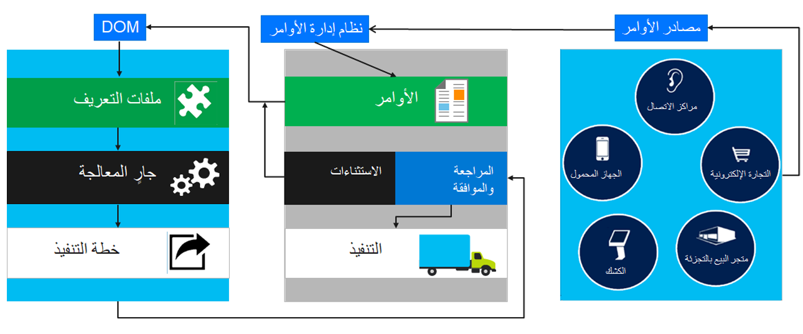

للمساعدة على تحسين تجربة العميل، يجب أن تكون لدى تجار البيع بالتجزئة رؤية واضحة لمخزونهم في الوقت الحقيقي، وعبر جميع قنواتهم. فبإمكان طريقة عرض واحدة وشاملة للمخزون بكامله أن تساعد على تنفيذ الأوامر وتخصيصها وتوزيعها، وبالتالي، أصبح اعتماد نظام إدارة الأوامر الموزعة (DOM) وتنفيذه أمراً ضرورياً لبائعي التجزئة.

يحسن نظام إدارة الأوامر الموزعة (DOM) تنفيذ الأوامر عبر شبكة معقدة من الأنظمة والعمليات. وهو يعتمد على طريقة عرض عمومية واحدة للمخزون عبر المؤسسة بكاملها تسمح بإدارة الأوامر بطريقة ذكية، بحيث يتم تنفيذها بطريقة دقيقة ومعقولة التكلفة. ومن خلال تحسين فعالية سلسلة توريد بائع التجزئة، يساعد نظام DOM بائعي التجزئة على تلبية توقعات العملاء بطريقة أفضل.

وغالباً ما يتم استخدام إدارة الأوامر الموزعة في صناعات البيع بالتجزئة.

يبين الرسم التوضيحي الآتي دورة حياة أمر مبيعات في نظام DOM.
 

فيما يأتي بعض الأشياء الواجب مراعاتها عند استخدام ميزة DOM:

- في الوقت الحالي، تراعي ميزة DOM فقط الأوامر التي تم إنشاؤها من قنوات البيع بالتجزئة. ويتم التعرف على أوامر المبيعات كأوامر مبيعات بالتجزئة عند تعيين الخيار **بيع بالتجزئة** إلى **نعم**.

- لم يتم اختبار ميزة DOM مع الميزات المتقدمة لإدارة المستودعات. ويتعين عليك توخي الحذر لتحديد ما إذا كانت ميزة DOM متوافقة مع قدرات وعمليات الإدارة المتقدمة للمستودعات ذات الصلة بها.

- تتوفر ميزة DOM فقط على إصدار السحابة في Dynamics 365 Commerce. وهي غير معتمدة في عمليات التوزيع المحلي.