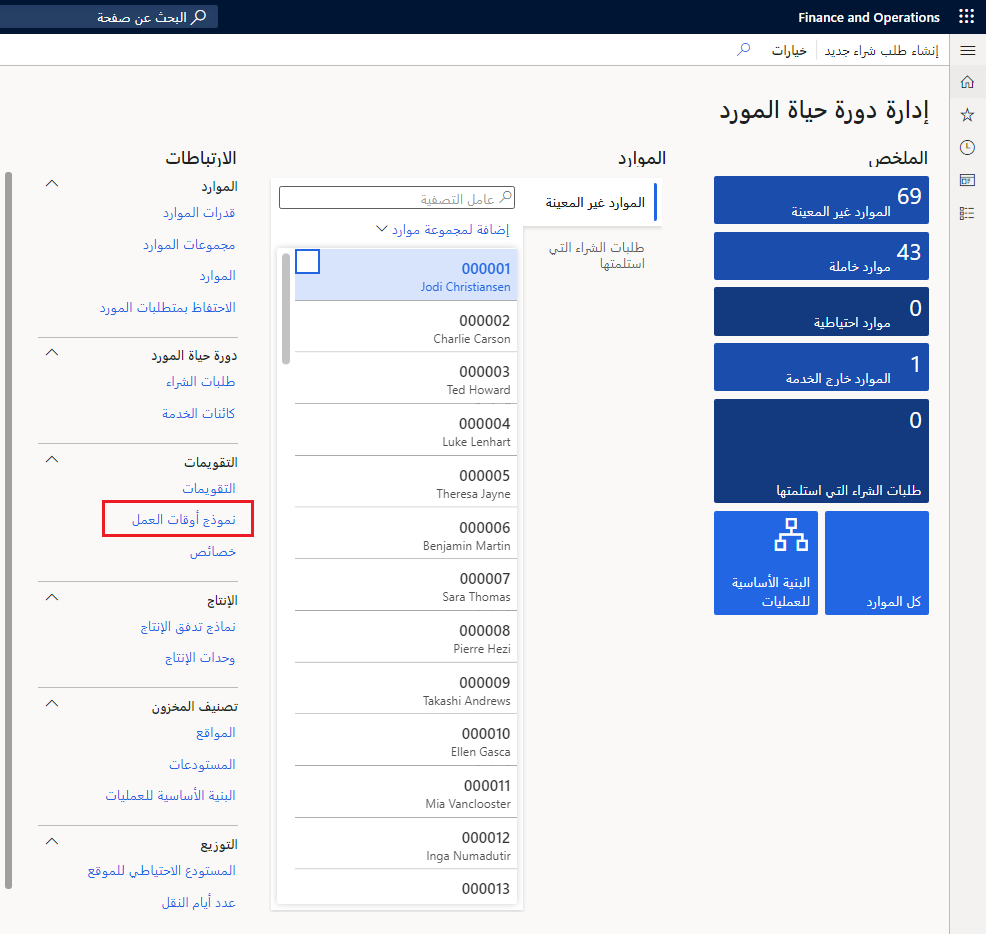
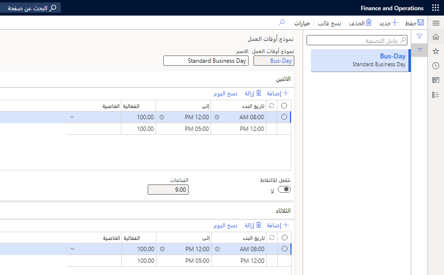
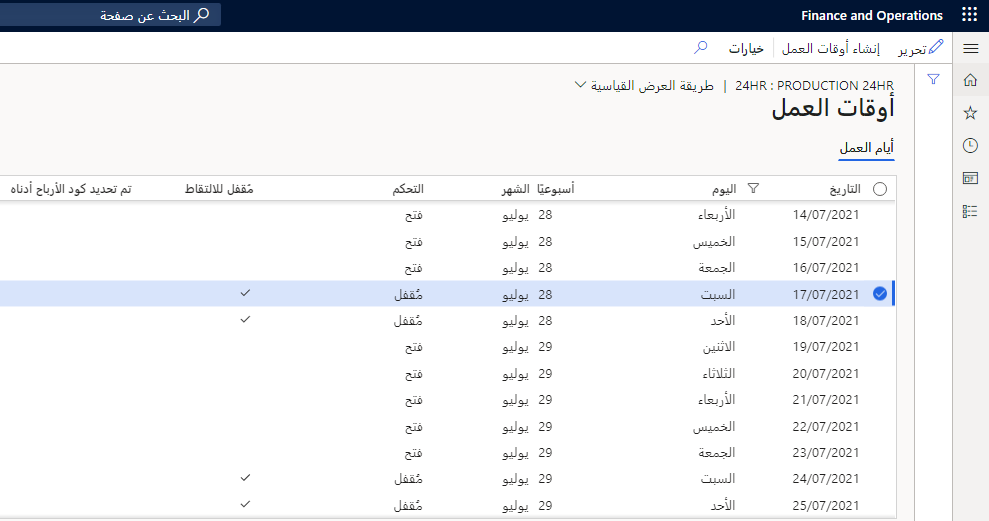
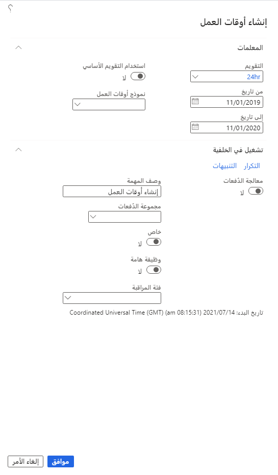
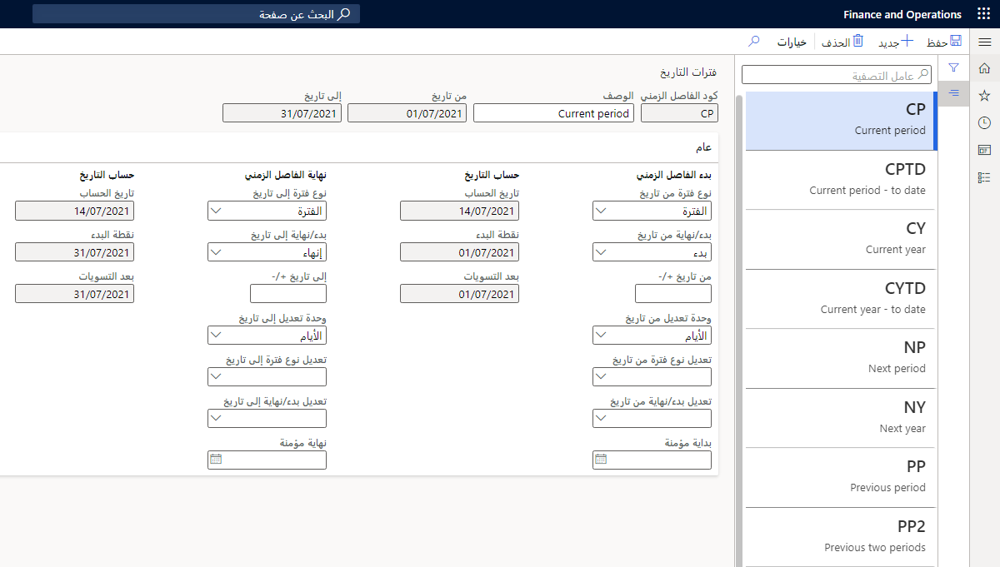

هناك نوعان من التقويمات في تطبيقات التمويل والعمليات. 

- **التقويمات المالية** - مستخدمة في تنفيذ الإدارة المالية والتحكم في التاريخ لترحيل الحركات المالية لفترة محددة. 

- **تقويمات العمل** - وصف القدرة وأوقات العمل لموارد العمليات وتعيين مدى توفر عمليات معينة.

في تطبيقات التمويل والعمليات، يمكنك استخدام تقاويم مختلفة لوحدات عمل مختلفة. على سبيل المثال، يمكن أن يكون لديك تقويم واحد للإنتاج وآخر لوحدات المبيعات والتسويق الخاصة بأعمالك.

لتحديد تقويم عمل، يجب إنشاء قالب وقت عمل. تحدد قوالب مواعيد العمل ساعات العمل خلال الأسبوع وتستخدم لإنشاء أوقات العمل لإحدى الفترات.
 

لإنشاء تقويم، اتبع الخطوات التالية:

1.  انتقل إلى **إدارة المؤسسة > مساحات العمل > إدارة دورة حياة الموارد**.
2.  حدد **قوالب أوقات العمل**.
3.  في الجزء الأيمن أسفل **الارتباطات**، ثم ضمن **التقويمات**، حدد **قوالب مواعيد العمل**.
4.  حدد **جديد**
5.  في الحقل **قالب مواعيد العمل**، أدخل قيمة، مثل "يوم عمل".
6.  في الحقل **الاسم**، اكتب قيمة، مثل "يوم العمل العادي".
7.  قم بتوسيع القسم **الاثنين**.
8.  حدد **إضافة**.
9.  في الحقل **من**، أدخل وقتاً، مثل 8:00 صباحاً. حدد الوقت الذي بدأ فيه العاملون يوم العمل.
10. في الحقل **إلى**، أدخل وقتاً، مثل 12:00 م. حدد الوقت الذي يرتاح فيه العمال لتناول وجبة الغداء.
11. حدد **إضافة**.
12. في الحقل **من**، أدخل الوقت الذي يعود فيه العمال من الغداء، مثل 1:00 م.
13. في الحقل **إلى**، أدخل وقت انتهاء يوم العمل، مثل 5:00 م.
14. يتيح تحديد **نسخ اليوم** نسخ تعريفات أوقات العمل من يوم الاثنين إلى الثلاثاء.
15. في القائمة المنسدلة **إلى يوم من أيام الأسبوع**، حدد "الثلاثاء".
16. حدد **موافق**.
17. يتيح تحديد **نسخ اليوم** نسخ تعريفات أوقات العمل من يوم الاثنين إلى الأربعاء.
18. في القائمة المنسدلة **إلى يوم من أيام الأسبوع**، حدد "الأربعاء".
19. حدد **موافق**.
20. يتيح تحديد **نسخ اليوم** نسخ تعريفات أوقات العمل من يوم الاثنين إلى الخميس.
21. في القائمة المنسدلة **إلى يوم من أيام الأسبوع**، حدد "الخميس".
22. حدد **موافق**.
23. يتيح تحديد **نسخ اليوم** نسخ تعريفات أوقات العمل من يوم الاثنين إلى الجمعة.
24. في القائمة المنسدلة **إلى يوم من أيام الأسبوع**، حدد "الجمعة".
25. حدد **موافق**.
26. قم بتوسيع القسم **الجمعة**.
27. في حقل **الخاصية**، أدخل قيمة أو حددها.
28. قم بتوسيع القسم **السبت**.
29. حدد **نعم** في الحقل **مغلق للالتقاط**.
30. قم بتوسيع القسم **الأحد**.
31. حدد **نعم** في الحقل **مغلق للالتقاط**.
32. حدد **حفظ**.

## إنشاء أوقات العمل

تصف التقويمات القدرة وأوقات العمل لموارد العمليات. سيساعدك هذا الإجراء على تحديد تقويم العمل استنادا إلى أحد قوالب مواعيد العمل. يمكنك الانتقال عبر هذا الإجراء في شركة البيانات التجريبية USMF أو استخدام البيانات الخاصة بك.

1.  انتقل إلى **إدارة المؤسسة > مساحات العمل > إدارة دورة حياة الموارد**.
2.  حدد **التقويمات**.
3.  حدد **جديد**.
4.  في حقل **التقويم**، اكتب قيمة، مثل "الإعفاء". هذا هو معرف التقويم المستخدم كمرجع عند تعيين التقويمات، مثل مورد عمليات أو مجموعة موارد.
5.  في حقل **الاسم**، اكتب قيمة، مثل "تقويم الإعفاء".
6.  في الحقل **يوم العمل العادي بالساعات**، أدخل رقماً، مثل "8".
7.  في القائمة، حدد الصف المميز الذي قمت بتحديثه.
8.  حدد **أوقات العمل** في جزء الإجراءات.
9.  حدد **إنشاء أوقات العمل** في جزء الإجراءات لإنشاء ساعات العمل لكل يوم في الفترة التي ترغب في التمكن من جدولة العمل فيها. بمرور الوقت، يمكنك إنشاء أوقات العمل لفترات إضافية.
10. في الحقل **من تاريخ**، أدخل تاريخاً، على سبيل المثال، اختر 11/1/19. وهذا هو اليوم الأول الذي يجب فتح هذا التقويم فيه.
11. في الحقل **إلى تاريخ**، أدخل تاريخاً، مثل 11/1/20. هذا هو اليوم الأخير الذي يجب فتح هذا التقويم فيه.
12. في الحقل **قالب مواعيد العمل**، حدد القالب الذي قمت بإنشائه، مثل "يوم عمل". يحدد قالب مواعيد العمل ساعات العمل لكل يوم من أيام الأسبوع.
13. حدد **موافق**.
14. حدد **حفظ**.
15. أغلق الصفحة.

## إنشاء فترات تاريخ

يمكنك إنشاء وإدارة فترات التواريخ التي يمكن استخدامها في القوائم المالية وفي التقارير. تتيح لك فترات التواريخ إنشاء تواريخ ديناميكية. عند استخدام فترات التواريخ، فسيمكنك إعداد فترات معرفة مسبقاً عند تشغيل القوائم المالية. يمكن استخدام فترات التواريخ أيضاً عند إعداد قاعدة توزيع.

علي سبيل المثال، يقوم Ken المراقب في شركة Contoso Entertainment USA‏ (USMF) بتشغيل بيان بُعد كل شهر. وبدلاً من قيامه بإدخال التواريخ في كل مرة يقوم فيها بتشغيل التقرير، سيقوم بتحديد فترة تاريخ.

تملأ فترة التاريخ تاريخي البدء والانتهاء تلقائياً. لذلك، لا يجب على كين تحديد تاريخ البدء وتاريخ الانتهاء عند تشغيل بيان البعد.

