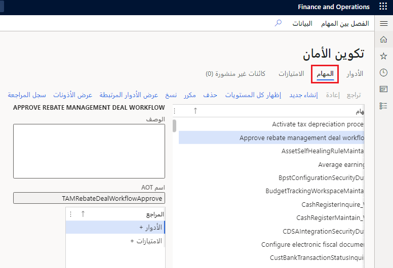

عندما تفهم بنية الأمان لتطبيقات Finance and Operations، يمكنك تخصيصها الأمان بسهولة أكبر لملائمة متطلبات أعمالك. 

سوف تتعرف في هذا الدرس على:

- هندسة الأمان
- الأمان المستند إلى الدور
- المهام
- الامتيازات
- الأذونات
- المصادقة
- التفويض
- التدقيق

تستخدم بنيه نظام تطبيقات Finance and Operations مكدس الميزات داخل Microsoft Azure. ويتيح هذا لتطبيقات Finance and Operations تشغيل والتواصل مع مجموعة متنوعة من الأجهزة التي تدعم الويب.  

نموذج الأمان هرمي، ويمثل كل عنصر في التدرج الهرمي مستوى مختلفاً من التفاصيل. ضع في اعتبارك الحقائق التالية المتعلقة بالأمان:

- تستخدم تطبيقات Finance and Operations الأمان المستند إلى الدور. 
- يتم منح الوصول إلى أدوار الأمان فقط، وليس على المستخدمين الفرديين. 
- تم تعيين المستخدمين إلى الأدوار. يكون لدى المستخدم الذي تم تعيينه لدور أمان حق الوصول إلى مجموعة الامتيازات المرتبطة بهذا الدور. 
- لا يمتلك المستخدم الذي لم يتم تعيينه لأي دور أي امتيازات.

يوفر الرسم التخطيطي التالي نظرة عامة عالية المستوى على بنية الأمان:

## الأمان المستند إلى الدور 
يتماشى الأمان المستند إلى الدور مع بنية الأعمال. يتم تعيين المستخدمين لأدوار الأمان بناءً على مسؤولياتهم في المؤسسة ومشاركتهم في عمليات الأعمال. يمنح المسؤول الوصول إلى الواجبات التي يؤديها المستخدمون في الدور، وليس إلى عناصر البرنامج التي يجب على المستخدمين استخدامها. 

في الأمان المستند إلى الدور، لا يتم منح الوصول للمستخدمين الفرديين، فقط لأدوار الأمان. تم تعيين المستخدمين إلى الأدوار. يكون لدى المستخدم الذي تم تعيينه لدور أمان حق الوصول إلى مجموعة الامتيازات المرتبطة بهذا الدور. لا يمتلك المستخدم الذي لم يتم تعيينه لأي دور أي امتيازات. 

يجب تعيين جميع المستخدمين لدور أمان واحد على الأقل ليتمكنوا من الوصول إلى تطبيقات Finance and Operations. تحدد أدوار الأمان التي يتم تعيينها للمستخدم المهام التي يمكن للمستخدم القيام بها وأجزاء واجهة المستخدم التي يمكن للمستخدم عرضها.

يتم تعيين المستخدمين للأدوار عبر **إدارة النظام > الأمان > تعيين المستخدمين إلى الأدوار**.

نظراً لإمكانية إعداد القواعد لتعيين الدور تلقائياً، لا يتعين على المسؤول المشاركة في كل مرة تتغير فيها مسؤوليات المستخدم. بعد إعداد قواعد وأدوار الأمان، يمكن لمديري الأعمال التحكم في وصول المستخدم اليومي بناءً على بيانات الأعمال.

بشكل افتراضي، يتم توفير نماذج لأدوار الأمان. ترتبط جميع الوظائف في تطبيقات Finance and Operations بواحد على الأقل من أدوار الأمان النموذجية. يمكن للمسؤول تعيين المستخدمين لأدوار الأمان النموذجية، أو تعديل نماذج أدوار الأمان لتناسب احتياجات العمل، أو إنشاء أدوار أمان جديدة. بشكل افتراضي، لا يتم ترتيب نماذج الأدوار في تدرج هرمي.

## المهام 

تتوافق الواجبات مع أجزاء من عملية الأعمال. يقوم المسؤول بتعيين مهام لأدوار الأمان. يمكن تعيين مهمة لأكثر من دور واحد. في تطبيقات Finance and Operations، تحتوي المهام على امتيازات. على سبيل المثال، تحتوي مهمة **صيانة حركات البنوك** على امتيازات **إنشاء إيصالات الودائع** و **إلغاء المدفوعات**. يمكن تعيين كل من المهام والامتيازات لأدوار الأمان. ومع ذلك، نوصي باستخدام المهام لمنح الوصول إلى تطبيقات Finance and Operations.

## الامتيازات 

يمكن تعيين الامتيازات مباشرة للأدوار. ومع ذلك، لتسهيل الصيانة، نوصي بتعيين مهام للأدوار فقط. يحدد الامتياز مستوى الوصول المطلوب لأداء مهمة أو حل مشكلة أو إكمال تعيين. يحتوي أيضاً على أذونات لكائنات التطبيق الفردية، مثل عناصر واجهة المستخدم والجداول. 

على سبيل المثال، يحتوي امتياز إلغاء المدفوعات على أذونات أصناف القائمة والحقول والجداول المطلوبة لإلغاء المدفوعات.

بشكل افتراضي، يتم توفير الامتيازات لجميع الميزات في تطبيقات Finance and Operations. يمكن للمسؤول تعديل الأذونات المرتبطة بامتياز أو إنشاء امتيازات جديدة.

## الأذونات 

تمثل الأذونات الوصول إلى الكائنات الفردية القابلة للتأمين، مثل أصناف القائمة والجداول. تتكون الامتيازات من الأذونات وتمثل الوصول إلى المهام، مثل نشر دفتر يومية ومعالجة الائتمانات والتحصيلات. تتكون المهام من امتيازات وتمثل أجزاء من عملية أعمال، مثل صيانة النقد والحركات البنكية. يمكن تعيين كل من المهام والامتيازات للأدوار لمنح الوصول إلى تطبيقات Finance and Operations.

يتم الوصول إلى كل وظيفة في تطبيقات Finance and Operations، مثل نموذج أو خدمة، من خلال نقطة إدخال. يشار إلى عناصر القائمة وعناصر محتوى الويب وعمليات الخدمة بشكل جماعي كنقاط إدخال.

## المصادقة 

يمكن فقط للمستخدمين المصادق عليهم والذين لديهم حقوق مستخدم في تطبيقات Finance and Operations إنشاء اتصال. تطبيقات Finance and Operations تستخدم Microsoft Azure Active Directory (‏AAD) كموفر أساسي للهوية. للوصول إلى النظام، يجب توفير المستخدمين في مثيل تطبيقات Finance and Operations ويجب أن يكون لديهم حساب AAD صالح في مستأجر مفوض.

## التفويض 

التفويض هو التحكم في الوصول إلى برنامج تطبيقات Finance and Operations. تُستخدم أذونات الأمان للتحكم في الوصول إلى العناصر الفردية للبرنامج: القوائم، وعناصر القائمة، وأزرار الإجراءات والأوامر، والتقارير، وعمليات الخدمة، وعناصر قائمة عنوان URL للويب، وعناصر تحكم الويب، والحقول في عميل تطبيقات Finance and Operations.

في تطبيقات Finance and Operations، يتم دمج أذونات الأمان الفردية في امتيازات، ويتم دمج الامتيازات في مهام. يمنح المسؤول أدوار الأمان الوصول إلى البرنامج عن طريق تعيين مهام وامتيازات لتلك الأدوار.

تستخدم تطبيقات Finance and Operations أماناً يستند إلى السياق لتحديد الوصول إلى كائنات قابلة للتأمين. عندما يقترن امتياز بنقطة إدخال (مثل عنصر قائمة أو عملية خدمة)، يتم تحديد مستوى وصول، مثل قراءة أو حذف. يكتشف النظام الفرعي لتفويض تطبيقات Finance and Operations الوصول في وقت التشغيل، عندما يتم الوصول إلى نقطة الإدخال هذه، ويطبق مستوى الوصول المحدد على الكائن القابل للتأمين الذي تؤدي إليه نقطة الإدخال. تساعد هذه الوظيفة على ضمان عدم تعيين أذونات للمستخدم أكثر مما تحتاج إليه.

## التدقيق 

تم الآن تمكين تدقيق تسجيل دخول المستخدم وتسجيل خروجه في تطبيقات Finance and Operations. يقوم النظام بتسجيل الدخول عندما يقوم المستخدم بتسجيل الدخول أو الخروج من التطبيق. يتم تسجيل الخروج حتى إذا انتهت صلاحية جلسة المستخدم أو انتهت.

يمكن لمسؤول النظام أو مسؤول الأمان الوصول إلى سجلات التدقيق من خلال الانتقال إلى صفحة **سجل المستخدم** (**إدارة النظام** > **الاستعلامات** > **سجل المستخدم**).

الاعتبارات الإضافية:

- يسمح نموذج **الأدوار الخارجية** للمسؤولين بتعيين أدوار أمان لدور خارجي مثل العميل والمورد والعميل المتوقع والمورد المحتمل والعامل
- **حسابات أمان المستخدمين الخاملين** تسمح لك بتحديد الحسابات الخاملة ومعرفة ما إذا كانت الحسابات ممكّنة أو معطلة