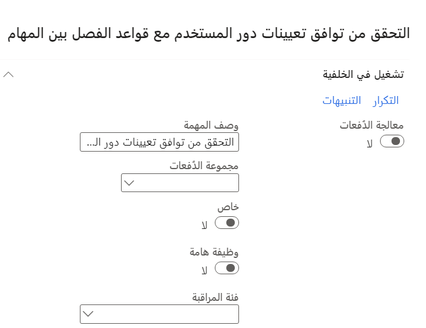

قد يتطلب الأمان أو النُهج تنفيذ مهام محددة بواسطة مستخدمين مختلفين.Security or policies may require that specific tasks be performed by different users. يمكنك إعداد قواعد لفصل المهام التي يجب تنفيذها بواسطة مستخدمين مختلفين.You can set up rules to separate tasks that must be performed by different users. يُسمى هذا المفهوم الفصل بين المهام.This concept is named segregation of duties. يساعدك في الحد من مخاطر الغش كما يساعدك أيضاً في اكتشاف الأخطاء أو المخالفات.This helps reduce the risk of fraud, and helps you detect errors or irregularities.

على سبيل المثال، قد لا تريد أن يقر نفس الشخص بكل من استلام البضائع ومعالجة الدفع للمورّد.For example, you might not want the same person both to acknowledge the receipt of goods and to process payment to the vendor. يساعدك الفصل بين المهام في الحد من مخاطر الغش كما يساعدك أيضاً في اكتشاف الأخطاء أو المخالفات.Segregation of duties helps you reduce the risk of fraud, and it also helps you detect errors or irregularities. يمكنك أيضاً استخدام الفصل بين المهام لفرض سياسات الرقابة الداخلية.You can also use segregation of duties to enforce internal control policies. 

للامتثال للمتطلبات التنظيمية، مثل تلك الخاصة بـ Sarbanes-Oxley (SOX)، والمعايير الدولية لإعداد التقارير المالية (IFRS)، وإدارة الغذاء والدواء الأمريكية (FDA)، استخدم الفصل بين المهام.To comply with regulatory requirements, such as those from Sarbanes-Oxley (SOX), International Financial Reporting Standards (IFRS), and the United States Food and Drug Administration (FDA), use segregation of duties. 

يتم توفير مهام افتراضية.Default duties are provided. يمكن للمسؤول تعديل الامتيازات المرتبطة بمهمة أو إنشاء مهام جديدة.The administrator can modify the privileges that are associated with a duty or create new duties.

## تحديد التعارضات وحلها في الفصل بين المهامIdentify and resolve conflicts in segregation of duties

عندما يخالف تعريف دور أمان أو تعيينات أدوار لأحد المستخدمين القواعد، سيتم تسجيل التعارض.When the definition of a security role or the role assignments of a user violate the rules, the conflict is logged. 

يجب حل جميع التعارضات بواسطة المسؤول.All conflicts must be resolved by the administrator. لتحديد التعارضات وحلها والتحقق مما إذا كانت تعيينات أدوار المستخدم تتوافق مع القواعد الجديدة للفصل بين المهام، تحتاج إلى تشغيل التحقق من توافق عملية تعيينات دور المستخدم من **إدارة النظام** > **الأمان** > **الفصل بين المهام** > **التحقق من توافق تعيينات دور المستخدم**.To identify and resolve conflicts and verify whether user role assignments comply with new rules for segregation of duties, you need to run the Verify compliance of user-role assignments process from **System administration** > **Security** > **Segregation of duties** > **Verify compliance of user-role assignments**.
 

بعد تحديد **موافق**، لتشغيل العملية، يعرض إخطار نتائج التحقق.After you select **OK**, to run the process, a notification displays the results of the validation. في حالة وجود تعارض، يمكنك فتح صفحة المستخدمين وتغيير تعيينات دور المستخدم.If there is a conflict, you can open the Users page and change the user’s role assignments. 

يتم أيضاً تسجيل التعارضات في صفحة **تعارضات الفصل بين المهام**.Conflicts are also logged on the **Segregation of duties conflicts** page. لتشغيل عملية التحقق كوظيفة دُفعية، حدد **معالجة الدُفعات**، ثم قم بتعيين معلمات الدُفعة الأخرى.To run the verification process as a batch job, select **Batch processing**, and then set the other batch parameters. بعد تشغيل الوظيفة الدفعية، يمكنك عرض التعارضات في صفحة **تعارضات الفصل بين المهام**.After the batch job runs, you can review the conflicts in the **Segregation of duties conflicts** page.