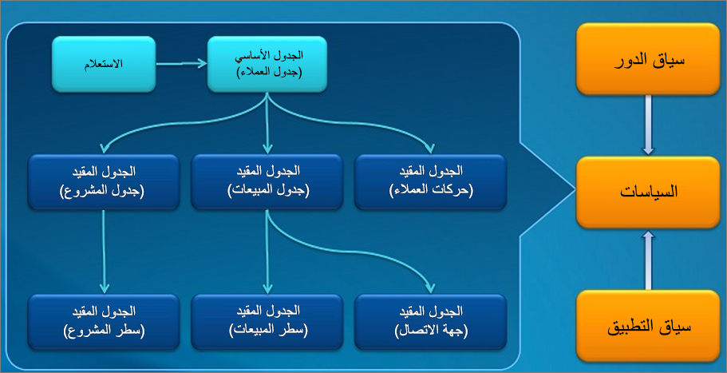

توفر هذه الوحدة نظرة عامة على سياسات أمان البيانات المفصلة (XDS) في تطبيقات Finance and Operations. يتيح XDS للمطورين استكمال الأمان المستند إلى الأدوار من خلال تقييد الوصول إلى سجلات الجدول بناءً على سياسات الأمان. يطبق الاستعلام الموجود في السياسة عامل تصفية، وسيتم فقط الوصول إلى السجلات التي تفي بشروط عامل التصفية من الجداول المقيدة.

## مكونات سياسة أمان البيانات

مكونات سياسة أمان البيانات هي:
 
- **الجداول المقيدة** - الجدول أو الجداول التي يتم من خلالها تصفية البيانات أو تأمينها. على سبيل المثال، في السياسة التي تؤمن الوصول إلى المعاملات بناءً على العميل، سيكون **CustTrans‎** مثال لجدول مقيد.
- **الجدول الرئيسي** - يُستخدم لتأمين محتوى الجدول المقيد ذي الصلة. في المثال أدناه، سيكون الجدول **CustTable** هو الجدول الأساسي. يجب أن يكون للجدول الأساسي علاقة صريحة بالجداول المقيدة.
- **الاستعلام عن السياسة** - يُستخدم لتأمين محتوى الجداول المقيدة باستخدام شرط النطاق على محتويات الجدول الأساسية. يمكن الوصول إلى السجلات المضمنة في النطاق فقط. يمكن أن يستند النطاق، على سبيل المثال، إلى قيمة محددة للعميل.
- **السياق** – يتحكم في الظروف التي بموجبها تنطبق السياسة. يتوفر نوعان رئيسيان من السياقات هما سياق الدور وسياق التطبيق.:
- **سياق الدور** - استناداً إلى الأدوار التي تم تعيينها للمستخدم. هناك خياران فرعيان لسياق الدور:
    - **RoleName‎** - يشير إلى أن سياسة الأمان يتم تطبيقها فقط على مستخدم التطبيق المعين إلى الدور الذي يساوي قيمة **RoleName‎**.
    - **RoleProperty‎** - تُستخدم هذه القيمة مع خاصية **ContextString‎** لتحديد سياق أدوار مستخدم متعددة. ويتم تطبيقها عندما تكون قيمة **سلسلة السياق** المحددة في الحقل **خاصية الدور** للسياسة هي نفسها قيمة الحقل **ContextString‎** لأدوار المستخدم المعينة.
- **سياق التطبيق** يتم تطبيقه إذا كانت سلسلة السياق التي تم تعيينها بواسطة التطبيق باستخدام XDS::SetContext API هي نفس القيمة المحددة في حقل **سلسلة السياق** للسياسة.
في شجرة مكونات البرنامج (AOT)، يتم عرض السياسات ومكوناتها ضمن **الأمان > السياسات**.

## اعتبارات مهمة
تتم إضافة الاستعلام عن السياسة إلى عبارة WHERE، أو عبارة ON، في عمليات SELECT وUPDATE وDELETE وINSERT المشتملة على الجداول المقيدة المحددة. يمكن أن يكون للاستعلامات المتعلقة بالسياسة تأثير كبير على الأداء ما لم يتم تصميمها واختبارها بعناية. لذلك، تأكد من اتباع إرشادات بسيطة ولكنها مهمة عند تطوير سياسة أمان البيانات المفصلة. لمزيد من المعلومات، راجع [‎‏‎تطوير سياسة أمان البيانات المفصلة (مستند تقني)](/dynamicsax-2012/appuser-itpro/developing-extensible-data-security-policies-white-paper/?azure-portal=true).

عند تطبيق سياستين أمان أو أكثر، فإن التقاطع (وليس الاتحاد) للسجلات المضمنة في كل سياسة هو السجلات الوحيدة التي يمكن الوصول إليها. هذا يعني أن السجل يجب أن يفي بجميع سياسات الأمان المعمول بها قبل السماح بالوصول إلى السجل.

## الموارد الإضافية
للحصول على معلومات حول كيفية تصحيح أخطاء السياسات، وإنشاء سياسات أكثر تقدماً، بما في ذلك تسلسل الجداول المقيدة، وعلاقات الجدول بناءً على التعبيرات، وغير ذلك الكثير، يرجى الرجوع إلى هذه الموارد:

- [إنشاء سياسة أمان](/dynamics365/fin-ops-core/dev-itpro/sysadmin/create-simple-security-policy/?azure-portal=true) 
- [تطوير سياسة أمان البيانات المفصلة (مستند تقني)](/dynamicsax-2012/appuser-itpro/developing-extensible-data-security-policies-white-paper/?azure-portal=true)
- [تأمين البيانات حسب قيمة البعد باستخدام أمان البيانات المفصلة (مستند تقني)](/dynamicsax-2012/appuser-itpro/securing-data-by-dimension-value-by-using-extensible-data-security-white-paper/?azure-portal=true)
- [أمثلة لأمان البيانات المفصلة](https://dynamicspedia.com/tag/xds/?azure-portal=true)
- [إطار عمل أمان البيانات المفصلة (XDS) في D365FO](https://alexdmeyer.com/2019/02/20/extensible-data-security-xds-framework-in-d365fo/?azure-portal=true)

 

