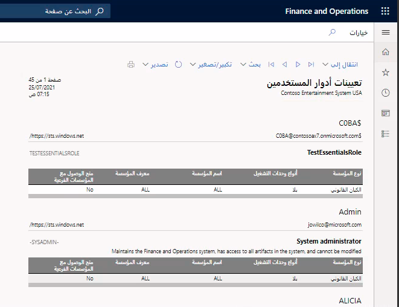
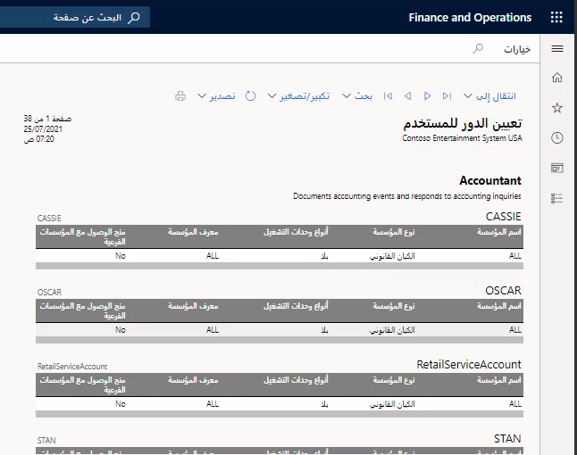
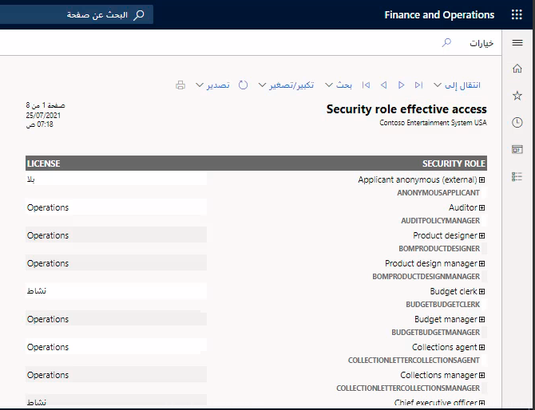
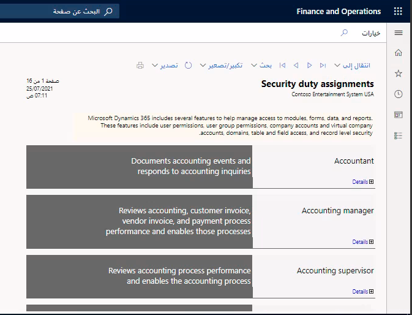

توفر تطبيقات Finance and Operations مجموعة من تقارير الأمان الغنية لمساعدتك على فهم مجموعة أدوار الأمان التي تعمل في البيئة الخاصة بك ومجموعة المستخدمين الذين يتم تعيينهم لكل دور.

يمكن العثور على تقارير الأمان ضمن **إدارة النظام** > **الاستعلامات** > **الأمان**. دعنا نتعرف على بعض تقارير الأمان هذه.

## تقرير تعيينات أدوار المستخدمين 

ينشئ التقرير **تعيينات أدوار المستخدمين** طريقة عرض لتعيينات أدوار المستخدمين الحالية في النظام. وافتراضياً، يشمل التقرير جميع المستخدمين الذين تم تعيين أدوار لهم. يمكنك اختيارياً قصر التقرير على مجموعة معينة من المستخدمين عن طريق إدخال قائمة مستخدمين عند إنشاء التقرير. 

في جزء المحددات **تعيينات أدوار المستخدمين**، انتقل إلى **السجلات المطلوب تضمينها** > **عامل التصفية**. يمكنك من هنا إضافة عوامل تصفية إلى قائمة المستخدمين الذين سيتم إنشاء التقرير لهم أو ازالتها منها. بالنسبة لكل مستخدم في التقرير، يتم توفير قائمة بالأدوار، إلى جانب أي قيود على مستوى الكيان القانوني أو المؤسسة.
 

## تقرير تعيينات الأدوار للمستخدمين 

يوفر تقرير ‏‏**تعيين الدور إلى المستخدم** تجميعاً لتعيينات الأدوار. ويعرض توسيع دور في التقرير قائمة بالمستخدمين الذين تم تعيينهم إلى الدور، كما يؤدي توسيع اسم المستخدم إلى عرض أي قيود تم تطبيقها على الدور. ويمكن تطبيق نفس طريقة تصفية مجموعة المستخدمين على هذا التقرير، كما هو موضح بالنسبة لتقرير **تعيينات أدوار المستخدمين**.
 

## تقرير الوصول الفعال لدور الأمان 

يوفر تقرير **الوصول الفعال لدور الأمان** طريقة عرض للأذونات الفعالة لكل دور أمان. يوفر هذا التقرير قائمة مسطحة بالأذونات مجمعة حسب النوع عبر جميع الأدوار الفرعية والمهام والامتيازات التي يحتوي عليها الدور. 

وقد يستغرق تشغيل هذا التقرير بعض الوقت. إذا كانت هذه هي المرة الأولى التي يتم فيها تشغيل التقرير، أو ربما تم إجراء تغييرات على تعريفات الأدوار، فيجب تعيين خيار **إعادة إنشاء المجموعة** إلى **نعم**. يمكنك اختيارياً تحديد الأدوار المراد تضمينها في التقرير بإضافة عامل تصفية أسفل **السجلات المطلوب تضمينها**.
 

يعرض توسيع دور فئة الكائنات التي يحق للدور الوصول إليها. وسيؤدي توسيع أحد أنواع الكائنات إلى إظهار قائمة تفصيلية بكل كائن من هذا النوع يتضمنه الدور.

## تقرير تعيينات رسوم الأمان 

يقدم تقرير **تعيينات رسوم الأمان** طريقة عرض لجميع المهام التي يتضمنها أحد الأدوار. ويمكن تكوين هذا التقرير ليتم تشغيله على أي مجموعة أدوار لضمان الحفاظ على الفصل بين المهام. افتراضياً، سيتضمن التقرير جميع الأدوار. لتقييد الأدوار المضمنة، قم بتحسين التصفية المتوفرة في قسم **السجلات المطلوب تضمينها**.
 

سيؤدي توسيع دور في تقرير **تعيينات رسوم الأمان** إلى إظهار كل مهمة تم تعيينها إلى الدور، بالإضافة إلى تفاصيل المهمة.