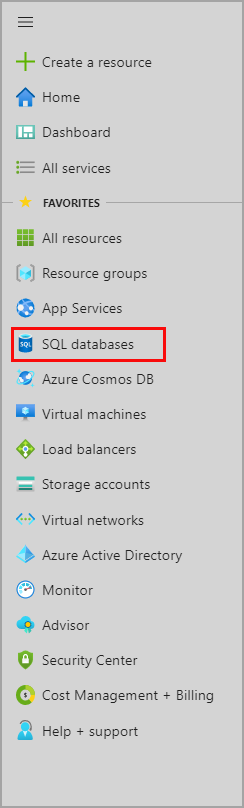
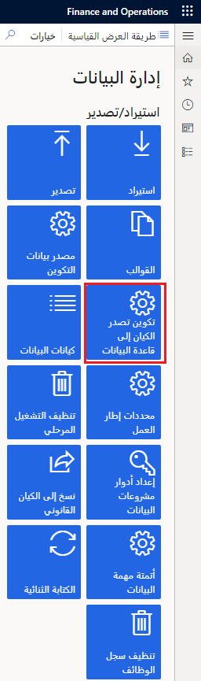
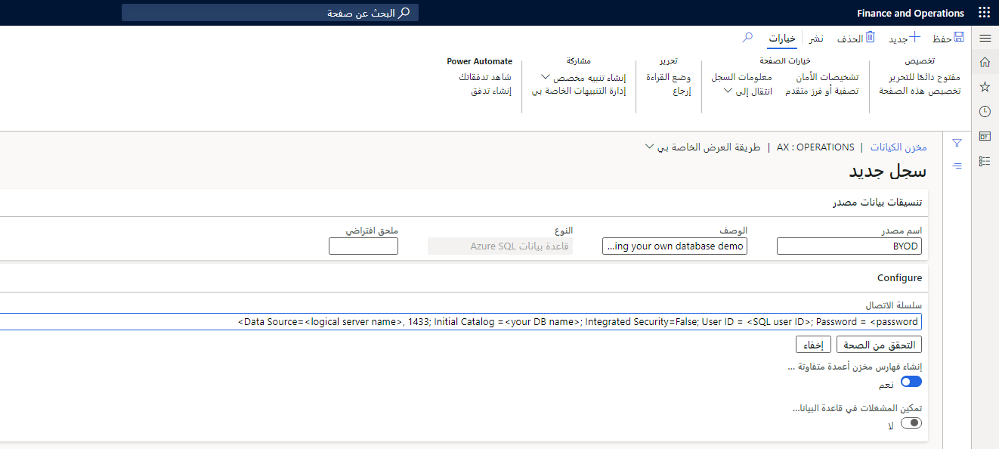

تتيح ميزة إحضار قاعدة بياناتك الخاصة (BYOD)‬ للمسؤولين تكوين قاعدة بياناتهم، ومن ثم تصدير كيان بيانات واحد أو أكثر إليها، وهي متوفرة في تطبيقات Finance and Operations. على وجه التحديد، تتيح لك هذه الميزة إكمال المهام التالية:

- تحديد قاعدة أو أكثر من قواعد بيانات Microsoft Azure SQL والتي يمكنك تصدير بيانات الكيان من تطبيقات Finance and Operations إليها.
- تصدير جميع السجلات (الدفع الكامل) أو السجلات التي تم تغييرها أو حذفها فقط (دفع تزايدي).
- استخدام إمكانيات الجدولة الثرية لإطار عمل الدُفعة لتمكين عمليات التصدير الدورية.
- الوصول إلى قاعدة بيانات الكيان باستخدام Transact-SQL (T-SQL)، وتوسيع قاعدة البيانات عن طريق إضافة المزيد من الجداول.
- تصدير كيانات إلى قواعد بيانات متعددة.

يُوصى باستخدام ميزة BYOD عند القيام بما يلي:

- تصدير البيانات من تطبيقات Finance and Operations إلى مستودع البيانات الخاص بك.
- استخدام الأدوات التحليلية بخلاف Power BI، وتتطلب هذه الأدوات وصول T-SQL إلى البيانات.
- إجراء تكامل دُفعات مع الأنظمة الأخرى.

إذا كان لديك حلول تكامل تتطلب وصول T-SQL المباشر إلى قاعدة البيانات، فإن BYOD تمثل مسار الترقية الموصى به. 

قبل أن تتمكن من تكوين خيار التصدير واستخدام خاصية BYOD، يجب عليك إنشاء قاعدة بيانات SQL لبيئات الإنتاج باستخدام مدخل Azure. 
 
 

يجب أيضاً إنشاء حساب مستخدم SQL لتسجيل الدخول إلى قاعدة البيانات. تأكد من تسجيل اسم الخادم واسم قاعدة البيانات ومعرف مستخدم SQL وكلمة المرور وحفظها. ستستخدم هذه القيم عند تكوين خيار تصدير الكيان.

إذا كنت تستخدم خاصية BYOD للتكامل مع أداة ذكاء الأعمال (BI)، ففكر في إنشاء قاعدة بيانات SQL متميزة. وتدعم قواعد البيانات المتميزة فهارس مخزن الأعمدة متفاوتة المسافات (CCIs). فهارس مخزن الأعمدة متفاوتة المسافات (CCI) هي فهارس في الذاكرة تعمل على تحسين أداء قراءة الاستعلامات التي تعتبر نموذجية في أحمال العمل التحليلية والمتعلقة بإعداد التقارير. 

إذا كنت تستخدم ميزة BYOD لتصدير البيانات إلى قاعدة بيانات مرحلية أو لأغراض التكامل العامة، فيمكنك استخدام قاعدة بيانات قياسية.

لتكوين تصدير الكيان، اتبع هذا الاجراء.

1.  انتقل إلى مساحة عمل **إدارة البيانات** وحدد لوحة **تكوين تصدير الكيان إلى قاعدة البيانات**.
 
    

2.  إذا قمت بالفعل بتكوين أي قواعد بيانات، فستظهر قائمة وستحتاج إلى تحديد قاعدة بيانات. ثم قم بتخطي الخطوة رقم 3.
3.  لتكوين قاعدة بيانات جديدة، حدد **جديد**، ثم أدخل اسماً فريداً ووصفاً لقاعدة البيانات الجديدة. 
4.  أدخل سلسلة الاتصال بالتنسيق التالي: **مصدر البيانات**=&lt;اسم الخادم المنطقي&gt;، **1433**؛ **الكتالوج الأولي** =&lt;اسم قاعدة بياناتك&gt;؛ **الأمان المتكامل**=خطأ؛ **معرّف المستخدم** = &lt;معرّف مستخدم SQL&gt;؛ **كلمة المرور** = &lt;كلمة المرور&gt;
 
    

5.  حدد **التحقق من الصحة**، وتأكد من نجاح الاتصال.

    عند اجتياز التحقق من الصحة، تظهر قاعدة البيانات التي قمت بتكوينها لتصدير الكيان في قوائم قواعد البيانات.

6.  افتراضياً، يتم تمكين خيار **إنشاء فهارس مخزن الأعمدة متفاوتة المسافات**. يُحسّن هذا الخيار قاعدة البيانات الوجهة الخاصة بالاستعلامات المحددة عن طريق تحديد فهارس مخزن الأعمدة متفاوتة المسافات (CCI) للكيانات التي تم نسخها من Finance and Operations.

7.  افتراضياً، يتم تعطيل خيار **تمكين المشغلات في قاعدة البيانات الهدف**. يحدد هذا الخيار مهام التصدير لتمكين مشغلات SQL في قاعدة البيانات الهدف، ويتيح لك ربط العمليات النهائية في المشغل لتنظيم الإجراءات التي يجب أن تبدأ بعد إدراج السجلات. 

8.  يمكنك الآن ترحيل كيان واحد أو أكثر في قاعدة البيانات الجديدة عن طريق تحديد خيار **ترحيل** الموجود في القائمة.

بعد ترحيل الكيانات إلى قاعدة البيانات الوجهة، يمكنك استخدام ميزة **تصدير** الموجودة في مساحة عمل **إدارة البيانات** لنقل البيانات. تتيح لك ميزة **تصدير** تحديد وظيفة **نقل البيانات** التي تحتوي علي كيان واحد أو أكثر.

يمكنك استخدام صفحة **تصدير** لتصدير البيانات من تطبيقات Finance and Operations إلى العديد من تنسيقات البيانات الهدف، مثل ملف القيم المفصولة بفاصلة (CSV). وتدعم هذه الصفحة أيضاً قواعد بيانات SQL كوجهة أخرى.

تضم قيمة &lt;اسم الخادم المنطقي&gt; تنسيقاً مثل &lt;yourSqlAzureServername&gt; .**database.windows.net**، الذي يمكن العثور عليه في مدخل Azure عن طريق تحديد قائمة قواعد بيانات SQL. 

بالنسبة للسيناريوهات التي تقرأ فيها أنظمة إعداد التقارير البيانات من BYOD، يوجد دائماً تحدٍ متمثل في ضمان حصول أنظمة إعداد التقارير على بيانات متسقة من BYOD بينما تكون المزامنة من تطبيقات Finance and Operations قيد التقدم. 

يتم دعم مشغل واحد لكل عملية إدراج مجمعة. يتم تحديد حجم الإدراج المجمع بواسطة معلمة **الحد الأقصى لحجم إدراج الالتزام** في Data Management Framework.

يمكنك تحقيق هذه النتيجة من خلال عدم قراءة أنظمة إعداد التقارير مباشرة من الجداول المرحلية التي تم إنشاؤها بواسطة عملية BYOD. تحتفظ الجداول المرحلية بالبيانات أثناء مزامنتها من مثيل تطبيقات Finance and Operations ومن ثم ستتغير باستمرار. 

استخدم ميزة مشغل SQL لتحديد وقت اكتمال مزامنة البيانات من تطبيقات Finance and Operations، ثم تجهيز أنظمة إعداد التقارير النهائية.