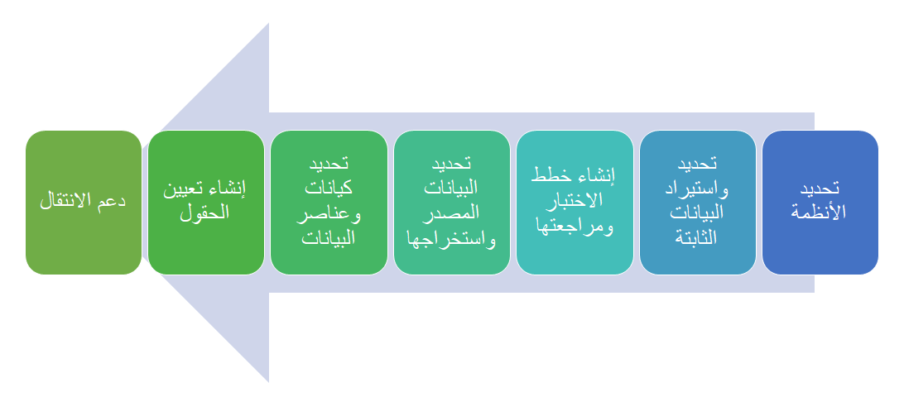
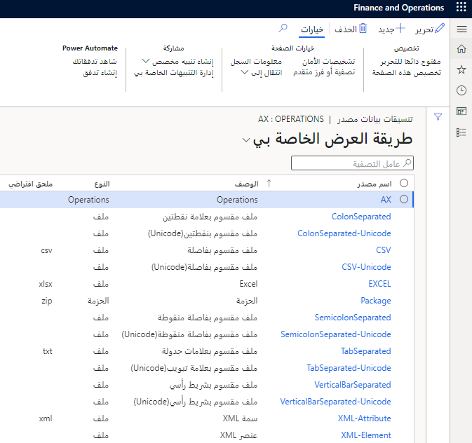
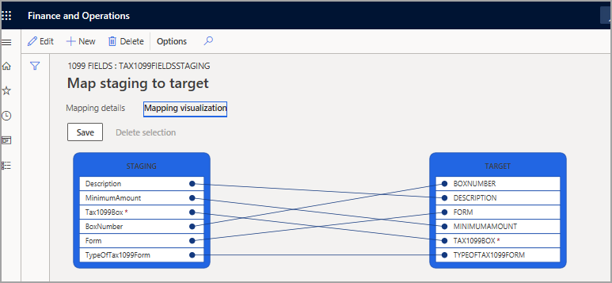
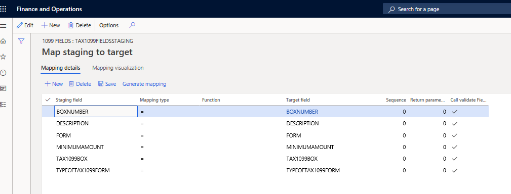

للتحضير لترحيل البيانات، تكون الخطوة الأولى تحديد الأنظمة (القديمة) ذات الصلة التي يستخدمها العميل حالياً. ثم تحتاج إلى تحديد البيانات الثابتة المشتركة بين الصناعات واستيرادها.

## تحديد الأنظمة (القديمة) ذات الصلة

النظام القديم هو حل أعمال له بعض السمات المشتركة مع الحلول الحالية في السوق، مثلاً يستند إلى تقنية أو تصميم قديم، أو غير متوافق أو يعد دمجه مع أنظمة حالية صعباً وباهظ التكلفة، وقد لا يمكن شراؤه من موردين نظراً لعدم توفره وإيقافه. 

وقد يكون لكل نظام قديم خيار تنسيق تصدير بيانات مختلف، ويجب اعتباره جزءاً من التخطيط لترحيل البيانات، ويجب أن تكون مستعداً لاستخراج البيانات من مصادر بيانات قديمة.

## تحديد البيانات الثابتة المشتركة بين الصناعات واستيرادها 

يمكن أن تكون لدى العميل قطاعات مختلفة، مثل التوزيع والتجارة، والتصنيع، والبيع بالتجزئة. حتى إذا كنت تدير ترحيل بيانات العميل التي تنصب على مجال معين فقط، مثل التصنيع، فلا يزال عليك الاستقصاء لتحديد ما إذا كان العملاء والموردون الخاصون به والذين قد يمثلون مجالاً مختلفاً كبائعين مثلاً، عن أي بائعي التجزئة هؤلاء يتبادل بيانات مع عميلك. 

عند تخطيط ترحيل البيانات، تحتاج إلى تعريف البيانات الشائعة التي لا تتغير بشكل متكرر، مثل رموز البلدان أو الرموز البريدية أو الولايات أو المناطق.

ويساعد تحديد البيانات الثابتة المشتركة بين مختلف القطاعات أو المجالات في خفض التكلفة وإعداد البيانات المصدر وتنظيفها والحصول على إجماع العميل قبل استيراد البيانات إلى تطبيقات Finance and Operations.

## إنشاء خطط اختبار لترحيل البيانات ومراجعتها

يجب أن تكون خططك الخاصة بترحيل البيانات جاهزة لإرشادك خلال العملية. تأكد من تطبيق أذونات النظام الصحيحة على الموارد لتحقيق ترحيل بيانات ناجح.

تأكد من عمل نسخة احتياطية من قاعدة البيانات والملفات المصدر التي تخطط لترحيلها. وإذا واجهت أي مشاكل أثناء الترحيل، كتلف ملفات أو عدم اكتمالها أو فقدها، فإنك تحتاج إلى تصحيح الخطأ واستعادة قاعدة البيانات من النسخة الاحتياطية.

يجب استخراج جميع البيانات من النظام المصدر، ثم ترحيل البيانات إلى الهدف، وهو تطبيقات Finance and Operations. ثم تحتاج إلى تنظيف البيانات وتحويلها إلى التنسيق الصحيح لنقلها إلى تطبيقات Finance and Operations. 

وأخيراً، قم بتحميل البيانات التي تم تنظيفها وإلغاء تكرارها إلى إدارة بيانات تطبيقات Finance and Operations وتعيين الحقول واستيراد البيانات إلى تطبيقات Finance and Operations. 

تأكد دائماً من مراقبة ترحيل البيانات أثناء العملية؛ حتى تتمكن من اكتشاف أي مشكلات أو أخطاء وحلها حال ظهورها.

بمجرد اكتمال الترحيل، تأكد من عدم وجود مشكلات اتصال مع النظام المصدر وFinance and Operations. هدفك هو التأكد من أن جميع البيانات تم ترحيلها بشكل صحيح عن طريق تنفيذ اختبار الوحدة والنظام والانحدار وغيرها من الاختبارات السارية. ولا تنسَ أبسط طريقة، وهي استخدام التقارير والاستعلامات المضمنة في Finance and Operations، ثم جعل المساهم الرئيسي للعميل يتحقق من صحة البيانات ويقارن البيانات التي تم ترحيلها مع نظامها القديم.

على سبيل المثال، افترض أنك تقوم بترحيل مخطط الحسابات والحركات المرحلة وما إلى ذلك. بعد ترحيل بيانات لفترة مالية معينة، تقوم بتشغيل طباعة ميزان المراجعة، ثم تطلب من المدير المالي (أو أحد الرؤساء الماليين لدى عميلك) مقارنة النتائج ومطابقتها مع التقرير المالي على نظامه القديم قبل ترحيل الفترة التالية.

## تحديد البيانات المصدر واستخراجها

عندما تقوم وفريقُك بتحليل البيانات واسترداد المعلومات ذات الصلة من مصادر بيانات (مثل قاعدة بيانات) بنمط معين، فذلك وقت استخراج البيانات ذات الصلة. قد تحتاج إلى إجراء معالجة بيانات أكبر، تنطوي على إضافة بيانات تعريف ودمج بيانات أخرى، وهي عملية أخرى في سير عمل البيانات.

## تحديد كيانات وعناصر البيانات ذات الصلة

تحتاج إلى معرفة مصادر البيانات المهمة للتحليل. إذا كانت المعلومات التي يتم تحليلها ترتبط فقط بالسيناريو الحالي، فيجب تنحيتها جانباً لأنه يجب عليك فقط استخدام مصادر البيانات ذات الصلة المطلقة بسيناريو الترحيل.

يجب ألا تُحضر جميع البيانات من مصادر بيانات متعددة إلى تطبيقات Finance and Operations مرة واحدة، وإنما يجب أن تكون لديك خطة مناسبة تُرشدك وفقاً لسيناريو العمل.

على سبيل المثال، إذا كنت تنوي إحضار جميع أوامر الشراء الموجودة في تطبيقات Finance and Operations من نظام قديم، فتوجد عدة كيانات مرتبطة وذات صلة يجب وضعها بعين الاعتبار أيضاً، مثل مجموعات الموردين والموردين والأكواد الضريبية ورؤوس وسطور أوامر الشراء وغيرها الكثير.

قبل بدء عملية ترحيل البيانات، حدد البيانات التي ستقوم بترحيلها، والتنسيق الذي تتخذه حالياً، ومكان وجودها، والتنسيق الذي يجب أن تكون عليه بعد الترحيل. وضع في اعتبارك ما إذا كان ترحيل البيانات سيتداخل مع العمليات التجارية العادية أو سيُسهم في تعطل العمل. وإذا كان الأمر كذلك، فستحتاج إلى تخطيط أوقات خارج ساعات العمل أو إجازات نهاية أسبوع لعملية الترحيل. تذكر أيضاً اجراء النسخ الاحتياطي لقاعدة البيانات قبل بدء ترحيل البيانات. ويجب إبلاغ العميل بأوقات التعطل المحتملة، حتى يمكن التخطيط وفقاً لذلك. تذكر أن استمرارية الأعمال يجب أن تكون أولى أولوياتك دائماً. 

وفي أغلب الأحيان، يجب تغيير بياناتك المصدر وتنظيفها، أو حتى تقسيمها إلى أقسام أكثر. يساعدك التحقق من البيانات في التحقق من توافر البيانات وإمكانية الوصول إليها واكتمالها وكونها بالتنسيق الصحيح. ويسمى هذا تطهير البيانات. المرحلة الأولى في تطهير البيانات هي تحديد القواعد التي يجب تنفيذها يدوياً والتي تحتاج إلى التخطيط باعتبارها تُنفذ تلقائياً.  

سيتم عادة إجراء تطهير البيانات اليدوي قبل بدء الترحيل، بينما يمكن إجراء التطهير التلقائي قبل المرحلة الأولى للترحيل أو كجزء منها.

## قم بإنشاء تعيين الحقل بين هياكل البيانات المصدر والهدف

يجب أولاً تحديد تنسيق مصدر البيانات. يمكنك عرض التنسيقات في إدارة البيانات من لوحة **مصدر بيانات التكوين**.
 

في **مصدر بيانات التكوين**، يمكنك إنشاء مصادر بيانات وتعديلها لعمليات الترحيل. إذا حددت مصادر البيانات والكيانات ذات الصلة بها، فيمكنك استخدام أنواع مختلفة من مصادر البيانات حسب التنسيق الذي يتم تصديره من الأنظمة الخارجية، والتي بعضها أنظمة قديمة.
 

عند إضافة كيان إلى مشروع إدارة البيانات لعملية استيراد أو تصدير، تُنشئ تطبيقات Finance and Operations تعيين حقول بين البيانات المصدر والجدول الهدف لكل كيان بيانات، يطابق مخطط الجدول المقترن بكيان البيانات. 
 

نوع الحقل، وما إذا كان حقلاً مطلوباً، هما من بين أمثلة بيانات التعريف الخاصة بالجدول الذي يتم عرضه في علامة التبويب **تفاصيل التعيين**. وهنا، يمكنك اختيار تجاهل القيم الفارغة وتحديد معرف نص لاستخدام القيم النصية بشكل صحيح من حقل البيانات المصدر.

وبدلاً من ذلك، يمكنك استخدام تسمية حقول العداد بدلاً من قيمته.  
 

## دعم الانتقال بين الأنظمة الموجودة والتي تم ترحيلها

يعد تحليل البيانات بين ما هو موجود في النظام القديم وما تم استيراده إلى تطبيقات Finance and Operations جزءاً مهماً من ترحيل البيانات. ويوفر هذا نظرة عامة على البيانات المصدر والجدول الهدف المقابل لها والذي يتم تمثيله بواسطة كيانات البيانات في تطبيقات Finance and Operations. 

من المهم معرفة كيفية عمل كل نظام وكيفية بناء البيانات الموجودة في كل نظام. كما تحتاج أيضاً إلى التحقق من صحة المعلومات التي يتم اكتشافها في مرحلة التحليل لكل مرحلة في ترحيل البيانات، ثم التأكد من ترحيل جميع البيانات بشكل صحيح عن طريق تشغيل تقارير معينة، أو استعلامات. بالتحقق من صحة البيانات، يمكن لفريقك التركيز على المعالجة البنيوية وتأمين الحركة والبيانات فقط.