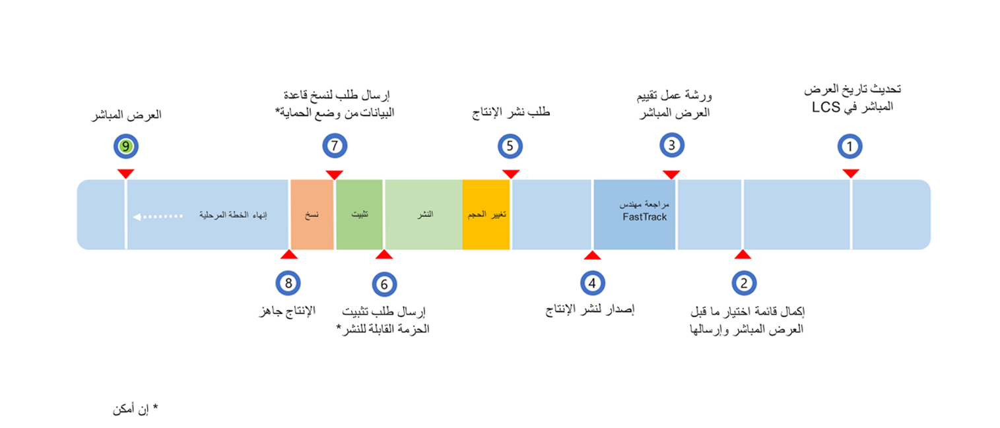

تظهر عملية العرض المباشر في الصورة التالية. 

تتكون عملية العرض المباشر من الإجراءات التالية، والتي يجب اعتبارها خطوات متسلسلة في قائمة الاختيار: 

1.  **تحديث تاريخ العرض المباشر في LCS**: خلال تنفيذ المشروع، تأكد من تحديث التواريخ الرئيسية باستمرار. ابدأ هذه الخطوة، على أبعد تقدير، قبل شهرين إلى ثلاثة أشهر من العرض المباشر. تحتاج إلى المشاركة عن كثب مع أصحاب المصلحة الرئيسيين من العملاء خلال هذه الفترة في حالة حدوث أي شيء غير عادي 
2.  **إكمال وإرسال قائمة اختبار ما قبل العرض المباشر**: يمكنك تنفيذ هذه المهمة بعد إكمال جميع اختبارات قبول المستخدم (UAT) والتوقيع عليها من قِبل أصحاب المصلحة الرئيسيين. يجب على جميع عملاء تطبيقات Finance and Operations استكمال تقييم العرض المباشر مع فريق Microsoft FastTrack قبل أن يتم توزيع بيئة التشغيل الخاصة بهم. يجب عليك إكمال هذا التقييم بنجاح قبل طلب بيئة التشغيل الخاصة بك. وإذا لم تكن معتاداً على استخدام Microsoft FastTrack، راجع [مرحباً بك في FastTrack for Dynamics 365](/dynamics365/fasttrack/?azure-portal=true). يمكنك أيضاً تنزيل قائمة الاختيار من [صفحة موارد FastTrack](https://www.microsoft.com/fasttrack/resources/?azure-portal=true).
3.  **تقييم المشروع (أساسيات التعقب السريع)**: سيقوم المهندس بتسليم التقييم بعد استلام قائمة التحقق وسيواصل بعد ذلك المراجعة حتى يتم توضيح الأسئلة ويتم تطبيق عوامل التخفيف، إن أمكن . من المفترض أن يستغرق التقرير الأولي بضعة أيام، بالإضافة إلى وقت إضافي للتخفيف، إذا لزم الأمر. هذه المهمة هي مسؤولية مهندس FastTrack.  **ورشة عمل المشروع (FastTrack)**: يستخدم مهندس FastTrack ورشة عمل المشروع لتنسيق الأنشطة من أجل التقييم. 
4.  **الإصدار لتوزيع الإنتاج**: إذا تم إرسال طلب توزيع الإنتاج بالفعل، فسيبدأ التوزيع. ومع ذلك، نطلب منك تقديم طلب الإنتاج فقط بعد اكتمال التقييم بنجاح. قم بتنفيذ هذه المهمة بناءً على تقييم مكتمل بنجاح.
5.  **طلب توزيع الإنتاج**: هذه مهمة خدمة ذاتية وتقع على عاتق عميلك، على الرغم من أنه يمكن القيام بها بمساعدتك. يجب على العميل طلب توزيع بيئة التشغيل وإرساله إلى Microsoft فقط بعد انتهاء المهندس المعماري الخاص بـ FastTrack من التقييم.

    كجزء سابق من هذه الخطوة، يجب أن يكون فريق تغيير الحجم قد أبلغ العميل عن المخطط المطلوب في خيار التسعير. يعتمد تغيير الحجم التلقائي على تقدير الاشتراك افتراضياً، بينما يعتمد تغيير الحجم اليدوي على استثناء. 

    في حالة تغيير الحجم التلقائي، يكون توقيت تغيير الحجم فورياً، ولكن قد يستغرق وقتاً أطول إذا تطلب مزيداً من التوضيح لتقدير الاشتراك.
    
    وأخيراً، يقوم فريق Dynamics Service Engineering ‏(DSE) بعملية التوزيع، التي قد تستغرق ما يصل إلى 48 ساعة حتى تكتمل. يُظهر حقل **الحالة** في LCS تقدم التوزيع. سيتم نشر أي أسئلة قد تكون لديك حول طلبك كتعليقات على طلب الخدمة.  
6.  **إرسال طلب تثبيت الحزمة القابلة للتوزيع**: يجب أن يدرك العميل أن تطبيق الحزم يتسبب في توقف النظام. سيتم إيقاف جميع الخدمات ذات الصلة، ولن يتمكنوا من استخدام البيئات أثناء تطبيق الحزمة. يجب أن تخطط وفقاً لذلك وربما تؤدي هذه المهمة خلال ساعات الراحة.
لتثبيت الحزمة، اعتماداً على عدد الحزم، قد يستغرق الأمر خمس ساعات على الأقل من المهلة وأربع ساعات تعطل لكل حزمة.

    بشكل عام، يتم تطبيق 95 بالمائة من التحديثات في أقل من ساعة واحدة؛ ومع ذلك، ما زلنا نوصيك بتوفير فترة تعطل مدتها أربع ساعات في حالة الحاجة إلى التراجع لأي سبب من الأسباب. 

    عندما ينجح نشر الحزمة، ستكون البيئة متاحة بمجرد انتهاء نشر الحزمة، مما يعني أن فترة التوقف الأطول ليس لها أي تأثير سلبي على توفر النظام.
7.  **إرسال طلب لنسخ قاعدة البيانات من وضع الحماية (إن أمكن)**: أنت تحتاج إلى اتباع التعليمات تماماً كما تم توثيقها في [تحديث قاعدة البيانات](/dynamics365/fin-ops-core/dev-itpro/database/database-refresh/?azure-portal=true).

    كما تحتاج إلى طلب **نسخ قاعدة البيانات** لاستعادتها إلى بيئة وضع الحماية. بمجرد الطلب، ستقوم Dynamics Service Engineering ‏(DSE) بنسخ قاعدة بيانات الإنتاج وإتاحتها في مكتبة أصول مشروع LCS. لاحظ أنه قد يحتاج إلى مهلة خمس ساعات وينتج عنه ساعتان من التعطل.

    بشكل عام، يتم الانتهاء من نسخ قاعدة البيانات في أقل من ساعة واحدة. ما زلنا نوصيك بتوفير فترة تعطل مدتها ساعتان في حالة الحاجة إلى التراجع لأي سبب من الأسباب.
8.  **الإنتاج جاهز**: في هذه المهمة، يمكنك أنت وعميلك التحكم في بيئة الإنتاج بعد الانتهاء من جميع الخطوات السابقة. اعتماداً على المشروع، قد يلزم تنفيذ بعض الأنشطة المؤقتة.
9.   **العرض المباشر**: استناداً إلى المشروع، يستطيع العميل إجراء العرض المباشر باستخدام تطبيقات Finance and Operations، المستضافة في بيئة الإنتاج.
