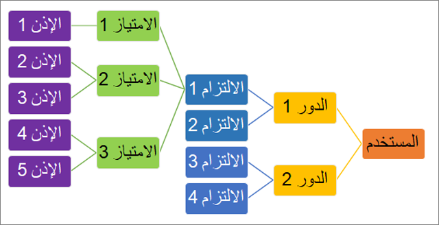

تقدم تطبيقات Finance and Operations  العديد من المهام والامتيازات والأذونات بشكل جاهز.Finance and Operations apps offers many duties, privileges, and permissions out of the box. إذا لزم الأمر، يمكنك إنشاء دور أو مهمة أو امتياز أو إذن جديد في Visual Studio.If needed, you can create a new role, duty, privilege, or permission in Visual Studio.

بينما يمكنك إدارة أدوار الأمان في تطبيقات Finance and Operations، نوصي بأن يكون لديك مسؤول نظام يدير الأدوار أو يعدل المهام والامتيازات خلف الكواليس في Visual Studio.While you can manage security roles in Finance and Operations apps, we recommend that you have a system administrator manage roles or modify duties and privileges behind the scenes in Visual Studio. لا يمكن إنشاء الأذونات أو تعديلها إلا في بيئة التطوير.Permissions can only be created or modified in the development environment. كل دور له مهام مختلفة معينة إليه.Each role has various duties assigned to it. يمكن تعيين امتياز للدور بشكل مباشر، ولكن من أفضل الممارسات تعيين امتياز لأحد المهام.A privilege can be directly assigned to a role, but it is best practice to assign a privilege to a duty. ضمن كل امتياز، يتم تعيين أذونات مختلفة.Within each privilege, various permissions are assigned. تمثل الأذونات الوصول الأكثر دقة إلى تطبيقات Finance and Operations.Permissions represent the most granular access to Finance and Operations apps. 

تمثل الأذونات الوصول إلى الكائنات الفردية القابلة للتأمين، مثل أصناف القائمة والجداول.Permissions represent access to individual securable objects, such as menu items and tables. تتكون الامتيازات من الأذونات، وهي تمثل المهام، مثل إنشاء أمر مبيعات.Privileges are composed of permissions, and they represent tasks, such as generating a sales order. تمنح الامتيازات المستخدم حق الوصول لتنفيذ إجراء معين.Privileges give the user access to perform a specific action. على سبيل المثال، قد يكون لأحد الامتيازات حق وصول للقراءة فقط لعرض سجل، بينما يمنح امتياز آخر حق الوصول لإنشاء سجل وتحريره.For example, one privilege might have read-only access to view a record, while another privilege grants access to create and edit a record. 

تتكون المهام من امتيازات وتمثل أجزاء من عملية أعمال، مثل الحفاظ على معلومات المورد.Duties are composed of privileges and represent parts of a business process, such as maintaining vendor information. تنطبق مجموعة واحدة من الأدوار عبر جميع الشركات والمؤسسات.A single set of roles applies across all companies and organizations. لم يعد يجب على المسؤول إنشاء مجموعات مستخدمين منفصلة والاحتفاظ بها لكل شركة، كما كان الحال في الإصدارات السابقة.An administrator no longer must create and maintain separate user groups for each company, as was the case in earlier versions. على الرغم من أن الأدوار ليست خاصة بشركة أو مؤسسة، إلا أنه يمكن للمسؤول التحكم في الوصول عن طريق تحديد شركة أو مؤسسة لمستخدم في دور ما.Even though roles are not specific to a company or organization, the administrator can control access by specifying a company or organization for a user in a role.

**مثال****Example**

يمكن أن يساعد مثال المحاسبة في شرح المهام والامتيازات والأذونات بشكل أفضل في واجهة المستخدم الخاصة بتطبيقات Finance and Operations.An accounting example can help better explain duties, privileges, and permissions in the user interface of Finance and Operations apps. 

في دورة معالجة المحاسبة، توجد مهام **صيانة دفاتر الأستاذ** و **صيانة حركات البنوك**.In the accounting process cycle, there are the **Maintain ledgers** and **Maintain bank transactions** duties. تحتوي مهمة **صيانة حركات البنوك** على امتيازات **إنشاء إيصالات الودائع** و **إلغاء المدفوعات**.The **Maintain bank transactions** duty contains the **Generate deposit slips** and **Cancel payments** privileges. يحتوي امتياز **إلغاء المدفوعات** على أذونات أصناف القائمة والحقول والجداول المطلوبة لإلغاء المدفوعات.The **Cancel payments** privilege contains permissions to the menu items, fields, and tables that are required to cancel payments. يمكن إعادة استخدام كل إذن وامتياز ومهمة في أدوار ومهام وامتيازات أخرى.Each permission, privilege, and duty can be reused in other roles, duties, and privileges. على سبيل المثال، سيكون لمدير الحسابات الدائنة نفس الأذونات التي يتمتع بها موظف الحسابات الدائنة، ولكن سيكون لديه أذونات إدارية إضافية أيضاً.For example, an Accounts payable manager would have the same permissions as an Accounts payable clerk, but would have additional managerial permissions as well.

## إنشاء أدوار ومهام وامتيازات جديدةCreate new roles, duties, and privileges

في Visual Studio، يمكنك إنشاء أدوار ومهام وامتيازات جديدة عن طريق إضافة عنصر إلى مشروعك في إطار **مستكشف الحلول**.In Visual Studio, you can create new roles, duties, and privileges by adding an item to your project in the **Solution Explorer** window. بالإضافة إلى ذلك، يمكنك إنشاء أذونات جديدة مباشرة من خلال امتياز في إطار مصمم العناصر.Additionally, you can create new permissions directly through a privilege in the element designer window.

هناك طريقتان لتعيين مهام لدور هما:Two ways to assign duties to a role are:

-   أضف مهمة جديدة في عقدة **المهام** بالدور في إطار مصمم العناصر.Add a new duty within the **Duties** node of the role in the    element designer window.
-   حدد مهمة من شجرة كائن التطبيق (AOT) واسحبه إلى عقدة **المهام** في إطار مصمم العناصر.Select a duty from the Application Object Tree (AOT) and drag it to the **Duties** node in the element designer window.
    تنطبق نفس العملية على تعيين الامتيازات للأدوار.This same process applies to assigning privileges to roles. يمكنك أيضا إنشاء ملحق لدور أو مهمة أو امتياز موجود.You can also create an extension of an existing role, duty, or privilege.
    سيسمح لك هذا بإضافة واجب أو إزالته من دور، أو ربما تغيير امتياز العرض فقط إلى امتياز تحرير لصفحة معينة في تطبيقات Finance and Operations.This would allow you to add or remove a duty from a role, or perhaps change a view-only privilege to an edit privilege for a certain page in Finance and Operations apps.

اتبع هذه الخطوات لإنشاء عنصر أمان جديد:Follow these steps to create a new security element:

1.  في **Visual Studio**، انتقل إلى إطار **مستكشف الحلول**.In **Visual Studio**, go to the **Solution Explorer** window.
2.  انقر بزر الماوس الأيمن فوق مشروعك وحدد **إضافة > صنف جديد**.Right-click your project and select **Add > New Item**.
3.  في العمود الأيمن، ضمن عُقدة **أصناف Dynamics 365**، حدد    **الأمان**.In the left column, under the **Dynamics 365 Items** node, select    **Security**.
4.  حدد **دور الأمان**، أو **مهمة الأمان**، أو **امتياز الأمان** اعتماداً على نوع العنصر الذي تريد إنشائه.Select **Security Role**, **Security Duty**, or **Security Privilege**, depending on the type of element that you need to create.
5.  قم بإدخال **اسم** لعنصر الأمان.Enter a **Name** for the security element.
6.  حدد **إضافة** لإضافة هذا العنصر إلى مشروعك.Select **Add** to add this element to your project. سيتم فتح العنصر الآن في إطار مصمم العناصر.The element will now be open in the element designer window.
