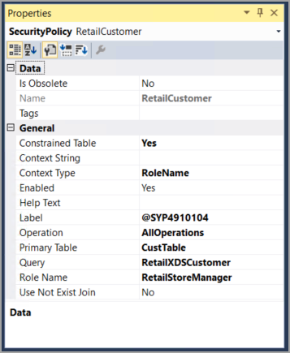
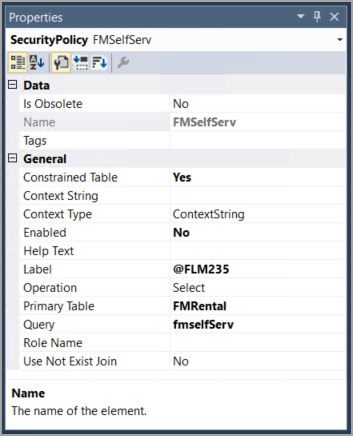

تُستخدم سياسات الأذونات في الأمان المستند إلى الدور لمنح الوصول للمستخدمين لأغراض محددة. ينشأ النوع الأكثر شيوعاً لسياسة الأمان من استعلام مخزن في AOT.

يحدد الاستعلام المعايير التي يجب أن يستوفيها كل صف أو سجل ليتم إرجاعه باستخدام عقدة **النطاقات** في مصدر البيانات الخاص به. تحدد عقدة **الحقول** الحقول التي يجب إرجاعها. يمكنك إنشاء ملف تعريف أمان حقل لاستخدام سياسات الأذونات لتقييد الوصول إلى حقل معين. بعد إنشاء ملف التعريف، يمكنك تعيين مستخدمين أو فرق إلى ملف التعريف هذا ثم إعداد أذونات قراءة أو إنشاء أو كتابة معينة للحقل. 

يمكنك استخدام نُهج الأذونات للتأكد من أنه يمكن للمستخدمين عرض كافة المجالات الضرورية لتطبيقات Finance and Operations والوصول إليها، من الصفحات الموجودة في جزء التنقل إلى الأزرار المحددة في الصفحة. تتم إضافة سياسة أمان جديدة إلى مشروع من خلال نافذة **مستكشف الحلول** باتباع نفس الخطوات مثل إضافة دور جديد أو مهمة أو امتياز إلى مشروع. في نافذة **الخصائص**، يمكنك تحديد تفاصيل السياسة، مثل الاستعلام الذي يمثل أساس السياسة و **الجدول الرئيسي**، وهو مصدر البيانات الأول في الاستعلام الذي تم تعيينه للسياسة. بالإضافة إلى ذلك، يمكنك تحديد **نوع السياق**، الذي يُستخدم لتحديد ما إذا كان النهج قابلاً للتطبيق أو لا.

تعرض الصورة التالية نافذة **الخصائص** في سياسة أمان `RetailCustomer`التي تستخدم نوع سياق `RoleName`. تمت تعبئة خاصية **اسم الدور** لتحديد أن دور `RetailStoreManager` مرتبط بهذه السياسة.

الصورة التالية هي نافذة **الخصائص** في سياسة أمان `FMSelfServ`التي تستخدم نوع سياق `ContextString`. لاحظ أنه يتم استخدام حقول مختلفة عند تحديد نوع سياق مختلف.

