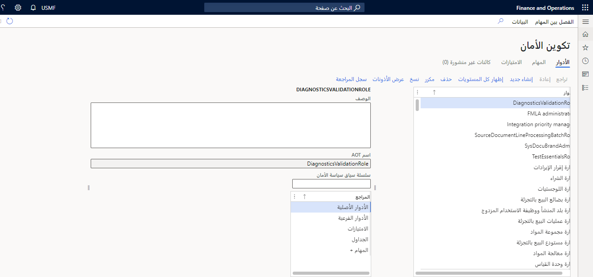

يتم تعيين المستخدمين إلى أدوار الأمان في الوحدة النمطية لإدارة النظام في تطبيقات التمويل والعمليات من خلال الانتقال إلى **إدارة الأمان > الأمان > تكوين الأمان.**

يمكنك تعيين مستخدمين إلى أدوار تلقائياً باستخدام استعلامات من Visual Studio، أو يمكنك تعيين مستخدم فردي لأحد الأدوار يدوياً. بالإضافة إلى ذلك، يمكنك اختيار استبعاد مستخدم من التعيين التلقائي للدور وذلك بإعادة تعيين حالته أو حالتها.

اتبع الخطوات التالية لتعيين مستخدمين إلى أدوار تلقائياً:

1.  في تطبيقات التمويل والعمليات، افتح جزء التنقل عن طريق تحديد أيقونة القائمة في الركن العلوي الأيسر من الصفحة.
2.  وضمن عُقدة **الوحدات النمطية**، حدد **إدارة النظام**.
3.  حدد **الأمان** لتوسيع العقدة، ثم حدد **تعيين مستخدمين للأدوار**.
4.  في العمود الأيمن، حدد الدور الذي ترغب في تعيين مستخدمين إليه، مثل **موظف الحسابات الدائنة**.
5.  في العمود الأوسط، أسفل عنوان **قواعد التعيين الديناميكي للمستخدمين إلى الأدوار**، حدد **إضافة قاعدة**.
6.  حدد اسم الاستعلام المطلوب للقاعدة، مثل **LedgerJournalPostControl**.
7.  لتعديل الاستعلام، مثل إزالة شركة من القاعدة أو إضافة صلة جدول، حدد **تحرير الاستعلام**.
8.  في جزء الإجراء، حدد **التشغيل التلقائي لتعيين الدور**. ستشاهد المستخدمين الذين تمت إضافتهم في العمود الأوسط ضمن **المستخدمون الذين تم تعيينهم للدور**. 