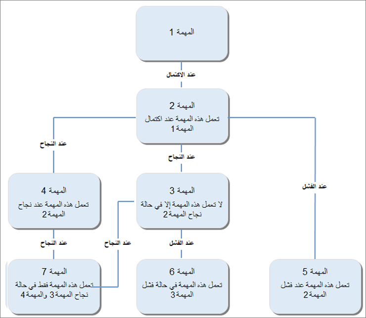

يوفر إطار عمل الدُفعات بيئة معالجة دُفعات غير متزامنة قائمة على الخادم يمكنها معالجة المهام عبر مثيلات متعددة لـ Application Object Server‏ (AOS). إن AOS هي الواجهة بين تطبيق العميل، مثل المستعرض وقاعدة بيانات تطبيقات Finance and Operations.

بالإضافة إلى القدرة على إنشاء وظائف مجمعة مع التنبيهات والتكرار، يمكنك أيضاً استخدام المعالجة المجمعة المستندة إلى الخادم لمعالجة المهام عبر مثيلات متعددة من AOS. هناك العديد من المزايا لاستخدام معالجة الدُفعات المستندة إلى الخادم. يمكنك إضافة تبعيات معقدة بين مهام الدُفعات أو بين المهام. يمكنك أيضاً تشغيل المهام بخطوات متسلسلة أو متوازية وفقاً لاحتياجات العمل. من المهم أن تتذكر أنه إذا لم يكن للمهمة تبعيات، فإنها تعتبر مهمة موازية. 

الرسم التالي هو مثال لوظيفة لها العديد من المهام وتبعيات المهام. في هذا السيناريو، هناك سبع مهام تشكل جزءاً من الوظيفة. يوضح الرسم كيفية إكمال المهام اعتماداً على نتيجة المهام التابعة:

دعنا نتعرف على الجوانب التالية من إطار عمل الدُفعة:

- تتكون **الوظيفة الدفعية** من مهمة دفعة واحدة أو أكثر.

- **مهمة الدُفعة** هي نشاط يتم تشغيله بواسطة وظيفة دفعية. يمكنك إضافة مهام دفعات لها أنواع متعددة من التبعيات إلى وظيفة دفعية. يمكنك أيضاً تكوين مثيلات AOS لتشغيل سلاسل رسائل متعددة، كل منها يدير مهمة. يمكن تنفيذ جميع مهام الدُفعات التي تنتظر التشغيل بواسطة أي مثيل AOS متاح تم تكوينه كخادم دُفعات. لتحسين الإنتاجية وتقليل وقت التنفيذ الإجمالي، يمكنك تحديد وظيفة دفعية مثل العديد من المهام ثم استخدام خادم دُفعات لتشغيل المهام مقابل جميع مثيلات AOS المتاحة.

- **مجموعة الدُفعات** هي سمة مهمة دُفعة. تتيح مجموعة الدُفعات للمسؤول تحديد أو تحديد مثيل AOS الذي يقوم بتشغيل المهمة. عند إنشاء مهمة جديدة، يتم وضعها في مجموعة الدُفعات الافتراضية. يتم تكوين جميع خوادم الدُفعات لمعالجة مجموعة الدُفعات الافتراضية ومهام الانتظار من أي وظيفة. 

    بالإضافة إلى ذلك، يمكنك إنشاء مجموعة دُفعات مسماة، ثم تعيين تقارب بين مجموعة الدُفعات ومثيلات AOS المحددة. بعد إنشاء هذا التقارب، ستقوم مثيلات AOS المحددة فقط بمعالجة المهام من مجموعة الدُفعات المسماة، وستقوم مثيلات AOS هذه بمعالجة المهام من مجموعة الدُفعات المسماة فقط. يمكنك أيضاً إضافة مجموعة الدُفعات الافتراضية إلى الخوادم المكونة، إذا كانت مجموعة الدُفعات هذه مطلوبة.

## تخطيط مخطط خادم الدُفعات 

تعتمد سعة خادم الدُفعات على الحد الأقصى لعدد سلاسل الرسائل التي يمكن تشغيلها بشكل متزامن على مثيل AOS. كل سلسلة تدير مهمة دفعة واحدة. يمكنك إضافة تبعيات معقدة بين المهام. يمكنك تشغيل هذه المهام في خطوات تسلسلية أو خطوات متوازية، اعتماداً على منطق ومتطلبات العمل. تعتبر جميع المهام التي ليس لها أي تبعيات مهام متوازية. تقوم مثيلات AOS التي تم تكوينها كخوادم دُفعات بالتحقق بشكل دوري من المهام التي تنتظر معالجتها. يقوم خادم الدفعات بتعيين كل مهمة متوازية إلى سلسلة ويبدأ في معالجة السلسلة.

يمكنك تشغيل سلاسل متعددة عبر مثيلات AOS متعددة. يقوم كل مثيل AOS تلقائياً بتشغيل سلاسل متعددة، اعتماداً على تلك السعة المحددة في إعدادات التكوين. لذلك، يمكن تشغيل المهام المتوازية من مهمة ما على سلاسل متعددة عبر مثيلات AOS متعددة.

يتحقق خادم الدُفعات من السلاسل المتاحة مرة واحدة في الدقيقة. لذلك، قد تضطر إلى الانتظار لمدة دقيقة قبل أن ترى أنه يتم انتقاء مهمة انتظار للمعالجة بواسطة سلسلة متاحة.

## تخطيط إدارة خادم الدُفعات 

يمكن إدارة جميع خوادم الدُفعات من مكان واحد. أحد الاستخدامات النموذجية لخوادم الدُفعات هو تحميل مهام الأرصدة عبر خوادم متعددة. يمكنك تعيين عدد السلاسل التي سيعالجها خادم الدُفعات.

نظراً لأن خوادم الدُفعات هي أيضاً مثيلات AOS نشطة والتي تطلب الخدمة من عملاء تطبيقات Finance and Operations والمكونات الأخرى المرتبطة بها، يجب أن تحدد بدقة متى يجب أن يكون مثيل AOS متاحاً لمعالجة الدُفعات.

