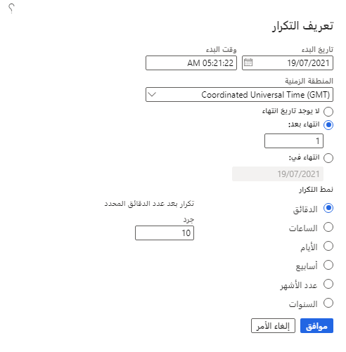
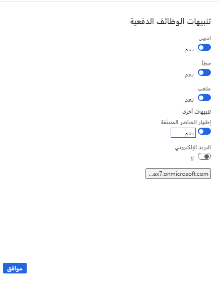

في تطبيقات التمويل والعمليات، يمكن تعيين أي من التقارير أو الإجراءات للتشغيل كوظيفة دفعة بالانتقال إلى قسم **التشغيل في الخلفية** في جزء معلمات التقرير. قم بتعيين **معالجة الدُفعات** إلى **نعم**، ثم قم بتوفير اسم الوظيفة الدفعية، ومجموعة الدُفعات، وما إذا كان يجب تشغيل الوظيفة على أنها خاصة أو مهمة. سيتم بعد ذلك إنشاء التقرير عند تشغيل مهمة الدُفعة.

يمكنك إعداد أنماط التكرار لوظائف الدُفعات. على سبيل المثال، يمكنك إعداد وظيفة لمعالجة الفواتير تلقائياً في نهاية كل شهر.

ما ترى أدناه هو مربع الحوار الموجود في معظم التقارير تقريباً في النظام إذا حددت **تشغيل في الخلفية** عند تحديد أحد التقارير: 

لمراقبة وظائف الدُفعات، يمكنك إعداد التنبيهات. يمكن إرسال التنبيهات عند نجاح مهمة الدُفعة أو فشلها أو انتهاء تشغيلها.

بعد معالجة وظيفة دفعية، يمكنك عرض المحفوظات. يتضمن السجل أي رسائل تمت مواجهتها أثناء تشغيل الوظيفة.

شاهد هذا الفيديو لمعرفة المزيد حول تقارير وظائف الدُفعات.

> [!VIDEO https://www.microsoft.com/videoplayer/embed/RE49D6O]

## جدولة قائمة على أولوية الدُفعة 

يمكنك تشغيل ميزة **الجدولة المستندة إلى أولوية الدُفعة** في مساحة عمل **إدارة الميزات**. تقوم الجدولة المستندة إلى الأولوية بفصل مجموعات الدُفعات عن خادم الدُفعات وتسمح لك بتحديد الأولويات لمجموعات الدُفعات. لا يتعين عليك تعيين مهام دُفعات لخوادم الدُفعات. بدلاً من ذلك، يمكنك استخدام أولويات الجدولة النسبية بناءً على متطلبات العمل المستخدمة لتحديد الترتيب الذي يتم تشغيل المهام به عبر خوادم الدُفعات المتاحة. 

يتم تحديد أولوية الجدولة لمجموعات الدُفعات، ولكن يمكن تجاوزها لوظائف دُفعات معينة. تُستخدم جدولة تصنيفات الأولوية للإعلان عن الأولويات النسبية، ولتحديد ترتيب معالجة الوظائف والعمليات التجارية. الأولويات التي يمكن استخدامها عند استخدام هذه الوظيفة هي **منخفض**، و **عادي**، و **مرتفع**، و **حرج**، و **السعة المحجوزة**. 

لمعرفة المزيد حول كيفية إعداد جدولة الدُفعات على أساس الأولوية، راجع [جدولة الدُفعات المستندة إلى الأولوية](/dynamics365/fin-ops-core/dev-itpro/sysadmin/priority-based-batch-scheduling/?azure-portal=true) 
