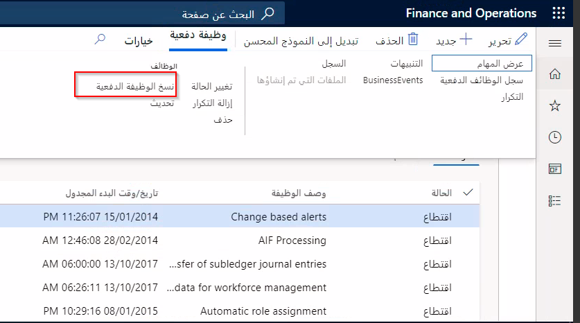

عندما ترغب في إنشاء نفس الوظائف لكيانات قانونية مختلفة، يمكنك استخدام وظيفة **نسخ الوظيفة الدفعية** لنسخ وظيفة دفعية موجودة ومهام الدُفعات، بما في ذلك التكرارات.

يمكنك تعيين الوصف والشركة وجدولة تاريخ ووقت البدء والتكرار والتشغيل حسب الحساب في نفس الوقت. عند نسخ وظيفة دفعية، سيتم أيضاً نسخ أي تنبيهات وتبعيات من وظيفة المصدر.

**إدارة النظام > الاستعلامات > الوظائف الدفعية**

