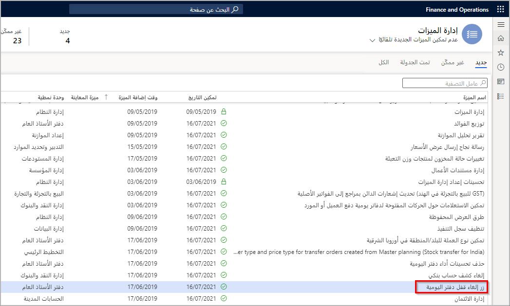
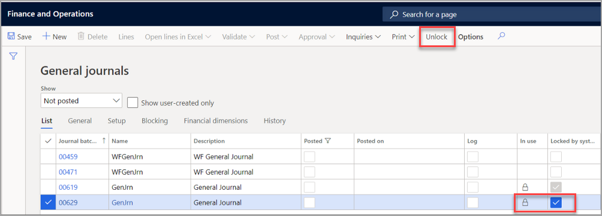
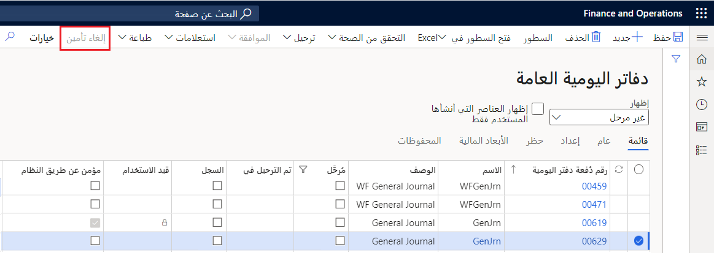

يتوفر زر في صفحة **دفتر اليومية** لإلغاء تأمين دفتر يومية عندما تكون قيمة حالة **مؤمن عن طريق النظام** هي **نعم**. يمكن لمسؤول النظام الذي قام بتحليل وظائف الدُفعات المشغلة، والذي أكَّد أنه لم يعد تتم معالجة دفتر اليومية هذا بشكل نشط بواسطة وظيفة دفعية، إلغاء تأمينه. 

يتم تمكين زر **إلغاء تأمين دفتر اليومية** بواسطة الميزة المسماة **زر إلغاء تأمين دفتر اليومية** في صفحة **إدارة الميزات**.

يمكن تأمين دفتر اليومية لضمان معالجة الحركات بدقة، وباستخدام مستوى عال من التزامن. بالنسبة لدفتر اليومية، يتم السماح لمستخدم واحد فقط في المرة بإدخال السطور، للحفاظ على التكامل والأمان. وأحياناً بسبب الإنهاء غير الطبيعي أو أخطاء أخرى غير متوقعة، يصبح دفتر اليومية مؤمناً.

في لقطة الشاشة التالية، يمكنك ملاحظه أنه تم تأمين دفتر يومية وتمكين الزر **إلغاء تأمين**. لمعرفة أنه غير مؤمَّن، سيكون عليك تخصيص الصفحة لإضافة العمود المسمى **مؤمن عن طريق النظام**.

عند تحديد الزر **إلغاء تأمين**، يتم تعطيل **مؤمن عن طريق النظام**، ولا يظل دفتر اليومية مؤمَّناً. 

