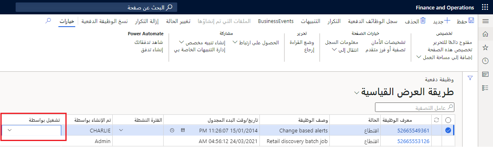

بتعيين مستخدم لدور الأمان **مدير الوظائف الدفعية**، تتوفر للمستخدم أذونات نسخ الوظائف الدفعية، وتغيير الشخص الذي سيقوم بتنفيذ الوظائف، وتحديد النطاقات الزمنية التي يمكن تنفيذ الوظائف خلالها.By assigning a user to the **Batch job manager** security role, the user has permissions to copy batch jobs, change who will execute jobs, and specify the time ranges during which jobs can execute. يعد امتياز الأمان الخاص بالوظائف الدفعية للوظيفة الدفعية "صيانة" جزءاً من دور الأمان الخاص بمدير الوظائف الدفعية، ويسمح للمستخدم بإنشاء وظيفة دفعية غير مخططة ومنح امتيازات لمستخدمين آخرين.The batch Maintain batch jobs security privilege is part of the Batch job manager security role and it allows a user to create an unplanned batch job and grant privileges to other users.

فقط ليتمكن المستخدم من إدارة الوظائف الدفعية، يجب تعيينه إلى دور **مدير الوظيفة الدفعية**، وليس إلى مسؤول النظام أو أمان مسؤول تكنولوجيا المعلومات.To just be able to manage batch jobs, a user should be assigned to the **Batch job manager** role, and not to the System admin or IT admin security.

## ميزة تشغيل بواسطةRun by feature

تتيح ميزة **تشغيل بواسطة** لمديري الوظائف المجمعة تحديد مستخدم لتشغيل وظيفة دفعية.The **Run by** feature allows Batch job managers to specify a user to run the batch job. فعلى سبيل المثال، عندما تريد تغيير المستخدم الذي تم تعيينه حالياً لتشغيل الوظيفة، أو إذا كنت ترغب في تعيين مستخدم سريعاً أثناء نسخ الوظائف الدفعية من شركة إلى أخرى.For example, when you want to change the user who is currently assigned to run the job, or if you want to quickly set a user while copying the batch jobs from one company to another. يمكنك أيضاً استخدام هذه الوظيفة لنسخ وظائف دفعية.You can also use this functionality to copy batch jobs.

يمكنك أدناه رؤية خيار **تشغيل بواسطة** الموجود على **إدارة النظام > الاستعلامات > الوظائف الدفعية > علامة التبويب تبديل إلى النموذج المحسن**.Below you can see the **Run by** option found on **System administration > Inquires > Batch jobs > Switch to enhanced form** tab.

