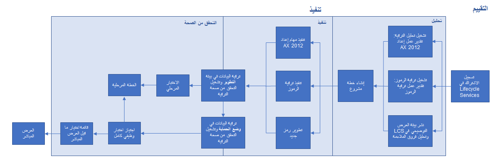
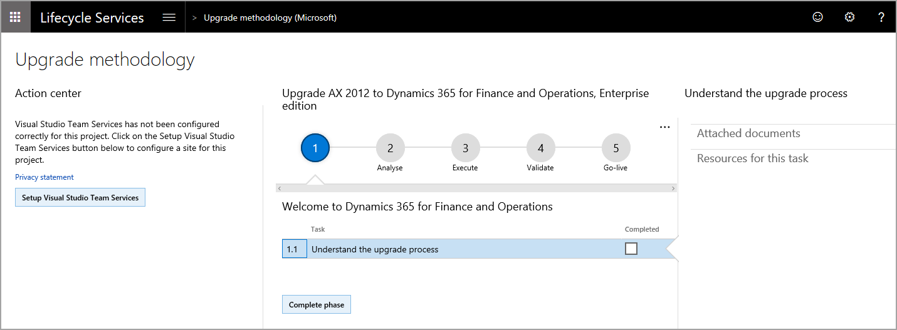

تدعم Microsoft الترقيات من Dynamics AX 2012 R2 وR3 إلى تطبيقات التمويل والعمليات. تكون جميع أدوات الترقية متاحة بشكل عام. تتوفر منهجية ترقية Microsoft Dynamics Lifecycle Services لمساعدتك خلال العملية.

وينقسم إجراء الترقية إلى ثلاث مراحل:

- **التحليل** – تقدير مهام الترقية وتحليلها، وإجراء تحليل الفروق والملاءمة، وإنشاء خطة مشروع.
- **التنفيذ** – إعداد قاعدة بيانات Dynamics AX 2012 وترقية الكود وترقية البيانات.
- **التحقق من الصحة** – التحقق من صحة الترقية واجتياز الاختبار الوظيفي والاختبار المرحلي.
يوضح المخطط التالي عمليه الترقية الشاملة.

وسيُعتبر تحديد منهجية الترقية من الخطوات الأولى التي تتخذها عند إعداد مشروع Lifecycle Services. في مشروع Lifecycle Services الجديد، حدّد منهجية المشروع لـ **ترقية AX** 2012 إلى Dynamics 365 for Finance and Operations، التي تم تصميمها خصيصاً لعملاء Dynamics AX 2012 الذين يقومون بالترقية. وتصف المنهجية المراحل الثلاث بالتفصيل كما توفر ارتباطات للوثائق الداعمة حول العملية. يمكنك إعداد مشروع Lifecycle Services قبل شراء Dynamics 365.   

اتبع الخطوات التالية لإنشاء مشروع Lifecycle Services للترقية: 

1. افتح مستعرضاً وانتقل إلى [https://lcs.dynamics.com](https://lcs.dynamics.com/?azure-portal=true).
1. حدد **تسجيل الدخول** وسجّل الدخول باستخدام حسابك في المؤسسة.  
1. بعد تسجيل الدخول، حدد علامة الزائد (+) في قسم **المشاريع** لإنشاء مشروع جديد.  
1. أدخِل **اسماً** و **وصفاً** للمشروع.  
1. حدد **التمويل والعمليات** لـ **اسم المنتج** و **إصدار المنتج**.  
1. حدد صناعتك في حقل **الصناعة**.  
1. حدد **ترقية AX 2012 إلى Dynamics 365 for Finance and Operations** في الحقل **المنهجية**.  
1. حدد **إنشاء**. ستظهر كل مرحلة من مراحل منهجية الترقية على الشاشة، بطريقة مشابهة لطريقة ظهورها في لقطه الشاشة اللاحقة.  
    
1. يمكنك تحديد كل مرحلة من المراحل والاطلاع على المهام التي يجب إكمالها في كل مرحلة، بالإضافة إلى وصف.  

