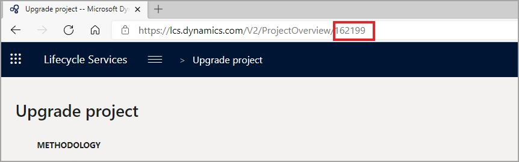

تساعدك المهام في مرحلة التحليل في تقدير الجهد المطلوب للترقية. بالإضافة إلى ذلك، تساعدك المهام في إعداد خطة مشروع. قبل شراء تطبيقات Finance and Operations، يجب إكمال هذه الأنشطة. ومن خلال عرض نقطة بيانات حول الجهد والموارد التي ستحتاجها، يمكن أن تساعدك المهام في اتخاذ قرار شراء مستنير. 

يمكن تقسيم مرحلة التحليل إلى إجراءات متعددة:

1.  **مهام قائمة اختيار ما قبل الترقية** – يجب عليك تثبيت **قائمة اختيار ما قبل الترقية** كجزء من هذه العملية. يمكن استخدام قائمة الاختيار هذه لإدخال التفاصيل التي ستحتاجها لعملية الترقية. للحصول على مزيد من المعلومات، راجع [الترقية من AX 2012 – قائمة اختيار ما قبل الترقية من أجل ترقية البيانات](/dynamics365/fin-ops-core/dev-itpro/migration-upgrade/prepare-data-upgrade/?azure-portal=true).

2.  **تشغيل أداة محلل الترقية** – حدد مهام التحضير في Dynamics AX 2012، استناداً إلى خدمة تشخيص Lifecycle Services، ثم قم بإنشاء فئات المهام التي يمكنها تحديد العناصر التالية:

    - **تنظيف البيانات** – تساعدك هذه العملية في تحديد البيانات التي يمكنك إزالتها دون التسبب في فقد في أداء الوظيفة. تحدد الأداة أنواعاً متنوعة من البيانات التي يمكنك تقليلها عن طريق تشغيل عملية تنظيف. لكل نوع من البيانات، يتم تقديم تفسير حول تأثير عملية التنظيف. يمكنك بعد ذلك تحديد ما إذا كنت تريد تشغيل عملية التنظيف أم لا. يعتمد جزء من تكلفة اشتراكك على حجم قاعدة البيانات. لذلك، عن طريق تقليل الحجم، فإنك تقلل هذا المكون من تكلفة الاشتراك وتساعد في تقليل الوقت المطلوب لعملية العرض المباشر للترقية. تساعد قاعدة البيانات الأصغر في ضمان ترقية أسرع. 
    - **تكوين SQL** – تراجع هذه العملية تكوين SQL وتوصي بالتحسينات. من خلال التأكد من أن SQL يعمل على النحو الأمثل، تساعد هذه العملية في تقليل الوقت المطلوب لعملية العرض المباشر للترقية. 
    - **الميزات المهملة** – تحدد هذه العملية الميزات قيد الاستخدام والتي لن تكون متاحة من الآن فصاعداً (مهملة). سيسمح لك هذا التحقق باكتشاف الثغرات مبكراً وتقديم اقتراحات للبدائل.
    - **تقارير تحليل عمليات الترقية** – يمكن أن تساعد هذه التقارير في تقليل التكلفة والترقية لتجنب فترات التعطل ويمكن أن توفر إرشادات حول مهام تنظيف البيانات.

    يمكنك عرض نتائج خدمة تشخيص النظام في تقرير Microsoft Power BI ضمن Lifecycle Services. للوصول إلى تقرير **محلل الترقية** واستخدامه، انتقل إلى https:\//diag.lcs.dynamics.com/UpgradeAnalysisReport/Report/"ProjectID" (يتعين عليك استبدال **ProjectID** بمعرّف المشروع الحالي الخاص بك، وهو عدد صحيح يمكن العثور عليه في عنوان URL الخاص بمشروع Lifecycle Services الحالي الخاص بك، كما هو موضح في لقطة الشاشة التالية).

    

    تعرض لقطات الشاشة التالية مثالاً لتقرير **محلل الترقية** وقائمة المهام التي يجب إكمالها.

     
    

3.  **تشغيل أدوات تقدير ترقية الكود‬** – توجد خدمة تعمل على ترقية الكود إلى تطبيقات Finance and Operations. تحوّل الكود وتحل معظم المشاكل تلقائياً. وتنتج أيضاً التقارير في Microsoft Excel. في هذه المرحلة، ستقوم بتقدير الجهد. 

    يمكنك تشغيل الأداة باتباع الخطوات التالية:

    1.  انتقل إلى [https://lcs.dynamics.com](https://lcs.dynamics.com/?azure-portal=true).
    2.  سجّل الدخول باستخدام بيانات اعتماد مؤسستك. 
    3.  بعد قيامك بتسجيل الدخول، حدد المشروع من قسم المشاريع. 
    4.  حدد القائمة ثم حدد **ترقية الكود.** 
    
        
    5.  حدد **إضافة** في الزاوية السفلية اليمنى من الصفحة. 
    6.  في الصفحة **خدمة ترقية الكود: إنشاء وظيفة**، حدد **اسماً** للوظيفة، **والإصدار الذي تقوم بالترقية منه** **والإصدار الذي تقوم بالترقية إليه**. 
    7.  حدد خانة الاختيار **تقدير فقط**. 
         > [!NOTE]
        > إذا تركت خانة الاختيار هذه غير محددة، فسيتم إيداع الكود المتراكب الذي تمت ترقيته إلى Microsoft Azure DevOps. 
  
    8.  حدد **إنشاء**. 
    9.  بعد إنشاء الوظيفة الجديدة، ستحتاج إلى إضافة مخزن النماذج الخاص بك. لمزيد من المعلومات، راجع [الكيفية: تصدير مخزن النماذج واستيراده](/dynamicsax-2012/developer/how-to-export-and-import-a-model-store?redirectedfrom=MSDN/?azure-portal=true).
    10. حدد **إضافة ملفات** في الزاوية السفلية اليمنى من الصفحة. 
    11. استعرض وصولاً إلى الملف ثم حدد **تحميل**. 
    12. حدد **تحليل الكود** في الزاوية السفلية اليسرى.
 
        

    عند اكتمال تشغيل الخدمة، سيتم إيداع الكود الخاص بك إلى Azure DevOps (فقط إذا تم إلغاء تحديد خانة الاختيار **تقدير فقط**)، وسيتم إنشاء تقرير Excel لمطور للمراجعة والاستهلاك. يهدف إخراج خدمة ترقية الكود إلى أن يستهلكه المطور. سيساعد هذا الإخراج المطور في تقدير الجهد المطلوب لإكمال مهام ترقية الكود. يتعين على المطور تقييم المهام التي تنشئها الخدمة في Azure DevOps وأحدث إصدار من الكود الذي تنشئه الخدمة لتكوين تقدير.

    تعرض لقطة الشاشة التالية مثالاً على الإخراج من أداة ترقية الكود. يتم إنشاء العديد من ملفات Excel للتحليل. 
    

    لمزيد من المعلومات، راجع [تقدير الجهد باستخدام خدمة ترقية الكود](/dynamics365/fin-ops-core/dev-itpro/migration-upgrade/analyze-code-upgrade/?azure-portal=true) [والتحضير لترحيل الكود إلى Finance and Operations](/dynamics365/fin-ops-core/dev-itpro/migration-upgrade/prepare-migration/?azure-portal=true).

    **نتائج** > **ترقيه الكود** – توفر تقرير ملخص **الترحيل**، حيث ستجد ملخص تحليل الكود، بما في ذلك معلومات التخصيص. 

    في تقرير ملخص **الترحيل**، تتضمن الورقة **RemainingOverlayering** عموداً جديداً باسم **مستودع**، والتي يمكن للمطور أن يستهلكها لمراجعة تقدير عالي المستوى للجهود المطلوبة لتحويل التراكب إلى ملحقات. يتم تصنيف كافة التخصيصات باستخدام الطريقة التالية:

    - **صغير** - الملحق ممكن.
    - **متوسط** - يمكن التحويل إلى ملحقات؛ الاجتياز مطلوب، إذا لزم الأمر. قد تحتاج إلى إنشاء طلب ملحق. 
    - **كبير** - يتم تحديد كافة عناصر التقرير بأنها كبيرة. 
    - **خارج النطاق** – الملحق غير ممكن؛ مطلوب الاجتياز. 
    - **TBD** - غير محدد؛ ستحتاج إلى تحديد حجم المستودع. 
    

4.  **ترقيه الكود** – **كود الجهة الخارجية** - إذا كانت لديك حلول شريكة أو ‏‫‏‫‏‫موردو البرامج المستقلون (ISV)‬، فتجاهل إخراج ترقية الكود لهم واتصل بالشريك للحصول على إصدار من Finance and Operations.
5.  **تحليل ‏‫‏‫الفروق والملاءمة‬ في بيئة الاختبار المعزولة** - استخدم Lifecycle Services لنشر بيئات الاختبار المعزولة لـ Finance and Operations. في مشروع **معاينة** Lifecycle Services، انشر بيئة عرض توضيحي في اشتراكك بعد إعداد موصل Microsoft Azure. أثناء وجودك في مشروع تنفيذ عميل Lifecycle Services، يمكنك نشر بيئة الاختبار المعزولة التي تعد جزءاً من العرض القياسي. بعد اكتمال هذه المهمة، قم بإجراء تحليل الفروق والملاءمة، خاصةً حول الميزات الجديدة والمهملة. لمزيد من المعلومات، راجع [الترقية من Dynamics AX 2012 - نشر بيئة العرض التوضيحي للتحليل](/dynamics365/fin-ops-core/dev-itpro/migration-upgrade/analysis-sandbox?azure-portal=true&toc=dynamics365%2Funified-operations%2Ffin-and-ops%2Ftoc.json).
6.  **إنشاء خطة مشروع** - سيتم توفير قالب مشروع في منهجية Lifecycle Services. يمكنك استخدام الإخراج من تحليل عمليات الترقية لتقدير جهد تحضير Dynamics AX 2012، وترقية الكود لتقدير جهد التطوير، وتحليل الفروق والملاءمة في بيئة الاختبار المعزولة لمعرفة ما إذا كانت هناك حاجة إلى تخصيصات جديدة.

    نظراً لأن تطبيقات Finance and Operations هي تطبيق سحابة يتم تحديثه باستمرار، يمكنك الآن تعديل التطبيق باستخدام الملحقات. تعتبر طريقة التطوير هذه أقل تدخلاً، مما يساعد في تسهيل حصولك باستمرار على التحديثات من Microsoft. لمزيد من المعلومات، راجع [الصفحة الرئيسية لقابلية التوسعة](/dynamics365/fin-ops-core/dev-itpro/extensibility/extensibility-home-page/?azure-portal=true).

    قد تكتشف أن بعض التخصيصات لا يمكن تحقيقها عن طريق الملحقات، وهو ما كان ممكناً مع تراكب الطبقات. قدمت تطبيقات Finance and Operations العديد من إمكانيات الملحقات للسماح بمتطلبات الأعمال نفسها دون تراكب الطبقات. ستحتاج إلى توثيق طلبات تخصيصات معينة تم إجراؤها باستخدام تراكب الطبقات لجعل Microsoft على دراية باحتياجاتك. 

    لمزيد من المعلومات، راجع [‏‫طلبات القابلية للتوسعة‬](/dynamics365/fin-ops-core/dev-itpro/extensibility/extensibility-requests/?azure-portal=true) وقم [بتكوين خدمة ترقية الكود في خدمات Lifecycle Services.](/dynamics365/fin-ops-core/dev-itpro/lifecycle-services/configure-execute-code-upgrade/?azure-portal=true)

