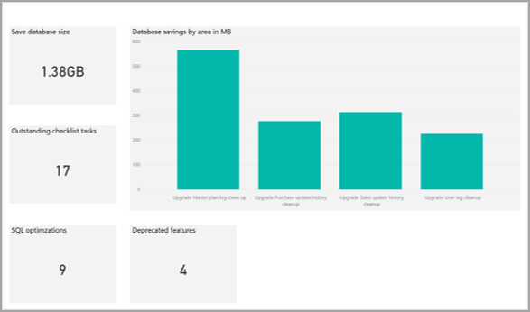

تساعدك المهام في مرحلة التحليل في تقدير الجهد المطلوب للترقية.The tasks in the Analyze phase assist you in estimating the effort that is needed for the upgrade. بالإضافة إلى ذلك، تساعدك المهام في إعداد خطة مشروع.Additionally, the tasks help you prepare a project plan. قبل شراء تطبيقات Finance and Operations، يجب إكمال هذه الأنشطة.Before you purchase Finance and Operations apps, these activities should be completed. ومن خلال عرض نقطة بيانات حول الجهد والموارد التي ستحتاجها، يمكن أن تساعدك المهام في اتخاذ قرار شراء مستنير. By offering a data point about the effort and resources that you will need, the tasks can help you make an informed buying decision. 

يمكن تقسيم مرحلة التحليل إلى إجراءات متعددة:The Analyze phase can be divided into multiple actions:

1.  **مهام قائمة اختيار ما قبل الترقية** – يجب عليك تثبيت **قائمة اختيار ما قبل الترقية** كجزء من هذه العملية.**Pre-upgrade checklist tasks** – You need to install a **pre-upgrade checklist** as part of this process. يمكن استخدام قائمة الاختيار هذه لإدخال التفاصيل التي ستحتاجها لعملية الترقية.This checklist can be used to enter details that you will need for the upgrade process. للحصول على مزيد من المعلومات، راجع [الترقية من AX 2012 – قائمة اختيار ما قبل الترقية من أجل ترقية البيانات](https://docs.microsoft.com/dynamics365/fin-ops-core/dev-itpro/migration-upgrade/prepare-data-upgrade/?azure-portal=true).For more information, see [Upgrade from AX 2012 - Pre-upgrade checklist for data upgrade](https://docs.microsoft.com/dynamics365/fin-ops-core/dev-itpro/migration-upgrade/prepare-data-upgrade/?azure-portal=true).

2.  **تشغيل أداة محلل الترقية** – حدد مهام التحضير في Dynamics AX 2012، استناداً إلى خدمة تشخيص Lifecycle Services، ثم قم بإنشاء فئات المهام التي يمكنها تحديد العناصر التالية:**Run the upgrade analyzer tool** – Identify preparation tasks in Dynamics AX 2012, based on the Lifecycle Services diagnostics service, and then create categories of tasks that can identify the following elements:

    - **تنظيف البيانات** – تساعدك هذه العملية في تحديد البيانات التي يمكنك إزالتها دون التسبب في فقد في أداء الوظيفة.**Data cleanup** – This process helps you identify data that you can remove without causing loss of functionality. تحدد الأداة أنواعاً متنوعة من البيانات التي يمكنك تقليلها عن طريق تشغيل عملية تنظيف.The tool identifies various types of data that you can reduce by running a cleanup process. لكل نوع من البيانات، يتم تقديم تفسير حول تأثير عملية التنظيف.For each type of data, an explanation is given about the impact of the cleanup. يمكنك بعد ذلك تحديد ما إذا كنت تريد تشغيل عملية التنظيف أم لا.You can then decide whether to run the cleanup process or not. يعتمد جزء من تكلفة اشتراكك على حجم قاعدة البيانات.Part of your subscription cost is based on database size. لذلك، عن طريق تقليل الحجم، فإنك تقلل هذا المكون من تكلفة الاشتراك وتساعد في تقليل الوقت المطلوب لعملية العرض المباشر للترقية.Therefore, by reducing the size, you reduce that component of the subscription cost and help reduce the time that is required for the upgrade go-live process. تساعد قاعدة البيانات الأصغر في ضمان ترقية أسرع.A smaller database helps guarantee a faster upgrade. 
    - **تكوين SQL** – تراجع هذه العملية تكوين SQL وتوصي بالتحسينات.**SQL configuration** – This process reviews the SQL configuration and recommends optimizations. من خلال التأكد من أن SQL يعمل على النحو الأمثل، تساعد هذه العملية في تقليل الوقت المطلوب لعملية العرض المباشر للترقية.By making sure that SQL performs optimally, this process helps reduce the time that is required for the upgrade go-live process. 
    - **الميزات المهملة** – تحدد هذه العملية الميزات قيد الاستخدام والتي لن تكون متاحة من الآن فصاعداً (مهملة).**Deprecated features** – This process identifies features in use that are not available moving forward (deprecated). سيسمح لك هذا التحقق باكتشاف الثغرات مبكراً وتقديم اقتراحات للبدائل.This verification will allow you to discover gaps early and make suggestions for alternatives.
    - **تقارير تحليل عمليات الترقية** – يمكن أن تساعد هذه التقارير في تقليل التكلفة والترقية لتجنب فترات التعطل ويمكن أن توفر إرشادات حول مهام تنظيف البيانات.**Upgrade analysis reports** – These reports can help in reducing cost and upgrade downtime and can provide guidance on data cleanup tasks.

    يمكنك عرض نتائج خدمة تشخيص النظام في تقرير Microsoft Power BI ضمن Lifecycle Services.You can view the results of the system diagnostic service in a Microsoft Power BI report within Lifecycle Services. للوصول إلى تقرير **محلل الترقية** واستخدامه، انتقل إلى https:\//diag.lcs.dynamics.com/UpgradeAnalysisReport/Report/"ProjectID" (يتعين عليك استبدال **ProjectID** بمعرّف المشروع الحالي الخاص بك، وهو عدد صحيح يمكن العثور عليه في عنوان URL الخاص بمشروع Lifecycle Services الحالي الخاص بك، كما هو موضح في لقطة الشاشة التالية).To access and use the **Upgrade analyzer** report, go to https:\//diag.lcs.dynamics.com/UpgradeAnalysisReport/Report/"ProjectID“ (you must replace **ProjectID** with your current Project ID, which is an integer that can be found in the URL of your current Lifecycle Services project, as shown in the following screenshot).

    

    تعرض لقطات الشاشة التالية مثالاً لتقرير **محلل الترقية** وقائمة المهام التي يجب إكمالها.The following screenshots show an example of the **Upgrade analyzer** report and the list of tasks that need to be completed.

     
    
Screenshot of the list of tasks that need to be completed.](../media/report-2.png)

3.  **تشغيل أدوات تقدير ترقية الكود‬** – توجد خدمة تعمل على ترقية الكود إلى تطبيقات Finance and Operations.**Run the Code upgrade estimation tools** – A service exists that upgrades the code to Finance and Operations apps. تحوّل الكود وتحل معظم المشاكل تلقائياً.It converts code and resolves most issues automatically. وتنتج أيضاً التقارير في Microsoft Excel.It also produces reports in Microsoft Excel. في هذه المرحلة، ستقوم بتقدير الجهد.In this phase, you will estimate the effort. 

    يمكنك تشغيل الأداة باتباع الخطوات التالية:You can run the tool by following these steps:

    1.  انتقل إلى [https://lcs.dynamics.com](https://lcs.dynamics.com/?azure-portal=true).Go to [https://lcs.dynamics.com](https://lcs.dynamics.com/?azure-portal=true).
    2.  سجّل الدخول باستخدام بيانات اعتماد مؤسستك.Sign in with your organization credentials. 
    3.  بعد قيامك بتسجيل الدخول، حدد المشروع من قسم المشاريع.After you have signed in, select your project from the projects section. 
    4.  حدد القائمة ثم حدد **ترقية الكود.**Select the menu and then select **Code upgrade.** 
    
        
    5.  حدد **إضافة** في الزاوية السفلية اليمنى من الصفحة.Select **Add** in the lower-left corner of the page. 
    6.  في الصفحة **خدمة ترقية الكود: إنشاء وظيفة**، حدد **اسماً** للوظيفة، **والإصدار الذي تقوم بالترقية منه** **والإصدار الذي تقوم بالترقية إليه**.On the **Code Upgrade Service: Create Job** page, specify a **Name** for the job, the **release that you are upgrading from**, and the **release that you are upgrading to**. 
    7.  حدد خانة الاختيار **تقدير فقط**.Select the **Estimate only** check box. 
         > [!NOTE]
        > إذا تركت خانة الاختيار هذه غير محددة، فسيتم إيداع الكود المتراكب الذي تمت ترقيته إلى Microsoft Azure DevOps.If you leave this check box cleared, then overlayered upgraded code will be checked in to Microsoft Azure DevOps. 
  
    8.  حدد **إنشاء**.Select **Create**. 
    9.  بعد إنشاء الوظيفة الجديدة، ستحتاج إلى إضافة مخزن النماذج الخاص بك.After the new job is created, you will need to add your model store. لمزيد من المعلومات، راجع [الكيفية: تصدير مخزن النماذج واستيراده]( https://docs.microsoft.com/dynamicsax-2012/developer/how-to-export-and-import-a-model-store?redirectedfrom=MSDN/?azure-portal=true).For more information, see [How to: Export and Import a Model Store]( https://docs.microsoft.com/dynamicsax-2012/developer/how-to-export-and-import-a-model-store?redirectedfrom=MSDN/?azure-portal=true).
    10. حدد **إضافة ملفات** في الزاوية السفلية اليمنى من الصفحة.Select **Add files** in the lower-left corner of the page. 
    11. استعرض وصولاً إلى الملف ثم حدد **تحميل**.Browse to your file and then select **Upload**. 
    12. حدد **تحليل الكود** في الزاوية السفلية اليسرى.Select **Analyze code** in the lower-right corner.
 
        

    عند اكتمال تشغيل الخدمة، سيتم إيداع الكود الخاص بك إلى Azure DevOps (فقط إذا تم إلغاء تحديد خانة الاختيار **تقدير فقط**)، وسيتم إنشاء تقرير Excel لمطور للمراجعة والاستهلاك.When the service run is complete, your code will be checked in to Azure DevOps (only if the **Estimation only** check box is cleared), and an Excel report will be generated for a developer to review and consume. يهدف إخراج خدمة ترقية الكود إلى أن يستهلكه المطور.The Code Upgrade Service output is intended to be consumed by a developer. سيساعد هذا الإخراج المطور في تقدير الجهد المطلوب لإكمال مهام ترقية الكود.This output will help the developer estimate the effort that is needed to complete the tasks of the code upgrade. يتعين على المطور تقييم المهام التي تنشئها الخدمة في Azure DevOps وأحدث إصدار من الكود الذي تنشئه الخدمة لتكوين تقدير.The developer must evaluate the tasks that the service generates in Azure DevOps and the latest version of the code that the service generates to form an estimation.

    تعرض لقطة الشاشة التالية مثالاً على الإخراج من أداة ترقية الكود.The following screenshot shows an example of the output from the code upgrade tool. يتم إنشاء العديد من ملفات Excel للتحليل.Several Excel files are generated for analysis. 
    

    لمزيد من المعلومات، راجع [تقدير الجهد باستخدام خدمة ترقية الكود]( https://docs.microsoft.com/dynamics365/fin-ops-core/dev-itpro/migration-upgrade/analyze-code-upgrade/?azure-portal=true) [والتحضير لترحيل الكود إلى Finance and Operations]( https://docs.microsoft.com/dynamics365/fin-ops-core/dev-itpro/migration-upgrade/prepare-migration/?azure-portal=true).For more information, see [Estimate effort by using the Code upgrade service]( https://docs.microsoft.com/dynamics365/fin-ops-core/dev-itpro/migration-upgrade/analyze-code-upgrade/?azure-portal=true) and [Prepare to migrate code to Finance and Operations]( https://docs.microsoft.com/dynamics365/fin-ops-core/dev-itpro/migration-upgrade/prepare-migration/?azure-portal=true).

    **نتائج** > **ترقيه الكود** – توفر تقرير ملخص **الترحيل**، حيث ستجد ملخص تحليل الكود، بما في ذلك معلومات التخصيص.**Code upgrade** > **Results** – Provides the **Migration** summary report, where you will find the code analysis summary, including customization information. 

    في تقرير ملخص **الترحيل**، تتضمن الورقة **RemainingOverlayering** عموداً جديداً باسم **مستودع**، والتي يمكن للمطور أن يستهلكها لمراجعة تقدير عالي المستوى للجهود المطلوبة لتحويل التراكب إلى ملحقات.On the **Migration** summary report, the **RemainingOverlayering** sheet includes a new column named **Bucket**, which can be consumed by a developer to review high-level estimate for the efforts required to convert overlayering to extensions. يتم تصنيف كافة التخصيصات باستخدام الطريقة التالية:All customizations are categorized using the following method:

    - **صغير** - الملحق ممكن.**Small** – Extension is possible.
    - **متوسط** - يمكن التحويل إلى ملحقات؛ الاجتياز مطلوب، إذا لزم الأمر.**Medium** – Can be converted to extensions; traversal is required, if needed. قد تحتاج إلى إنشاء طلب ملحق.You might need to create an extension request. 
    - **كبير** - يتم تحديد كافة عناصر التقرير بأنها كبيرة.**Large** – All report elements are defined as large. 
    - **خارج النطاق** – الملحق غير ممكن؛ مطلوب الاجتياز.**Not in scope** – Extension is not possible; traversal is required. 
    - **TBD** - غير محدد؛ ستحتاج إلى تحديد حجم المستودع.**TBD** – Unidentified; you will need to define the bucket size. 
    

4.  **ترقيه الكود** – **كود الجهة الخارجية** - إذا كانت لديك حلول شريكة أو ‏‫‏‫‏‫موردو البرامج المستقلون (ISV)‬، فتجاهل إخراج ترقية الكود لهم واتصل بالشريك للحصول على إصدار من Finance and Operations.**Code upgrade** – **third-party code** - If you have partner solutions or ISVs, ignore the code upgrade output for them and contact the partner for a version of Finance and Operations.
5.  **تحليل ‏‫‏‫الفروق والملاءمة‬ في بيئة الاختبار المعزولة** - استخدم Lifecycle Services لنشر بيئات الاختبار المعزولة لـ Finance and Operations.**Fit-gap analysis on sandbox** - Use Lifecycle Services to deploy sandbox environments of Finance and Operations. في مشروع **معاينة** Lifecycle Services، انشر بيئة عرض توضيحي في اشتراكك بعد إعداد موصل Microsoft Azure.In the Lifecycle Services **Preview** project, deploy a demo environment in your own subscription after setting up a Microsoft Azure connector. أثناء وجودك في مشروع تنفيذ عميل Lifecycle Services، يمكنك نشر بيئة الاختبار المعزولة التي تعد جزءاً من العرض القياسي.While in the Lifecycle Services customer implementation project, you can deploy the sandbox environment that’s part of the standard offering. بعد اكتمال هذه المهمة، قم بإجراء تحليل الفروق والملاءمة، خاصةً حول الميزات الجديدة والمهملة.After this task is completed, perform the fit-gap analysis, especially around new and deprecated features. لمزيد من المعلومات، راجع [الترقية من Dynamics AX 2012 - نشر بيئة العرض التوضيحي للتحليل](https://docs.microsoft.com/dynamics365/fin-ops-core/dev-itpro/migration-upgrade/analysis-sandbox?toc=dynamics365%2Funified-operations%2Ffin-and-ops%2Ftoc.json%2F%3Fazure-portal%3Dtrue/?azure-portal=true).For more information, see [Upgrade from Dynamics AX 2012 - Deploy a demo environment for analysis](https://docs.microsoft.com/dynamics365/fin-ops-core/dev-itpro/migration-upgrade/analysis-sandbox?toc=dynamics365%2Funified-operations%2Ffin-and-ops%2Ftoc.json%2F%3Fazure-portal%3Dtrue/?azure-portal=true).
6.  **إنشاء خطة مشروع** - سيتم توفير قالب مشروع في منهجية Lifecycle Services.**Create a project plan** - A project template will be provided in Lifecycle Services methodology. يمكنك استخدام الإخراج من تحليل عمليات الترقية لتقدير جهد تحضير Dynamics AX 2012، وترقية الكود لتقدير جهد التطوير، وتحليل الفروق والملاءمة في بيئة الاختبار المعزولة لمعرفة ما إذا كانت هناك حاجة إلى تخصيصات جديدة.You can use the output from the upgrade analysis for estimating the Dynamics AX 2012 preparation effort, the code upgrade for estimating the development effort, and the sandbox fit-gap analysis to see if new customizations are needed.

    نظراً لأن تطبيقات Finance and Operations هي تطبيق سحابة يتم تحديثه باستمرار، يمكنك الآن تعديل التطبيق باستخدام الملحقات.Because Finance and Operations apps is a cloud application that is continuously being updated, you can now modify the application by using extensions. تعتبر طريقة التطوير هذه أقل تدخلاً، مما يساعد في تسهيل حصولك باستمرار على التحديثات من Microsoft.This method of developing is less intrusive, which helps make it easier for you to continuously get updates from Microsoft. لمزيد من المعلومات، راجع [الصفحة الرئيسية لقابلية التوسعة](https://docs.microsoft.com/dynamics365/fin-ops-core/dev-itpro/extensibility/extensibility-home-page/?azure-portal=true).For more information, see the [Extensibility home page](https://docs.microsoft.com/dynamics365/fin-ops-core/dev-itpro/extensibility/extensibility-home-page/?azure-portal=true).

    قد تكتشف أن بعض التخصيصات لا يمكن تحقيقها عن طريق الملحقات، وهو ما كان ممكناً مع تراكب الطبقات.You might discover that certain customizations can’t be achieved by extensions, which were possible with overlayering. قدمت تطبيقات Finance and Operations العديد من إمكانيات الملحقات للسماح بمتطلبات الأعمال نفسها دون تراكب الطبقات.Finance and Operations apps have introduced several extension capabilities to allow the same business requirements without overlayering. ستحتاج إلى توثيق طلبات تخصيصات معينة تم إجراؤها باستخدام تراكب الطبقات لجعل Microsoft على دراية باحتياجاتك.You will need to document requests for certain customizations that have been made with overlayering to make Microsoft aware of your needs. 

    لمزيد من المعلومات، راجع [‏‫طلبات القابلية للتوسعة‬](https://docs.microsoft.com/dynamics365/fin-ops-core/dev-itpro/extensibility/extensibility-requests/?azure-portal=true) وقم [بتكوين خدمة ترقية الكود في خدمات Lifecycle Services.](https://docs.microsoft.com/dynamics365/fin-ops-core/dev-itpro/lifecycle-services/configure-execute-code-upgrade/?azure-portal=true)For more information, see [Extensibility requests](https://docs.microsoft.com/dynamics365/fin-ops-core/dev-itpro/extensibility/extensibility-requests/?azure-portal=true) and [Configure the code upgrade service in Lifecycle Services.](https://docs.microsoft.com/dynamics365/fin-ops-core/dev-itpro/lifecycle-services/configure-execute-code-upgrade/?azure-portal=true).

