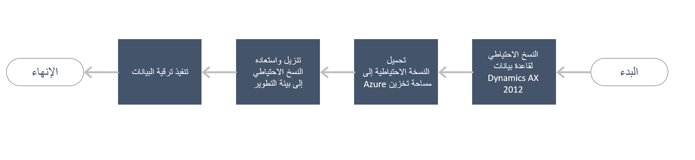

في مرحلة التنفيذ، ستعمل في مشروع تنفيذ Lifecycle Services لتطبيقات Finance and Operations. للانتقال إلى مرحلة التنفيذ، يجب شراء تطبيقات Finance and Operations.

وتعد الأنشطة التالية ضرورية في مرحلة التنفيذ:

1.  **مهام إعداد Dynamics AX 2012** - إكمال المهام المحددة في مرحلة التحليل، مثل مهام تنظيف البيانات وتكوين SQL وقائمة اختيار ما قبل الترقية.

2.  **قائمة اختيار ما قبل الترقية** - ترشدك خلال الإعداد لتشغيل الترقية. يجب عليك تثبيت إصلاح عاجل في Dynamics AX 2012، حيث يعمل على تثبيت قائمة اختيار ترقية Dynamics 365. يلزم إكمال المهام التي تتطلّب إضافة البيانات (على سبيل المثال، تعيين المستخدم إلى Azure AD). إذا كنت تقوم بالترقية من Dynamics AX 2012 R3، فسيتعيّن عليك تثبيت [مقالة قاعدة المعارف 4035163](https://go.microsoft.com/fwlink/?linkid=852255). إذا كنت تقوم بالترقية من Dynamics AX 2012 R2، سيتعيّن عليك تثبيت [مقالة قاعدة المعارف 4048614](https://go.microsoft.com/fwlink/?linkid=869025).
    > [!NOTE]
    > لتثبيت هذه الإصلاحات العاجلة، يجب أن تتوفر لديك إمكانية الوصول إلى Lifecycle Services.

    ‏‫تعرض لقطة الشاشة التالية **قائمة اختيار ترقية بيانات Dynamics 365 for Unified Operations** في Dynamics AX 2012.
 

    

3.  **ترقية الكود** - ستتلقى أولاً الإصدارات الجديدة من حلول ISV. بعد ذلك، سيلزمك إعادة بناء التعليمات البرمجية للتخصيصات (تراكب الطبقات) إلى الملحقات. ثمة نهج يتمثّل في البدء بالنموذج الأدنى ثم التقدّم لأعلى. يمكنك البدء بنموذج النظام الأساسي، ثم الأساس، ثم متابعة التقدّم من هنا. وفي النهاية، يجب أن تُركّز على إجراء التحويل البرمجي بنجاح لأنه يتعذّر فتح التطبيق حتى يتم تحويله برمجياً بالكامل.
4.  **ترقية البيانات** - تأكد من اكتمال قائمة اختيار ما قبل ترقية Dynamics AX 2012. بعد ذلك، يمكنك تشغيل ترقية البيانات في بيئة التطوير ثم التحقق منها. انسخ قاعدة بيانات Dynamics AX 2012 إلى SQL Azure، وقم بتشغيل ترقية البيانات في بيئة اختبار معزولة‬ من الطبقة 2 أو أعلى، ثم تحقق منها.

## ترقية البيانات

ستبدأ عملية ترقية البيانات بنسخ قاعدة بيانات Dynamics AX 2012 لديك احتياطياً، ثم يتم تحميل هذه النسخة الاحتياطية إلى مساحة تخزين Azure. سيكون الهدف بيئة التطوير التي يمكنك فيها تنزيل النسخة الاحتياطية واستعادتها. وأخيراً، ستقوم بتشغيل الترقية، التي يمكن تشغيلها يدوياً، أو يمكنك استخدام Lifecycle Services لتشغيل ترقية البيانات في بيئة التطوير. تساعد هذه العملية في تقليل إجمالي الوقت المستغرق في تكرار عملية ترقية البيانات. 

يمكن في بيئة التطوير إصلاح أي مشكلة على الفور وتعديل الكود وإعادة تشغيل الترقية في غضون دقائق. ومع ذلك، هناك بيئات اختبار معزولة‬ أكبر لا تُتيح هذا المستوى من سرعة الأداء، حيث يتطلّب فيها الأمر عدة ساعات على الأقل من أجل إصلاح المشكلات ومعالجتها وتحديث الكود ونشر الكود المُحدّث، ثم إعادة تشغيل الترقية. 

للحصول على مزيد من المعلومات، راجع [الترقية من AX 2012 – ترقية البيانات في بيئات التطوير](/dynamics365/fin-ops-core/dev-itpro/migration-upgrade/data-upgrade-2012/?azure-portal=true).

إن عملية ترقية البيانات في بيئة من الطبقة 2+ تُماثل تلك في بيئة التطوير. ولكن الفرق الرئيسي بينهما هو أن بيئة الاختبار المعزولة تستخدم قاعدة بيانات Microsoft Azure SQL لتخزين البيانات، في حين تستخدم بيئة التطوير Microsoft SQL Server. ويتطلّب هذا الفرق التقني في طبقة قاعدة البيانات تعديل إجراء ترقية البيانات قليلاً في بيئة الاختبار المعزولة لأنه تتعذر استعادة نسخة احتياطية من مثيل قاعدة بيانات Dynamics AX 2012 إلى قاعدة بيانات SQL. 

تشير بيئة الاختبار المعزولة إلى بيئة اختبار القبول القياسي أو الرئيسي (من الطبقة 2/3) أو أعلى المتصلة بقاعدة بيانات SQL Azure. في هذه البيئة، يمكن لمستخدمي الأعمال وأعضاء فريق العمل التحقق من صحة وظائف التطبيق. وتتضمن هذه الوظائف التخصيصات والبيانات المتوفرة من Dynamics AX 2012.

يستعرض الإجراء التالي عملية ترقية البيانات بمزيد من التفصيل:

1.  أنشئ نسخة من قاعدة بيانات Dynamics AX 2012. نوصي بشدة باستخدام نسخة لأنه يتعين عليك حذف بعض الكائنات في النسخة التي سيتم تصديرها.  
2.  تشغيل برنامج T-SQL النصي لإعداد قاعدة البيانات. يُعِدّ هذا البرنامج النصي قاعدة البيانات من خلال إزالة المستخدمين وإزالة الإجراءات ذات الصلة بمخزن نماذج Dynamics AX 2012 RTM وتنظيف المخططات وإفلات طرق العرض وإفلات المراجع إلى tempDB. 
3.  قم بتصدير قاعدة البيانات المنسوخة إلى ملف bacpac باستخدام أداة SQL Server مجانية تسمى SQLPackage.exe. توفر هذه الأداة نوعاً خاصاً من النسخة الاحتياطية لقاعدة البيانات التي يمكن استيرادها إلى قاعدة بيانات SQL. معالجة bacpac هي الإدخال/الإخراج (I/O) وتستهلك وحدة المعالجة المركزية (CPU) بشكل كبير. لذلك، يرجى تشغيل التصدير على جهاز قوي جداً. 
4.  قم بتحميل ملف bacpac إلى تخزين Azure (موصى به) أو مكتبة أصول Lifecycle Services (يستغرق وقتاً أطول).
5.  قم باستيراد ملف bacpac إلى قاعدة بيانات Azure SQL من بيئة مستضافة على السحابة تعمل في نفس المنطقة مثل بيئة آلية اختبار معزولة.
6.  قم بتشغيل برنامج نصي T-SQL مقابل قاعدة البيانات المستوردة لإعادة تعيين مستخدمي قاعدة بيانات SQL. 
7.  قم بتشغيل حزمة ترقية البيانات المناسبة مقابل قاعدة البيانات المستوردة. 

لمزيد من المعلومات، راجع [الترقية من Dynamics AX 2012 – ترقية البيانات في بيئات اختبار معزولة](/dynamics365/fin-ops-core/dev-itpro/migration-upgrade/upgrade-data-sandbox/?azure-portal=true).

