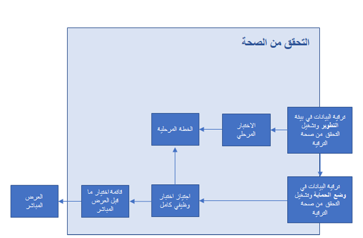
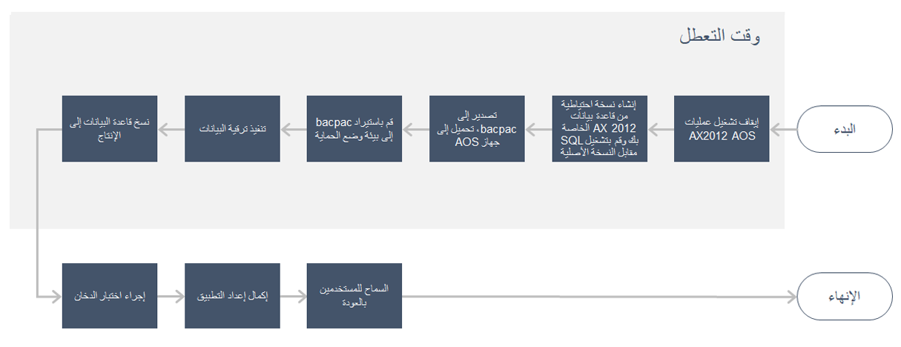

يمثل التحقق من الصحة الخطوة الأخيرة قبل العرض المباشر. فهي خطوة ضرورية لإجراء اختبار الدخان للإجابة على الأسئلة التالية.

- هل بدأت جميع الخدمات؟
- هل يمكن الوصول إلى جميع مكونات التطبيق؟
- هل البيانات المتوقعة موجودة؟
- هل تمت تسوية دفتر الأستاذ العام إلى Dynamics AX 2012؟
- هل تمت تسوية المخزون إلى Dynamics AX 2012؟
- هل تعمل الإجراءات الوظيفية للتطبيق؟

توضح الصورة التالية نظرة عامة على خطوات مرحلة التحقق من الصحة. 
 

خلال هذه المرحلة، ستقوم بإكمال المهام التالية:

1.  إجراء الاختبار المرحلي.
2.  إكمال الاختبار الوظيفي.
3.  إنشاء خطة مرحلية.

## الاختبار المرحلي
يتكون الاختبار المرحلي من الأنشطة التي تحدث بعد إيقاف تشغيل Dynamics AX وقبل تشغيل تطبيقات التمويل والعمليات. الهدف من الاختبار أو التكوين المرحلي الوهمي‬، هو إجراء عملية التكوين المرحلي. بهذه الطريقة، ستساعد في ضمان أن أي شخص يشارك في التكوين المرحلي الفعلي للعرض المباشر ستكون لديه ثقة كافية لعرض مباشر ناجح. 

مسارا العمل الرئيسيان لهذه المهمة هما:

1.  **دفق العمل الفني** – يعد أسلوب تشغيل ترقية البيانات هو دفق العمل هذا. سيتم فرض قيد على مقدار التعطل المطلوب من قِبل شركتك. لن تتوفر أي من قواعد بيانات المنتجات خلال وقت التعطل هذا. للوصول إلى الحد الأقصى لوقت تعطل الشركة، سيتعين على دفق العمل التكنولوجي ضبط أداء إجراء ترقية البيانات الخاص به.
2.  **دفق العمل الوظيفي** - سيكون العديد من مهام التكوين مطلوباً في بيئة تطبيقات التمويل والعمليات بعد ترقية البيانات. يتعين تسجيل كل هذه المهام وتحديد حجمها، ويتعين تخصيص مورد لها لأنها يجب أن تتناسب مع الحد الأقصى لوقت التعطل للشركة جنباً إلى جنب مع المهام الفنية.

## إكمال الاختبار الوظيفي
ستحتاج إلى إكمال اجتياز اختبار وظيفي كامل لجميع عمليات الأعمال. تتضمن عمليات الأعمال هذه العمليات القديمة التي تم ترحيلها من Dynamics AX 2012 والعمليات الحديثة التي تتضمن ميزات جديدة تم تناولها في تطبيقات التمويل والعمليات لأول مرة. اعتماداً على جودة الكود، قد تتطلب معالجة المشكلة وإعادة الاختبار عدة تكرارات لاجتياز الاختبار الوظيفي. عندما يتم إصلاح مشكلة، تأكد من إعادة اختبار جميع العمليات المتضمنة للمساعدة في ضمان عدم تأثر عملية المراحل التمهيدية أو المراحل النهائية بالتغيير.

لمزيد من المعلومات، راجع [الترقية من Dynamics AX 2012 – اجتيازات الاختبارات الوظيفية](/dynamics365/fin-ops-core/dev-itpro/migration-upgrade/upgrade-functional-validation/?azure-portal=true).

## إنشاء خطة مرحلية
قبل أسبوع واحد من التخطيط لبدء العرض المباشر، يجب عليك إيقاف تغييرات التكوين في Dynamics AX 2012. يعتبر القيد المفروض على تغييرات التكوين إجرائياً؛ حيث يجب أن يوافق مسؤولو نظام Dynamics AX على تعليق جميع التغييرات في هذه المرحلة. نوصي بشدة ببدء تجميد الكود في أساس كود تطبيقات التمويل والعمليات. لا ينبغي السماح بأي تغييرات ما لم يتم تقييمها وإثبات أنها لا تمنع العرض المباشر. يجب تشغيل ترقية البيانات لآخر مرة قبل التكوين المرحلي، بعد تفعيل قيود التكوين وتجميد الكود. ويساعدك هذا الأسلوب في ضمان استمرار عمل الترقية كما هو مخطط لها.

بعد إكمال اختبار الترقية بنجاح في بيئة اختبار القبول القياسي أو المميز، وبعد الانتهاء من الاختبار المرحلي بنجاح، ستكون جاهزاً لترقية بيئة التشغيل الخاصة بك ثم بدء العرض المباشر.

يستعرض الإجراء التالي العملية الشاملة لبدء العرض المباشر للتكوين المرحلي.

 

1.  تأكد من استيفاء جميع المتطلبات المسبقة (على سبيل المثال، قائمه اختيار ما قبل الترقية، وتنظيف البيانات والمزيد) ونشر التعليمة البرمجية المخصصة‬ في وضع الحماية. يجب استخدام وضع الحماية لترقية البيانات فقط.
2.  قم بتنزيل **AX 2012 Database Upgrade Toolkit for Dynamics 365** من Lifecycle Services واستخدم ‏‫مجموعه الأدوات هذه من خادم SQL المصدر.
3.  قم بتشغيل إعداد النسخ المتماثل مسبقًا (حتى الخطوة 6) واستمر في مراقبته بانتظام باستخدام مجموعة الأدوات.
4.  قم بإيقاف تشغيل مثيلات AX 2012 AOS في وقت التعطل/ الخطة المرحلية.
5.  تأكد من اكتمال النسخ المتماثل. تحقق من اكتمال النسخ المتماثل (dv) بمقارنة عدد السجلات بين المصدر والهدف، باستخدام مجموعة الأدوات.
6.  قم بتشغيل خطوات الخطة المرحلية باستخدام مجموعة الأدوات وتأكد من اكتمالها.
7.  ابدأ ترقية البيانات باستخدام مجموعة الأدوات، وقم بإنهاء ترقية البيانات.
8.  استخدم عملية تحديث قاعدة بيانات الخدمة الذاتية لنسخ قاعدة البيانات التي تمت ترقيتها من بيئة وضح الحماية إلى بيئة الإنتاج الخاصة بك.
9.  أكمل تكوين التطبيق الإضافي واختبار الدخان.
10. السماح للمستخدمين بالعودة

لمزيد من المعلومات، راجع [الترقية من AX 2012 – ترقية البيانات في بيئات اختبار معزولة](/dynamics365/fin-ops-core/dev-itpro/migration-upgrade/upgrade-data-sandbox/?azure-portal=true).

