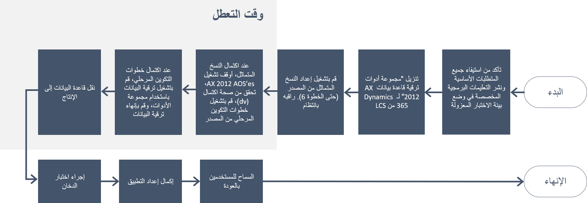

يمثل التحقق من الصحة الخطوة الأخيرة قبل العرض المباشر.Validation is the final step before going live. فهي خطوة ضرورية لإجراء اختبار الدخان للإجابة على الأسئلة التالية.It is a needed step to perform a smoke test to answer the following questions:

- هل بدأت جميع الخدمات؟Did all services start?
- هل يمكن الوصول إلى جميع مكونات التطبيق؟Are all application components accessible?
- هل البيانات المتوقعة موجودة؟Is the expected data in place?
- هل تمت تسوية دفتر الأستاذ العام إلى Dynamics AX 2012؟Does General ledger reconcile to Dynamics AX 2012?
- هل تمت تسوية المخزون إلى Dynamics AX 2012؟Does inventory reconcile to Dynamics AX 2012?
- هل تعمل الإجراءات الوظيفية للتطبيق؟Do application functional procedures work?

توضح الصورة التالية نظرة عامة على خطوات مرحلة التحقق من الصحة.The following image shows an overview of the Validate phase steps. 
 

خلال هذه المرحلة، ستقوم بإكمال المهام التالية:During this phase, you will complete the following tasks:

1.  إجراء الاختبار المرحلي.Perform cutover testing.
2.  إكمال الاختبار الوظيفي.Complete functional testing.
3.  إنشاء خطة مرحلية.Create a cutover plan.
## الاختبار المرحليCutover testing
يتكون الاختبار المرحلي من الأنشطة التي تحدث بعد إيقاف تشغيل Dynamics AX 2012 وقبل تشغيل تطبيقات Finance and Operations.Cutover testing consists of the activities that occur after turning off Dynamics AX 2012 and before turning on Finance and Operations apps. الهدف من الاختبار أو التكوين المرحلي الوهمي‬، هو إجراء عملية التكوين المرحلي.The objective of the test, or mock cutover, is to perform the cutover process. بهذه الطريقة، ستساعد في ضمان أن أي شخص يشارك في التكوين المرحلي الفعلي للعرض المباشر ستكون لديه ثقة كافية لعرض مباشر ناجح.In this way, you will help ensure that anyone who participates in the actual go-live cutover will have enough confidence for a successful go-live. 

مسارا العمل الرئيسيان لهذه المهمة هما:The two main workstreams for this task are:

1.  **دفق العمل الفني** – يعد أسلوب تشغيل ترقية البيانات هو دفق العمل هذا.**Technical workstream** – The method of running the data upgrade is this workstream. سيتم فرض قيد على مقدار التعطل المطلوب من قِبل شركتك.A restriction on the amount of downtime that is required will be imposed by your company. لن تتوفر أي من قواعد بيانات المنتجات خلال وقت التعطل هذا.None of the product databases will be available during this downtime. للوصول إلى الحد الأقصى لوقت تعطل الشركة، سيتعين على دفق العمل التكنولوجي ضبط أداء إجراء ترقية البيانات الخاص به.To reach the company's downtime cap, the technological workstream would have to performance-tune its data upgrade procedure.
2.  **دفق العمل الوظيفي** - سيكون العديد من مهام التكوين مطلوباً في بيئة تطبيقات Finance and Operations بعد ترقية البيانات.**Functional workstream** – Several configuration tasks will be needed in the Finance and Operations apps environment after the data upgrade. يتعين تسجيل كل هذه المهام وتحديد حجمها، ويتعين تخصيص مورد لها لأنها يجب أن تتناسب مع الحد الأقصى لوقت التعطل للشركة جنباً إلى جنب مع المهام الفنية.All these tasks must be recorded and quantified, and a resource must be allocated to them because they must fit into the downtime cap of the company along with the technical tasks.

## إكمال الاختبار الوظيفيComplete functional testing
ستحتاج إلى إكمال اجتياز اختبار وظيفي كامل لجميع عمليات الأعمال.You will need to complete a full functional test pass of all business processes. تتضمن عمليات الأعمال هذه العمليات القديمة التي تم ترحيلها من Dynamics AX 2012 والعمليات الحديثة التي تتضمن ميزات جديدة تم تناولها في تطبيقات Finance and Operations لأول مرة.These business processes include old processes that are carried forward from Dynamics AX 2012 and modern processes that include new features that have been taken up in Finance and Operations apps for the first time. اعتماداً على جودة الكود، قد تتطلب معالجة المشكلة وإعادة الاختبار عدة تكرارات لاجتياز الاختبار الوظيفي.Depending on code quality, issue remediation and retesting might require several iterations of the functional test pass. عندما يتم إصلاح مشكلة، تأكد من إعادة اختبار جميع العمليات المتضمنة للمساعدة في ضمان عدم تأثر عملية المراحل التمهيدية أو المراحل النهائية بالتغيير.When an issue is fixed, be sure to retest all processes that are involved to help guarantee that the downstream or upstream process isn't affected by the change.

لمزيد من المعلومات، راجع [الترقية من Dynamics AX 2012 – اجتيازات الاختبارات الوظيفية]( https://docs.microsoft.com/dynamics365/fin-ops-core/dev-itpro/migration-upgrade/upgrade-functional-validation/?azure-portal=true).For more information, see [Upgrade from Dynamics AX 2012 – Functional test passes]( https://docs.microsoft.com/dynamics365/fin-ops-core/dev-itpro/migration-upgrade/upgrade-functional-validation/?azure-portal=true).

## إنشاء خطة مرحليةCreate a cutover plan
قبل أسبوع واحد من التخطيط لبدء العرض المباشر، يجب عليك إيقاف تغييرات التكوين في Dynamics AX 2012.One week before go-live is planned, you should stop configuration changes in Dynamics AX 2012. يعتبر القيد المفروض على تغييرات التكوين إجرائياً؛ حيث يجب أن يوافق مسؤولو نظام Dynamics AX على تعليق جميع التغييرات في هذه المرحلة.The restriction on configuration changes is procedural; Dynamics AX system administrators should agree to put all changes on hold at this point. نوصي بشدة ببدء تجميد الكود في أساس كود تطبيقات Finance and Operations.We highly recommend that you also initiate a code freeze in the Finance and Operations apps code base. لا ينبغي السماح بأي تغييرات ما لم يتم تقييمها وإثبات أنها لا تمنع العرض المباشر.No changes should be allowed unless they have been evaluated and have been shown not to block go-live. يجب تشغيل ترقية البيانات لآخر مرة قبل التكوين المرحلي، بعد تفعيل قيود التكوين وتجميد الكود.You should run the data upgrade for the last time before cutover, after the configuration restriction and code freeze are in effect. ويساعدك هذا الأسلوب في ضمان استمرار عمل الترقية كما هو مخطط لها.This approach helps you guarantee that the upgrade still functions as planned.

بعد إكمال اختبار الترقية بنجاح في بيئة اختبار القبول القياسي أو المميز، وبعد الانتهاء من الاختبار المرحلي بنجاح، ستكون جاهزاً لترقية بيئة التشغيل الخاصة بك ثم بدء العرض المباشر.After you have successfully completed upgrade testing in a Standard or Premier Acceptance Test environment, and after you have finished a successful test cutover, you will be ready to upgrade your production environment and then go live.

يستعرض الإجراء التالي العملية الشاملة لبدء العرض المباشر للتكوين المرحلي.The following procedure reviews the overall process for cutover to go-live.

 

1.  أوقف تشغيل كافة مثيلات Dynamics AX 2012 AOS.Shut off all Dynamics AX 2012 AOS instances.  
2.  أنشئ نسخة من قاعدة بيانات Dynamics AX 2012.Create a copy of the Dynamics AX 2012 database. نوصي بشدة باستخدام نسخة لأنه يتعين عليك حذف بعض الكائنات في النسخة التي سيتم تصديرها.We strongly recommend that you use a copy because you must delete some objects in the copy that will be exported.  
3.  قم بتصدير قاعدة البيانات المنسوخة إلى ملف bacpac باستخدام أداة SQL Server مجانية تسمى SQLPackage.exe.Export the copied database to a bacpac file by using a free SQL server tool called SQLPackage.exe. ستوفر هذه الأداة نوعاً خاصاً من النسخ الاحتياطي لقاعدة البيانات التي يمكن استيرادها إلى قاعدة بيانات SQL.This tool will provide a special type of database backup that can be imported into SQL Database. 
4.  قم بتحميل ملف bacpac إلى تخزين Azure (موصى به) أو مكتبة أصول Lifecycle Services (يستغرق وقتاً أطول).Upload the bacpac file to Azure storage (recommended) or Lifecycle Services asset library (takes longer).
5.  قم باستيراد ملف bacpac إلى قاعدة بيانات Azure SQL من بيئة مستضافة على السحابة تعمل في نفس المنطقة مثل بيئة آلية اختبار معزولة.Import the bacpac file into Azure SQL Database from a cloud-hosted environment that is running in the same region as the sandbox environment.
6.  قم بتشغيل برنامج نصي T-SQL مقابل قاعدة البيانات المستوردة لإعادة تعيين مستخدمي قاعدة بيانات SQL.Run T-SQL script against the imported database to reset the SQL database users. 
7.  قم بتشغيل حزمة ترقية البيانات المناسبة مقابل قاعدة البيانات المستوردة.Run the appropriate data upgrade package against the imported database. 

لمزيد من المعلومات، راجع [الترقية من AX 2012 – ترقية البيانات في بيئات اختبار معزولة]( https://docs.microsoft.com/dynamics365/fin-ops-core/dev-itpro/migration-upgrade/upgrade-data-sandbox/?azure-portal=true).For more information, see [Upgrade from AX 2012 – Data upgrade in sandbox environments]( https://docs.microsoft.com/dynamics365/fin-ops-core/dev-itpro/migration-upgrade/upgrade-data-sandbox/?azure-portal=true).

تحتاج إلى تلبية العديد من المتطلبات قبل أن تتمكن من نسخ قاعدة البيانات إلى الإنتاج، بما في ذلك التأكد من إكمال جميع المهام في مرحلة التحقق من الصحة.You need to meet several requirements before you can copy the database to production, including making sure that you complete all tasks in the Validation phase. عندما تكون جاهزاً لجدولة ترقية الإنتاج، فستقوم بجدولة طلب خدمة في Lifecycle Services.When you are ready to schedule your production upgrade, you will schedule a service request in Lifecycle Services. تأكد من جدولة طلب الخدمة بأسرع ما يمكن، خاصة إذا كنت تحتاج إلى فترة زمنية في نهاية الأسبوع لأن هذه الفترات تكون مطلوبة بشدة.Make sure that you schedule the service request as soon as you can, especially if you require a weekend timeslot because these slots are in highest demand. 

لمزيد من المعلومات، راجع [إرسال طلبات الخدمة إلى فريق هندسة خدمات Dynamics]( https://docs.microsoft.com/dynamics365/fin-ops-core/dev-itpro/lifecycle-services/submit-request-dynamics-service-engineering-team/?azure-portal=true).For more information, see [Submit service requests to the Dynamics Service Engineering team]( https://docs.microsoft.com/dynamics365/fin-ops-core/dev-itpro/lifecycle-services/submit-request-dynamics-service-engineering-team/?azure-portal=true).

