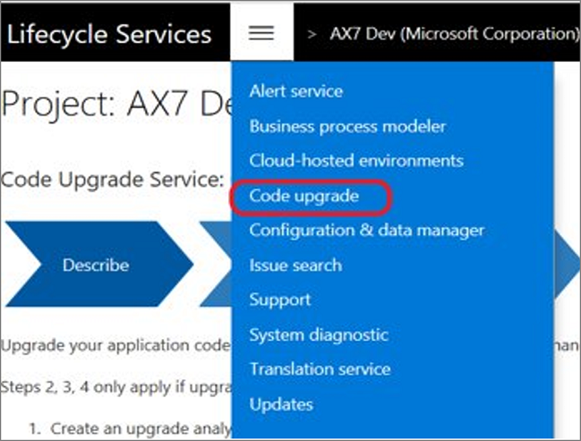
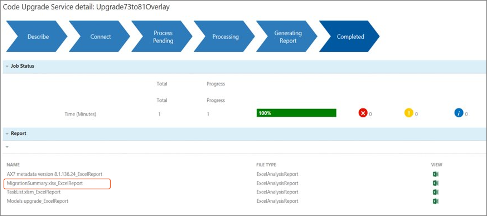

إذا كان لديك إصدار سابق من Finance and Operations، مثل 7.0 (RTW) أو 7.1 (1611) أو 7.2 (يوليو‬ 2017) أو 7.3، فيمكنك تطبيق ترقية الخدمة الذاتية دون تبعيات على دعم Microsoft.If you have a previous version of Finance and Operations, such as 7.0 (RTW), 7.1 (1611), 7.2 (July 2017), or 7.3, you can apply a self-service upgrade with no dependencies on Microsoft support. 

استخدم ميزة ترقية الخدمة الذاتية في LCS لترقية بيئات التطوير والاختبار المعزولة والتشغيل.Use the LCS upgrade self-service feature to upgrade the development, sandbox, and production environments. 

 

## عملية الترقيةProcess to upgrade 

يمكنك تقسيم عملية الترقية إلى مراحل.You could divide the upgrade process into phases. المرحلة الأولى هي التحليل، والتي ستُكمل فيها المهام التالية:The first phase is Analysis, where you will complete the following tasks:

1.  تجميد التعليمات البرمجية (نقل أحدث تعليمات برمجية إلى الفرع Trunk/Main).Freeze your code (move the latest code to the Trunk/Main branch).
2.  الحصول على الإصدار الأخير من تعليمات ISV البرمجية (إن أمكن).Obtain the latest version of ISV code (if applicable).
3.  تشغيل ترقية كود الإصدار الأخير في LCS.Run the latest version code upgrade in LCS.
4.  نشر الإصدار الأخير في بيئة التطوير.Deploy the latest version in the development environment.
5.  تحليل تراكب الطبقات لنقاط الملحق.Analyze overlayering for extension points.
6.  طلب نقاط الملحق المطلوبة في LCS.Request required extension points in LCS. 
7.  الحصول على نقاط الملحق الجديدة من تحديث Microsoft الشهري.Receive the new extension points from Microsoft’s monthly update.
8.  إنشاء خطة مشروع.Create a project plan.

تذكّر الاعتبارات والمهام التالية لمرحلة التحليل:Keep in mind the following considerations and tasks for the Analysis phase: 

- إذا كنت تستخدم عدة فروع، فتأكد من أن الكود النهائي لديك موجود في الفرع Trunk/Main قبل تشغيل ترقية الكود.If you use multiple branches, make sure that your final code is in the Trunk/Main branch before you run the code upgrade.

- مراجعة علامة التبويب **RemainingOverlayering** في تقرير **MigrationSummary.xlsx_ExcelReport** من ترقية الكود.Review the **RemainingOverlayering** tab in the **MigrationSummary.xlsx_ExcelReport** report from the code upgrade. 
  
    

-   مراجعة المستندات من أجل الإصلاحات العاجلة التي يجب عليك تثبيتها في البيئة المصدر لديك، وذلك وفقاً للإصدار الذي تتم الترقية منه.Review the docs for the hotfixes that you must install in your source environment, depending on the version that you're upgrading from.
-   تشغيل ترقية الكود في LCS والحصول على تقدير جهد ترقية الكود.Run the code upgrade in LCS and get the estimate for the code upgrade effort.
-   تعيين الإصدار الأخير من بيئة التطوير لديك إلى فرع الإصدار الذي تم إنشاؤه من خلال ترقية الكود:Map the latest version of your development environment to  the release branch that was created by the code upgrade: 
    1.  استنساخ تعريف البنية الموجود الذي تم إنشاؤه من أجل **Trunk > Main**.Clone the existing build definition that was created for **Trunk > Main**. 
    2.  تحديث الحقلين **تعيين** و **حماية** في معلمة **الحصول على مصادر** لمطابقة فرع الإصدار.Update **Map** and **Cloak** fields in the **Get Sources** parameter to match the release branch. 
    3.  نسخ **AXModulesBuild.proj** من الفرع **الرئيسي** إلى فرع **الإصدار**.Copy **AXModulesBuild.proj** from the **Main** branch to the **Release** branch. 
    4.  تحديث معلمة **المشروع** ضمن **إنشاء الحل** للإشارة إلى المشروع الذي تم نسخه.Update the **Project** parameter under **Build the solution** to refer to the copied project. 
    5.  حدد **حفظ**.Select **Save**. والآن حان الوقت لإنشاء حزمة جديدة قابلة للنشر.Now, it is time to build a new deployable package.

-   بالنسبة إلى تراكب الطبقات، سيتعيّن عليك تسجيل طلبات قابلية التوسعة لإعلام Microsoft بما تحتاجه.For overlayering, you will need to log extensibility requests to inform Microsoft of what you need. تأكد من بيان التفاصيل عند إنشاء طلبات قابلية التوسعة الخاصة بك لأنها ستصبح تصميماً من أجل التغيير.Make sure that you are detailed when creating your extensibility requests because they will become a design for the changes. يمكنك قراءة المزيد في [تسجيل طلبات قابلية التوسعة لـ Dynamics 365 Finance and Operations (الإصدار 8)](https://community.dynamics.com/365/financeandoperations/b/mfp/posts/logging-extensibility-requests-for-dynamics-365-finance-and-operations-v8-0/?azure-portal=true).You can read more in [Logging extensibility requests for Dynamics 365 Finance and Operations (V8)](https://community.dynamics.com/365/financeandoperations/b/mfp/posts/logging-extensibility-requests-for-dynamics-365-finance-and-operations-v8-0/?azure-portal=true).

أما المرحلة التالية في عملية الترقية، فهي **التنفيذ**، والتي ستقوم فيها بأداء الخطوات التالية:The next phase in the upgrade process is **Execute**, where you will perform the following steps: 

1.  تثبيت التحديث الشهري الذي يتضمن نقاط الملحق الجديدة.Install the monthly update that includes the new extension points. 
2.  نقل الكود المتراكب إلى الملحقات.Move overlayered code to extensions. 
3.  إجراء **تسجيل الكود النهائي** في عنصر التحكم بالمصادر.Perform the **Final code check-in** to source control. 
4.  إجراء ترقية البيانات في بيئة التطوير.Perform data upgrade in a development environment. 
5.  استخدام أحدث إصدار من بيئة الإنشاء من أجل إنشاء حزمة قابلة للنشر.Use a latest version build environment to generate a deployable package. 
6.  إجراء **ترقية بيانات** الخدمة الذاتية في بيئة الاختبار المعزولة‬.Perform a self-service **Data upgrade** on the sandbox. 

النقاط الرئيسية التي تجب مراعاتها في مرحلة التنفيذ:Key points to consider in the Execute phase: 

-   ستوفر Microsoft نقاط الملحق الجديدة في تحديث شهري.Microsoft will deliver the new extension points in a monthly update.
-   يجب عليك تثبيت التحديث الشهري الذي يتضمن جميع نقاط الملحق في بيئة التطوير.You should install the monthly update that includes all your extension points in the development environment.
-   ينبغي أن تكون الملحقات كاملة.Your extensions should be complete.
-   يجب تحديث Retail SDK.The Retail SDK should be updated. 
-   يجب استخدام أحدث إصدار من بيئة الإنشاء لديك من أجل إنشاء حزمة قابلة للنشر (إلزامي).The latest version of your build environment should be used to generate a deployable package (mandatory). 
-   يجب تشغيل ترقية البيانات في بيئة التطوير (إلزامي).A data upgrade should be run in a development environment (mandatory).
-   إذا كنت في العرض المباشر بالفعل، فاستخدم **النسخ الاحتياطي لقاعدة بيانات الإنتاج إلى التطوير** قبل إجراء الترقية.If you are already live, use **the prod DB backup to Dev** before performing an upgrade. 
-   تتوفر حزمة ترقية البيانات من مكتبة الأصول المشتركة.A data upgrade package is available from the Shared Asset library.
-   ستتم ترقية البيئة المستضافة على الشبكة السحابية من خلال دليل التشغيل.A cloud-hosted environment will be upgraded through a runbook. 
-   ستتم ترقية البيئة المستضافة من قِبل Microsoft من خلال ميزة الخدمة الذاتية في LCS.A Microsoft-hosted environment will be upgraded through the LCS self-service feature. 
-   يجب تثبيت التحديث الشهري الذي يتضمن جميع نقاط الملحق في بيئة الاختبار المعزولة.The monthly update that includes all your extension points should be installed in the sandbox.
-   ينبغي استخدام الخدمة الذاتية في LCS لتشغيل ترقية بيانات بيئة الاختبار المعزولة.LCS self-service should be used to run the sandbox data upgrade. 

> [!NOTE]
> يمكن ترقية الكود/البيانات مباشرةً إلى أحدث إصدار من الإصدار 7.x.Code/data can be upgraded directly to the latest version from any 7.x version. 

بعد اكتمال الترقية، فإن المرحلة التالية هي **التحقق** من إنجاز المهام التالية:After you have completed your upgrade, the next phase is to **Validate** that the following tasks have been accomplished: 

-   اكتمال ترقية بيئة الاختبار المعزولةCompletion of the sandbox upgrade 
-   اختبار وظيفيFunctional testing 
-   إصلاح أي تراجع أو أخطاء أخرىFixing of any regressions or other bugs
-   الموافقة على الاختبار الوظيفيSign-off on the functional testing
-   إجراء الترقية الذاتية لبيئة التشغيلProduction self-upgrade is performed
-   الانتهاء من ترقية بيئة التشغيلProduction upgrade is complete
-   إجراء اختبار الدخان الخاص بالتشغيل والموافقة عليه (العرض المباشر)Production smoke test and sign-off (Go-Live) has been performed
-   يمكن لمستخدمي الوظائف المتميزين تنفيذ حالات الاختبار لديهم تلقائياً باستخدام Regression Suite Automation tool.Functional power users can automate the implementation of their test cases by using the Regression Suite Automation tool
-   اعتماد الاختبار الوظيفي من مستخدمي الأعمالFunctional testing sign-off from business users 
-   ترقية بيانات تشغيل الخدمة الذاتيةSelf-service production data upgrade 
-   تثبيت التحديث الشهري الذي يتضمن جميع نقاط الملحق في بيئة التشغيلMonthly update that includes all your extension points in production is installed
-   إتمام اختبار الدخان الخاص بالتشغيل واعتماده من العميلProduction smoke test and sign-off by customer is completed