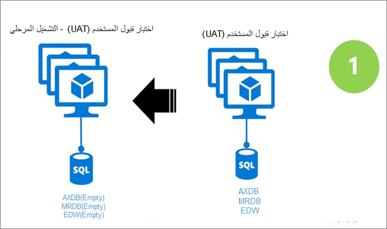
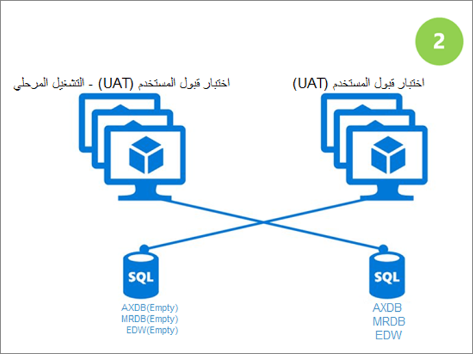

لإجراء ترقية لبيانات بيئة الاختبار المعزولة، اتبع هذه الخطوات.

1.  **اختيار ترقية البيانات** - في LCS، انتقل إلى قائمة **تفاصيل البيئة > احتفاظ > ترقية**. حدد التطبيق الجديد وإصدارات النظام الأساسي. 
2.  **الإعداد** - خلال هذا الوقت، يتم توفير بنية أساسية جديدة نيابةً عنك. لا يحدث وقت تعطل في بيئة الاختبار المعزولة الحالية لديك. 
3.  **تطبيق الحزم** - تطبيق حزم البرامج القابلة للتوزيع المنشأة حديثاً على بيئة الترقية. يجب أن تكون هذه الحزمة قد تم تجميعها بالفعل واختبارها في بيئة مطور، ويجب أن تكون الحزمة قد تم إنتاجها من بيئة إنشاء جديدة. لا يحدث وقت تعطل في بيئة الاختبار المعزولة الحالية لديك. 

 
    

4.  **ترقية البيانات** - ستتبدل هذه الخطوة في بيئة الترقية الخاصة بك، وستقوم بإلغاء توزيع بيئة الاختبار المعزولة السابقة لديك. سيتم تطبيق حزمة ترقية البيانات المناسبة لك بناءً على إصدار التطبيق الأصلي والهدف. 

 
    

5.  **التحقق من الصحة وتسجيل الخروج** - سجِّل الدخول إلى البيئة، وتأكد من أن البيانات والكود يعملان بالشكل المتوقع. سجِّل الخروج عند الترقية، وبعد ذلك يمكن إجراء نفس الخطوات في بيئة التشغيل باستخدام الحزم نفسها. 

ترقية بيانات بيئة الاختبار هي خدمة ذاتية تماماً؛ ويمكنك جدولتها في وقتك الخاص. يمكنك الحصول على مثيل موازٍ للمساعدة في تقليل وقت التعطل. في حالة حدوث أي مشاكل، يتم دعم العودة إلى الحالة السابقة لبيئة الاختبار المعزولة. 

عادةً ما تحتوي بيئة الاختبار المعزولة على أحدث بيانات الإنتاج، مما يعني أن كود الإنتاج سيكون مطابقاً لبيئة الاختبار المعزولة. 

وبعد الترقية، لن تتم مطالبتك بتشغيل مزيد من الترقيات، فقط التحديثات المستمرة. 

