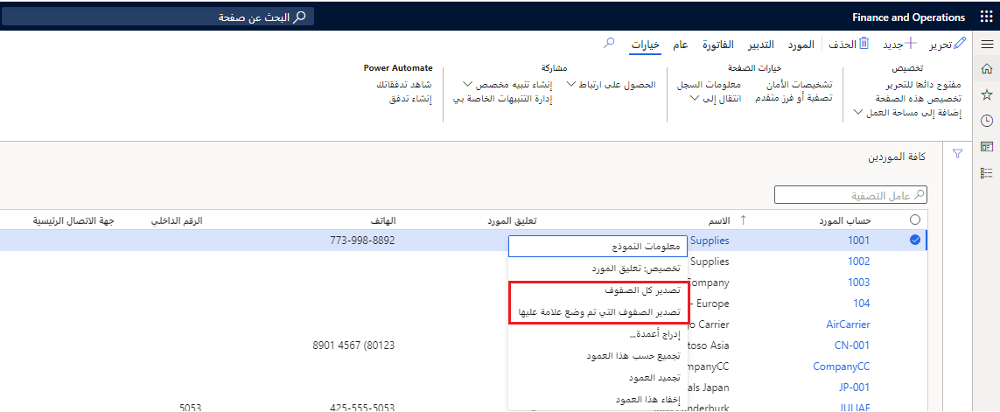

تتمثل الخطوة الأولى في العمل مع وظيفة إعداد التقارير في تطبيقات Finance and Operations في فهم ميزات إعداد التقارير الموجودة بالفعل والتي يمكنك استخدامها، إما كما هي، أو من خلال ملحقات صغيرة لمطابقة متطلبات العملاء.The first step in working with the reporting functionality in Finance and Operations apps is to understand the reporting features that already exist and that you can use, either as they are, or through small extensions to match your customer requirements.

توفر تطبيقات Finance and Operations العديد من أدوات إعداد التقارير التي تلبي سيناريوهات الوصول إلى البيانات المختلفة.Finance and Operations apps provide several reporting tools that cater to various data access scenarios.  

على سبيل المثال، تختلف احتياجات المستخدمين عند تفاعلهم مع مستندات الأعمال اختلافاً كبيراً عن السيناريوهات التي يريدون فيها استكشاف البيانات على مستوى إجمالي أو اشتقاق رؤى باستخدام نماذج الذكاء الاصطناعي التي يتم استضافتها في المجموعة.For example, the needs of users when they are interacting with business documents differ greatly from scenarios where they want to explore data at an aggregate level or derive insights by using Artificial Intelligence models that are hosted in the cloud.  

توفر تطبيقات Finance and Operations أدوات متخصصة لخمس تجارب لإعداد التقارير:Finance and Operations apps provide specialized tools for five reporting experiences:

- **التحليلات المضمنة وعناصر التحكم الأصلية** - المرئيات المضمنة المستخدمة في التقارير التشغيلية لتجميع البيانات في مساحات العمل، باستخدام عناصر التحكم الأصلية مثل المخططات والشبكات.**Embedded analytics and native controls** - Built-in visualizations that are used in operational reports to aggregate data to workspaces, by using native controls such as charts and grids.
- **خدمات SQL Server Reporting Services ‏(SSRS)** - تُستخدم بشكل أساسي لوثائق العمل وسيناريوهات الطباعة كبيرة الحجم الشائعة مع الفواتير وإيصالات التعبئة وقوائم الانتقاء والمزيد.**SQL Server Reporting Services (SSRS)** - Primarily used for business documents and high-volume printing scenarios that are common with invoices, packing slips, picking lists, and more. 
- **مصمم التقارير المالية** - أداة مرنة تُستخدم لتخصيص وإنشاء البيانات المالية مثل الميزانيات العمومية وبيانات الدخل وبيانات التدفق النقدي.**Financial Report Designer** - Flexible tool that is used to customize and create financial statements such as balance sheets, income statements, and cashflow statements. 
- **Power Platform** - يشمل لوحات المعلومات ومساحات العمل التي تحتوي على طرق عرض محددة مسبقاً ومخصصة، وعمليات تكامل Power BI، وPower Apps، وPower Automate.**Power Platform** - Includes dashboards and workspaces that contain predefined and personalized views, Power BI, Power Apps, and Power Automate integrations.
- **التقارير الإلكترونية** - تُستخدم لتكوين المستندات الإلكترونية وفقاً للمتطلبات القانونية للبلدان أو المناطق المختلفة.**Electronic Reporting** - Used to configure electronic documents in accordance with the legal requirements of various countries or regions.

## عمليات تكامل Microsoft OfficeMicrosoft Office integrations 

باستخدام ميزة تكامل Microsoft Office المضمنة، يمكنك تصدير الصفوف المحددة أو كلها من شبكة صفحة قائمة وتصدير قيم كيان البيانات إلى مصنف Microsoft Excel لأغراض إعداد التقارير.By using the Microsoft Office integration built-in feature, you can export selected, or all, rows from a list page grid and export data entity values into a Microsoft Excel workbook for reporting purposes. بعد ذلك، يمكنك استخدام الإمكانات الغنية لبرنامج Excel، مثل الجدول المحوري والمخططات والمزيد لتقديم بياناتك.Then, you can use the rich capabilities of Excel, such as pivot table, charts, and more, to present your data.

## إعداد التقارير الماليةFinancial reporting 

يتم توفير التقارير المالية القياسية باستخدام فئات الحساب الرئيسية الافتراضية في تطبيقات Finance and Operations.Standard financial reports are provided by using the default main account categories in Finance and Operations apps. استخدم مصمم التقارير لإنشاء أو تعديل البيانات المالية التقليدية، مثل كشف الدخل والميزانية العمومية، ومشاركة النتائج مع الأعضاء الآخرين في مؤسستك.Use the Report designer to create or modify traditional financial statements, such as the Income statement and Balance sheet, and share the results with other members of your organization.