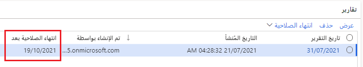
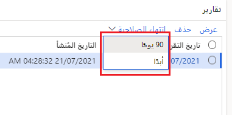

تتيح التقارير المالية للمهنيين الماليين والتجاريين إنشاء البيانات المالية والحفاظ عليها وعرضها. ويتفوق على التقارير التقليدية لمساعدتك على تصميم أنواع متعددة من التقارير بشكلٍ فعال.

تتضمن التقارير المالية دعم الأبعاد لتحديد الأبعاد المالية التي تريد تضمينها، والتسلسل، وتمكين إنشاء بنية تقارير مخصصة. 

يمكنك تعيين ما يلي للحصول على رؤية أفضل للبيانات المالية:

- الحسابات الرئيسية
- الأبعاد المالية
- مجموعات من الاثنين

على سبيل المثال، يمكنك إنشاء هياكل الصفوف المالية للتركيز على حسابات التكلفة. يمكنك إعداد أبعاد مالية غير محدودة تسمح بتفاصيل التكلفة. الأبعاد المالية التالية هي أمثلة قد ترتبط بحسابات التكلفة:

- مراكز التكلفة
- الأقسام
- مجموعات من الاثنين

يتم نشر قاعدة بيانات التقارير المالية في قاعدة بيانات SQL Azure الخاصة بها على نفس خدمة SQL Azure مثل مثيل تطبيقات Finance and Operations. هذا يعني أن قاعدة البيانات مكوّنة مسبقاً عند نشر تطبيقات Finance and Operations وترتبط تلقائياً بقواعد البيانات المتاحة حتى يتمكن مصمم التقارير المالية من الاتصال بها. 

## مصمم التقارير 

باستخدام مصمم التقارير، ستتمكن من: 

- حفظ وإعادة استخدام مجموعات الأبعاد لتقارير متعددة.
- التحكم في كيفية تنسيق وعرض أوصاف الأبعاد.
- حدد الحسابات أو الأبعاد التي تم حذفها من الكتل الإنشائية للتقرير.
- تنسيق الرؤوس للتنبؤات الدورية.  

يمكنك إدارة إنشاء التقارير وتوزيعها باستخدام الميزات التالية:

- جدولة التقارير بحيث يتم إنشاؤها تلقائياً على أساس يومي أو أسبوعي أو شهري أو سنوي.  
- تصدير نتيجة التقرير إلى تنسيق PDF للقراءة فقط، والذي يوفر أماناً أفضل للمستند من خلال التوقيعات الرقمية.  
- قم بالتصدير إلى ورقة عمل Microsoft Excel.  

تتيح لك الميزات التفاعلية أداء المهام التالية ضمن إعداد التقارير المالية:

- تغيير تاريخ التقرير للتقرير الذي تشاهده.
- تغيير عملة التقرير الذي تشاهده.
- عرض التقرير إما في طريقة عرض ملخص أو طريقة عرض مفصلة.
- إضافة عوامل تصفية الأبعاد لقصر محتوى التقرير على بُعد معين أو مجموعة أبعاد.
- إضافة عوامل تصفية السمات لقصر محتوى التقرير على سمة معينة أو مجموعة من السمات.

التوصية بربط حساباتك الرئيسية بفئات حسابك الرئيسية. هذا يجعل الأمر أسهل وأسرع عند إعداد التقارير الخاصة بك في التقارير المالية. 

على سبيل المثال، إذا كنت تقوم بإنشاء تقرير، بدلاً من سرد العديد من الحسابات الرئيسية، يمكنك ببساطة سرد فئة حسابك الرئيسية والحصول على إجمالي جميع الحسابات الرئيسية في تلك الفئة.

## الوصول إلى التقارير المالية 

قبل إنشاء وتوليد التقارير المالية، تأكد من إعداد العناصر التالية لشركتك:

- العملة
- التقويم المالي
- دليل الحسابات
- دفتر الأستاذ

لمزيد من المعلومات، راجع الوثائق التالية ومحتوى Microsoft Learn:

- [التقويمات المالية، والسنوات المالية، والفترات‬ الزمنية](https://docs.microsoft.com/dynamics365/finance/budgeting/fiscal-calendars-fiscal-years-periods/?azure-portal=true) 
- [تخطيط دليل الحسابات](https://docs.microsoft.com/dynamics365/finance/general-ledger/plan-chart-of-accounts/?azure-portal=true) 
- [تكوين العملات في Dynamics 365 Finance](https://docs.microsoft.com/learn/modules/configure-currencies-dyn365-finance/?azure-portal=true) 
- [إنشاء التقويمات والسنوات والفترات المالية في Dynamics 365 Finance](https://docs.microsoft.com/learn/modules/create-fiscal-calendars-years-periods-dyn365-finance/?azure-portal=true) 
- [تكوين مخطط الحسابات في Dynamics 365 Finance](https://docs.microsoft.com/learn/modules/configure-chart-accounts-dyn365-finance/?azure-portal=true) 
- [تكوين دفاتر الأستاذ ودفاتر اليومية في Dynamics 365 Finance](https://docs.microsoft.com/learn/modules/configure-ledgers-journals-dyn365-finance/?azure-portal=true) 

يمكنك البحث عن قائمة **التقارير المالية** في المواقع التالية في Dynamics 365 Finance:

- **دفتر الأستاذ العام > الاستعلامات والتقارير**
- **إعداد الموازنة > الاستعلامات والتقارير > إعداد الموازنة الأساسية**
- **إعداد الموازنة > الاستعلامات والتقارير > تخطيط الموازنة**
- **إعداد الموازنة > الاستعلامات والتقارير > عنصر تحكم الموازنة**
- **عمليات الدمج**

## إعداد التقارير المالية 

تحتوي صفحة **إعداد التقارير المالية** في **دفتر الأستاذ العام > إعداد دفتر الأستاذ** على قائمة بالأبعاد المالية في النظام. يتألف من قسمين يحددان البيانات التي ستبلغ عنها في التقارير المالية:

- **علامة التبويب الأبعاد** - نظراً لأن الشركات المختلفة تستخدم أبعاداً وهياكل حسابات مختلفة، فلا توجد طريقة لتحديد الترتيب الذي يرغب المستخدمون في عرض جميع الأبعاد المالية به في التقارير. تسمح لك هذه الصفحة بتعيين الترتيب الذي تريد أن تظهر به الأبعاد المالية عند إنشاء تقرير وعرضه في التقارير المالية.
- **علامة تبويب السمات** - هذا هو المكان الذي يمكنك فيه تحديد ما إذا كنت تريد استخدام الموردين والعملاء كسمات للتصفية وتصميم التقرير. سيكون إعداد التقارير عن المورد والعميل ذا قيمة فقط إذا لم تدخل عدة بائعين أو عملاء في إيصال واحد عند ترحيل الحركات. سيؤدي تحديد **المورد** و/أو **العميل** إلى إضافة مزيد من الوقت إلى التكامل.

## مكونات التقارير المالية 

تسهل المكونات التالية لإعداد التقارير المالية إنشاء التقارير وعرضها وجدولتها:

- **مصمم التقارير** - إنشاء كتل إنشاء التقارير التي يمكن دمجها لتحديد وإنشاء تقرير. يمكن للمستخدمين المتقدمين إنشاء كتل إنشاء تقارير جديدة أو تعديل الكتل الإنشائية الحالية لتلبية متطلباتهم.
- **جداول التقارير** - قم بجدولة تقرير واحد، أو مجموعة من التقارير، بحيث يتم إنشاؤها على أساس منتظم.

تعمل وظيفة القوائم المالية على تبسيط قدرتك على بناء هياكل إعداد التقارير لأغراض التحليل الداخلي. يمكنك إنشاء العديد من التقارير المالية لتتوافق مع متطلبات ومعايير المحاسبة الدولية.

هناك نوعان من تقارير الميزانية العمومية الافتراضية:

- **الميزانية العمومية - الافتراضية** - الأقسام مكدسة. توفير طريقة عرض للوضع المالي للمؤسسة للسنة.
- **جنباً إلى جنب الميزانية العمومية - افتراضية** الأقسام جنباً إلى جنب. توفير طريقة عرض للوضع المالي للمؤسسة للسنة. الأصول والمسؤوليات وحقوق ملكية المساهمين جنباً إلى جنب.

تقارير ميزان المراجعة الثلاثة هي:

- **ميزان المراجعة التفصيلي - افتراضي** - يوفر معلومات الرصيد لجميع الحسابات، ويتضمن أرصدة المدين والدائن وصافي هذه الحسابات، جنباً إلى جنب مع تاريخ المعاملة والإيصال ووصف دفتر اليومية.
- **ملخص ميزان المراجعة - افتراضي** - يوفر معلومات الرصيد لجميع الحسابات ويتضمن فتح وإغلاق أرصدة وأرصدة دائنة ومدين، بالإضافة إلى صافي الفرق بينهما.
- **ملخص ميزان المراجعة على مدار العام - افتراضي** - توفير معلومات الرصيد لجميع الحسابات ويتضمن أرصدة الافتتاح والختام، والأرصدة المدينة والدائنة، بالإضافة إلى صافي الفرق للعام الحالي والعام الماضي.

يقدم تقرير **بيان الدخل - الافتراضي** عرضاً لربحية المؤسسة للفترة الحالية والسنة حتى تاريخه.

## سياسات استبقاء التقارير المالية

أثناء تشغيل التقارير المالية، يتم تطبيق تواريخ انتهاء الصلاحية الافتراضية على كل منها لحذفها تلقائياً بعد فترة زمنية. يمكن الاحتفاظ بأي تقارير لأغراض تنظيمية، ومع ذلك، باستخدام ميزة انتهاء الصلاحية في التقارير المالية. لديك خياران:

- 90 يوماً
- أبداً

## تعريف الصف 

تعريف الصف هو أحد مكونات التقرير، أو الكتلة البرمجية الإنشائية، التي تحدد محتويات كل صف في تقرير مالي. يمكن دمجه مع تعريفات الأعمدة وتعريفات شجرة التقارير وتعريفات التقارير لإنشاء مجموعة كتل إنشائية يمكن استخدامها من قبل شركات متعددة.

يحدد تعريف الصف البنود الوصفية (على سبيل المثال، الرواتب أو المبيعات) في أحد التقارير. كما يسرد أيضاً قيم أو أبعاد المقطع التي تحتوي على قيم كل عنصر سطر وتتضمن تنسيق الصفوف والحسابات.

يمكنك استخدام تعريفات الصفوف في البيانات المالية لعرض الأرقام المالية من خلال ما يلي:

- البعد المالي
- الحسابات الرئيسية
- مجموعة من الاثنين

يمكن أن يحتوي تعريف الصف على ما يصل إلى 20000 من صفوف الأبعاد المالية ويمكن أن يتضمن المعلومات التالية:

- نص وصفي يضيف معنى للتقرير عن طريق إنشاء عناوين الأقسام والأسطر والمسافات، مثل النقدية أو إجمالي الإيرادات.
- ارتباطات إلى البيانات المالية، والتي يمكن أن تتضمن قيم الأبعاد في تطبيقات Finance and Operations.
- إجماليات الصفوف والمعادلات التي تستند إلى البيانات المالية المرتبطة.

عادةً ما يحتوي كل صف في تعريف صف على أحد أنواع المعلومات التالية:

- مراجع لنظام الأبعاد المالية.
- الإجماليات أو العمليات الحسابية التي تستند إلى البيانات.
- تنسيق.

طريقتان لإدخال المعلومات في تعريف صف هما:

- **يدوياً** - أدخل معلومات الصف في تعريف صف جديد. لمزيد من المعلومات، راجع [تعديل خلايا تعريف الصف](https://docs.microsoft.com/dynamics365/fin-ops-core/dev-itpro/analytics/modify-row-definition-cells-financial-reporting?toc=%2Ffin-and-ops%2Ftoc.json/?azure-portal=true).
- **استخدام مصمم التقارير** - استخدم هذا لسحب معلومات الصف مباشرة من الأبعاد المالية.

يمكنك إعداد تعريف صف لسحب البيانات من نظام الأبعاد المالية في كل مرة يتم فيها إنشاء التقرير.

البعد هو تقاطع البيانات والقيم. يمكنك تجميع البيانات والقيم في مصمم التقارير. بعد ذلك، يمكنك تصنيف الحركات وتحليلها بمزيد من التفصيل. يمكنك استخدام وظيفة **إدراج الصفوف** من مربع الحوار **الأبعاد** لإضافة عدة صفوف إلى تعريف الصف في نفس الوقت.

تصف القائمة التالية المعلومات التي يمكنك تحديدها لكل بُعد:

- **البعد** - النمط الذي يعرّف البعد المراد إضافته إلى تعريف الصف. يحتوي هذا النمط على علامة عطف واحدة (&) أو علامة رقم (#) لكل موضع في الأبعاد. إذا كان أحد الأبعاد يحتوي على علامة عطف، فسيقوم هذا البعد بملء تعريف الصف. بشكل افتراضي، يتم تعيينه على الحساب الرئيسي، وهي الطريقة الأكثر شيوعاً لإنشاء تعريف صف.
- **بدء نطاق البعد** - القيمة الأولى لهذا البعد المراد إضافتها إلى تعريف الصف.
- **نهاية نطاق البعد** - القيمة الأخيرة لهذا البعد المراد إضافتها إلى تعريف الصف.

## تعريف العمود 

تعريف العمود هو أحد مكونات التقرير، أو الكتلة البرمجية الإنشائية، التي تحدد محتويات الأعمدة في التقرير. مثل تعريفات الصفوف، يمكن استخدام تعريفات الأعمدة الأساسية في تقارير متعددة.

يحدد تعريف العمود الفترة التي يجب استخدامها عند استخراج البيانات من الأبعاد المالية. ويتضمن أيضاً تنسيق العمود والحسابات. يمكنك أيضاً تقييد عمود تقرير بوحدة معينة أو لتواريخ محددة.

في كثير من الأحيان، قد تحتاج إلى الجمع بين مجموعات الأبعاد المالية لإعداد تقارير مالية مفصلة تتناسب مع متطلبات العميل. يساعد ذلك الشركات على تحليل المعاملات من المعاملات التالية:

- دفتر الأستاذ العام
- الموازنة

يمكنك إضافة وتعديل وحذف الرؤوس التي تظهر أعلى الأعمدة في التقرير. يمكنك أيضاً تكوين رؤوس أعمدة التوسيع المشروط، بناءً على حقل **الفترة** من تعريفات الأعمدة وحقل **الفترة الأساسية** من تعريفات التقارير. تساعد ميزة الفترة الأساسية في توفير الوقت عند إنشاء تقارير التنبؤ المتداول.

## تعريف شجرة التقارير 

يساعد تعريف شجرة التقارير في تحديد بنية وتسلسل هرمي مؤسستك. إنه هيكل هرمي متعدد الأبعاد وعبر الشركات يعتمد على العلاقات ذات الأبعاد في بياناتك المالية. يوفر معلومات على مستوى وحدة التقارير وعلى مستوى ملخص لجميع الوحدات في الشجرة. 

يمكن دمج تعريفات شجرة التقارير مع تعريفات الأعمدة وتعريفات التقرير لإنشاء مجموعة كتل الإنشاء التي يمكن استخدامها من قبل العديد من الشركات. 

يمكن أن تكون وحدة التقارير قسماً فردياً من البيانات المالية، أو يمكن أن تكون وحدة ملخص ذات مستوى أعلى تجمع المعلومات من وحدات التقارير الأخرى. بالنسبة لتعريف تقرير يتضمن شجرة تقارير، يتم إنشاء تقرير واحد لكل وحدة تقارير ومستوى الملخص. 

تستخدم التقارير المالية التي لا تستند إلى شجرة تقارير سوى بعض إمكانيات إعداد التقارير المالية. يمكنك استخدام تعريفات متعددة لشجرة التقارير مع نفس تعريفات الصفوف والأعمدة لعرض بيانات مؤسستك بطرق مختلفة.
تستخدم كل هذه التقارير تعريفات الصفوف والأعمدة المحددة في تعريف التقرير، ما لم يحدد تعريف التقرير أنه يجب استخدام شجرة التقارير من تعريف الصف. تعد تعريفات الصفوف والأعمدة مكونات مهمة في تصميم ووظيفة التقارير المالية.

## اعتبارات الأمان 

يمكنك إنشاء كلمة مرور لقفل الكتلة البرمجية الإنشائية والمساعدة في حمايتها. بهذه الطريقة، يمكنك إضافة مستوى من الأمان إلى مكون التقرير دون تأمين النظام بأكمله. 

يمكن أن تساعد كلمة المرور في حماية معلومات الكتلة البرمجية الإنشائية المهمة لعملية إعداد التقارير في نهاية الشهر. يمكن لأي مستخدم في أي دور قفل الكتلة البرمجية الإنشائية. ومع ذلك، يتمتع المستخدمون الآخرون دائماً بوصول للقراءة فقط إلى مكون مقفل. يمكن للمستخدمين فتح المكون المقفل وتغييره وحفظه باسم جديد. يمكن للمستخدم الذي لديه دور المسؤول الوصول دائماً إلى كتلة إنشاء مقفلة وتغييرها.