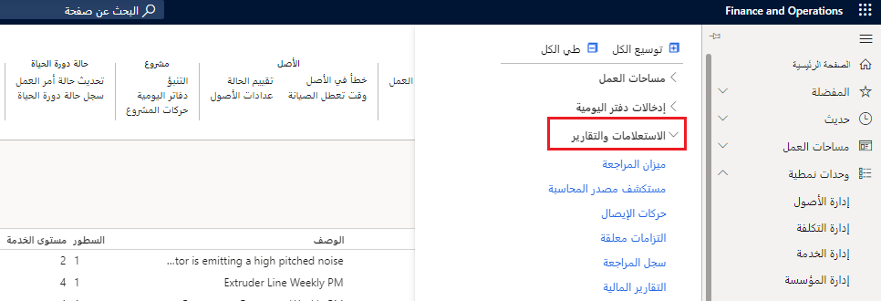

تتضمن تطبيقات Finance and Operations مئات التقارير والاستعلامات الجاهزة.

تحتوي معظم الوحدات النمطية في تطبيقات Finance and Operations على مجموعة عناصر القائمة التي تسمى **الاستعلامات والتقارير**.  

تعد لقطة الشاشة التالية مثالاً على عنصر قائمة **دفتر الأستاذ العام > الاستعلامات والتقارير**.

