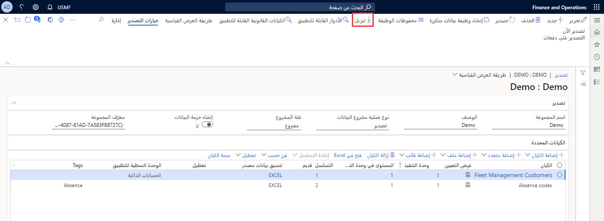

يتكون إطار عمل إدارة البيانات من المفاهيم التالية:The data management framework consists of the following concepts:

- **كيانات البيانات** – كيان البيانات هو فكرة تجريدية مفاهيمية وتغليف لجدول أو أكثر من الجداول الأساسية.**Data entities** – A data entity is a conceptual abstraction and encapsulation of one or more underlying tables. يمثل كيان البيانات مفهوماً أو وظيفة بيانات مشتركة، على سبيل المثال، العملاء أو الموردين.A data entity represents a common data concept or functionality, for example, customers or vendors. من المفترض أن تكون كيانات البيانات مفهومة بسهولة من قبل المستخدمين الذين هم على دراية بمفاهيم الأعمال.Data entities are intended to be easily understood by users who are familiar with business concepts. بعد إنشاء كيانات البيانات، يمكنك إعادة استخدامها من خلال الوظيفة الإضافية لـ Excel، أو استخدامها لتحديد حزم الاستيراد/التصدير، أو استخدامها لعمليات التكامل.After data entities are created, you can reuse them through the Excel add-in, use them to define import/export packages, or use them for integrations.

- **مشروع البيانات** – يتم إنشاء مشروع البيانات تلقائياً عند تحديد **استيراد** أو **تصدير** من مساحة العمل ويجب أن يكون لديك وظيفة واحدة على الأقل.**Data project** – A data project is automatically created when you select **Import** or **Export** from the workspace and should have at least one job. يحتوي على كيانات البيانات التي تم تكوينها، والتي تشمل خيارات التعيين والمعالجة الافتراضية.It contains configured data entities, which include mapping and default processing options. يسمح مشروع البيانات للمستخدمين بتكوين الكيانات التي يجب أن تكون جزءاً من المشروع، ويحدد التنسيق المستخدم لكل كيان.A data project allows users to configure the entities that should be part of the project, and defines the format that is used for each entity. يسمح للمستخدمين بتعريف التعيين المستخدم من الملف المصدر إلى التجهيز المرحلي، وتحديد خيارات المعالجة الافتراضية.It allows users to define the mapping that is used from the source file to the staging, and specify the default processing options.

- **وظيفة البيانات** – هذه مهمة تحتوي على مثيل تنفيذ لمشروع البيانات والملفات التي تم تحميلها والجدول الزمني (التكرار) وخيارات المعالجة.**Data job** – This is a job that contains an execution instance of the data project, uploaded files, schedule (recurrence), and processing options. ويتم استخدام مهمة البيانات لتنفيذ عملية الاستيراد أو التصدير الفعلية.A data job is used to perform the actual import or export operation. فهي تحتوي على الملفات التي تم تحميلها أو الجدول أو معلومات التكرار وخيارات المعالجة المطلوب استخدامها للمهمة.It contains the uploaded files, the schedule or recurrence information, and the processing options to use for the job.  

    يتم إنشاء وظيفة البيانات عند تنفيذ عملية الاستيراد أو التصدير.A data job is created when the import or export operation is performed. تنشئ وظيفة البيانات مثيلاً لمشروع البيانات وتقوم بتشغيله.The data job creates an instance of the data project and runs it. إذا كنت تقوم باستيراد أو تصدير غير مخطط له، فعادةً ما يكون هناك وظيفة واحدة فقط لكل مشروع بيانات.If you're doing an unplanned import or export, then there's typically only one job for each data project. إذا تم إجراء ذلك عدة مرات باستخدام بيانات مختلفة، فيمكنك استخدام مشروع البيانات نفسه لاستيراد البيانات عدة مرات باستخدام وظائف مختلفة.If it is being done multiple times with different data, then you can use the same data project to import data multiple times by using different jobs.  

    يمكن أن يحتوي كل مشروع بيانات على وظيفة بيانات واحدة أو أكثر.Each data project can have one or more data jobs. على سبيل المثال، إذا كنت تقوم باستيراد بيانات واحد غير مخطط له، فقد يكون لديك ملف واحد يتم استيراده.For instance, if you're doing a single unplanned data import, then you might have one file that is being imported. في هذه الحالة، يوجد مشروع بيانات واحد له وظيفة بيانات واحدة.In this case, there is a single data project that then has one data job.  

    سيناريو آخر هو أنك قد تقوم باستيراد البيانات باستخدام نفس مشروع البيانات عدة مرات، ولكن ببيانات مختلفة.Another scenario is that you might be importing data using the same data project multiple times, but with different data. في هذه الحالة، يمكن أن يكون هناك أكثر من وظيفة بيانات لمشروع بيانات واحد.In this case, there can be more than one data job for a single data project. يمكن أن يكون لكل وظيفة بيانات واحد أو أكثر من محفوظات الوظائف.Each data job can have one or more job histories.  

    على سبيل المثال، قد يتم تشغيل وظيفة البيانات عدة مرات بعد إصلاح الأخطاء.For instance, a data job might be run multiple times after errors have been fixed. تخبرك محفوظات الوظائف بالتفاصيل، مثل الوقت المستغرق لتشغيل الوظيفة وعدد السجلات التي تمت معالجتها والأخطاء أثناء المعالجة.The job history tells you the details, such as the time taken to run the job, the number of records processed, and the errors during processing.

- **محفوظات الوظائف** – محفوظات المصدر إلى التجهيز المرحلي والتجهيز المرحلي إلى استهداف الوظائف.**Job history** – Histories of source to staging and staging to target jobs. بمجرد تشغيل الوظيفة، يمكنك رؤية محفوظات الوظيفة، التي تحتوي على محفوظات التشغيل لكل تشغيل تنفيذ لوظيفة البيانات ومحفوظات البيانات التي تنتقل من المصدر إلى التجهيز المرحلي ومن التجهيز المرحلي إلى الهدف.Once a job has been run, you can see the job history, which contains the run history for each execution run of the data job and the history of the data move from source to staging and from staging to target.  

    تعرض علامة التبويب **محفوظات الوظائف** في مساحة عمل **إدارة البيانات** جميع محفوظات الوظائف لمشاريع بيانات الاستيراد والتصدير.The **Job history** tab in the **Data management** workspace shows all job histories for the import and export data projects. من **محفوظات الوظائف**، يمكنك عرض محفوظات التشغيل للمصدر للتجهيز المرحلي والتجهيز المرحلي إلى الخطوات المستهدفة.From **Job history**, you can view the run history for the source to staging and staging to target steps. يمكن أن يكون لكل مشروع وظائف متعددة، والتي بدورها لها عمليات تنفيذ.Each project can have multiple jobs, which in turn have executions. باستخدام محفوظات الوظائف، يمكنك عرض تفاصيل التنفيذ وتحديد الوقت المستغرق لتشغيل الوظيفة وعدد السجلات التي تمت معالجتها وما إلى ذلك.By using the job history, you can view the execution details and determine the time it took to run the job, the number of records that were processed, and so on.  
 

- **حزمة البيانات** – تعد حزم البيانات مفاهيم أساسية للعديد من سيناريوهات إدارة دورة حياة التطبيقات (ALM)، مثل تكوين النسخ وترحيل البيانات.**Data package** – Data packages are key concepts for many application lifecycle management scenarios, such as copy configuration and data migration. ملف مضغوط واحد يحتوي على بيان مشروع البيانات وملفات البيانات.A single compressed file that contains a data project manifest and data files. يتم إنشاء هذا من وظيفة البيانات، ويتم استخدامه لاستيراد أو تصدير ملفات متعددة مع البيان.This is generated from a data job, and is used for the importing or exporting of multiple files with the manifest. بمجرد تحديد مشروع البيانات، بما في ذلك كيانات البيانات والتعيين والتسلسل بين كيانات البيانات هذه، يمكنك عندئذٍ إنشاء حزمة بيانات.Once a data project is defined, including the data entities and the mapping and sequencing between these data entities, you can then create a data package. يمكن بعد ذلك استخدام حزمة البيانات لنقل تعريف مشروع البيانات من بيئة إلى أخرى.The data package can then be used to move the definition of the data project from one environment to another. 

    يمكن للمستخدمين إنشاء حزمة بيانات من وظيفة بيانات.Users can generate a data package from a data job. لإنشاء حزمة بيانات، انتقل إلى مساحة عمل **إدارة البيانات**، وقم بتحميل المشروع الذي تريد إنشاء حزمة البيانات له، ثم حدد **تنزيل**.To create a data package, go to the **Data management** workspace, load the project that you want to create the data package for, and then select **Download**. يؤدي هذا إلى إنشاء ملف مضغوظ بتنسيق zip.This generates a zip file.  

    

    يحتوي الملف المضغوط بتنسيق zip على رأس الحزمة والبيان.The zip file contains the package header and the manifest. يحدد البيان إعدادات مشروع البيانات.The manifest defines the settings of the data project. يمكن استخدام حزمة البيانات لنسخ إعدادات مشروع البيانات الخاص بك من بيئة إلى أخرى.The data package can be used to copy the settings of your data project from one environment to another.  

## النظام الأساسي لإدارة البياناتData management platform 

باستخدام إطار عمل إدارة البيانات، يمكنك ترحيل بيانات المرجع والرسالة والمستندات بسرعة من الأنظمة القديمة أو الخارجية.By using the data management framework, you can quickly migrate reference, master, and document data from legacy or external systems. يوفر ميزات لاستيراد البيانات إلى بيئة مرحلية، وأداء خدمات جودة البيانات الأساسية أو عمليات التحقق من الصحة على هذه البيانات، ويسمح لك بالتحقق من صحة البيانات وتنظيفها.It provides features to import data into a staging environment, perform basic data quality services or validation operations on this data, and allow you to validate and cleanse the data.  

يحتوي النظام الأساسي لإدارة البيانات أيضاً على ميزات تتيح لك تعيين البيانات من الإدخال إلى الهدف والقيام بمعالجة البيانات السابقة واللاحقة.The data management platform also has features that allow you to map data from input to the target and do pre and post-processing on data. في حالة تصدير البيانات، يكون المصدر هو تطبيقات Finance and Operations، وفي حالة استيراد البيانات، يكون الهدف هو تطبيقات Finance and Operations.If you export data, the source is Finance and Operations apps, and if you import data, the target is Finance and Operations apps.

يهدف إطار العمل إلى مساعدتك في ترحيل البيانات بسرعة باستخدام الميزات التالية:The framework is intended to help you quickly migrate data by using the following features:

- يمكنك فقط تحديد الكيانات التي تريد ترحيلها.You can select only the entities you need to migrate.
- في حالة حدوث خطأ في الاستيراد، يمكنك تخطي السجلات المحددة واختيار متابعة الاستيراد باستخدام البيانات الجيدة فقط واختيار إصلاح البيانات التالفة واستيرادها لاحقاً.If an import error occurs, you can skip selected records and choose to proceed with the import by using only the good data, opting to then fix and import the bad data later. ستتمكن من المتابعة جزئياً واستخدام الأخطاء للعثور بسرعة على البيانات التالفة.You will be able to partially continue and use errors to quickly find bad data.
- يمكنك نقل كيانات البيانات مباشرة من أحد أنظمة تطبيقات Finance and Operations إلى نظام آخر، دون الحاجة إلى المرور عبر Excel أو XML.You can move data entities straight from one Finance and Operations apps system to another, without having to go through Excel or XML.
- يمكن جدولة عمليات استيراد البيانات بسهولة باستخدام دفعة، مما يوفر المرونة عند الحاجة للتشغيل.Data imports can be easily scheduled by using a batch, which offers flexibility when it is required to run. على سبيل المثال، يمكنك ترحيل مجموعات العملاء والعملاء والموردين وكيانات البيانات الأخرى في النظام في أي وقت.For example, you can migrate customer groups, customers, vendors, and other data entities in the system at any time.

يدعم إطار عمل إدارة البيانات استخدام كيانات البيانات في سيناريوهات إدارة البيانات الأساسية الآتية:The data management framework supports using data entities in the following core data management scenarios:

- **ترحيل البيانات** – يمكنك ترحيل بيانات المرجع والرسالة والمستندات من الأنظمة القديمة أو الخارجية.**Data migration** – You can migrate reference, master, and document data from legacy or external systems.
- **إعداد ونسخ التكوينات** – يمكنك استخدام هذا لنسخ التكوين بين الشركات أو البيئات وتكوين العمليات أو الوحدات باستخدام بيئة Lifecycle Services ‏(LCS).**Set up and copy configurations** – you can use this to copy configuration between companies or environments and configure processes or modules by using the Lifecycle Services (LCS) environment.
- **التكامل** – يُستخدم هذا عند الحاجة إلى التكامل المستند إلى الخدمة في الوقت الحقيقي، أو عندما تحتاج إلى تكامل غير متزامن.**Integration** – This is used where the real-time service-based integration is needed, or when you need an asynchronous integration. لا يحتوي التكامل في الوقت الحقيقي على منطقة مرحلية وتتم معالجته مباشرةً بواسطة طبقة الخدمات.The real-time integration does not have a staging area and is directly processed by the services layer.  

## ترحيل البياناتData migration 

هذا هو تحميل بيانات أولي أو غير مخطط يتم إجراؤه يدوياً باستخدام واجهة المستخدم.This is an initial or unplanned data load that is performed manually by using the user interface. يمكن أن تكون السيناريوهات التي يستخدم فيها المرء هذا النمط عندما يكون لدى مستخدم وظيفي بعض البيانات في مصدر، مثل مصنف Excel الذي يحتاج إلى استيراده من نظام قديم إلى تطبيقات Finance and Operations أثناء ترحيل البيانات.The scenarios where one uses this pattern could be when a functional user has some data in a source, such as an Excel workbook that needs to be imported from a legacy system to Finance and Operations apps during data migration.  

## تدفق البياناتData flow 

تتمثل الخطوة الأولى في تحميل الملف من المصدر إلى وحدة التخزين المركزية، مثل Azure.The first step is to load the file from the source to the central storage, such as Azure. بعد ذلك، يقوم إطار عمل استيراد/تصدير البيانات بالتقاط البيانات من وحدة التخزين المركزية ثم يدفعها إلى الجداول المرحلية لتطبيقات Finance and Operations.Then, the data import/export framework picks up the data from the central storage and then pushes it into the staging tables of Finance and Operations apps. ثم من التجهيز المرحلي، يتم نقل البيانات إلى الهدف باستخدام كيانات البيانات التي تم تحديدها.Then from staging, the data is moved to the target by using data entities that have been defined. يمكن إجراء تدفق البيانات هذا إما صفاً بصف أو باستخدام قاعدة مجموعة من كيانات البيانات للجداول الأساسية بالكامل لكل كيان بيانات.This flow of data can be done either row-by-row or by using a set base of the data entities for the entire underlying tables for each data entity. يمكن التحكم في التسلسل والترتيب الذي سيتم فيه ملء الجداول المستهدفة باستخدام ميزة كيان التسلسل في تطبيقات Finance and Operations.The sequence and order in which the target tables will be populated can be controlled by using the sequence entity feature of Finance and Operations apps.

