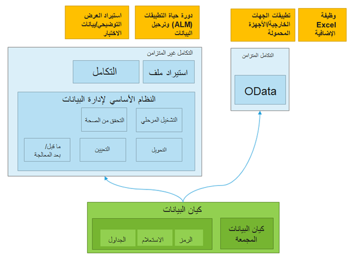

توفر كيانات البيانات تجريداً مفاهيمياً وتغليفاً (طريقة عرض غير طبيعية) لمخطط الجدول الأساسي الذي يمثل مفاهيم البيانات ووظائفها.Data entities provide conceptual abstraction and encapsulation (de-normalized view) of underlying table schema that represent data concepts and functionalities. 

بعد إنشاء كيانات البيانات، يجب أن تكون قادراً على إعادة استخدامها لوظائف Excel الإضافية أو الاستيراد والتصدير أو سيناريوهات التكامل.After data entities are created, you should be able to reuse them for Excel add-ins, import and export, or integration scenarios. كيان البيانات هو تجريد من التنفيذ المادي لجداول قاعدة البيانات.A data entity is an abstraction from the physical implementation of database tables. 

تقدم هذه الصورة سيناريوهات تكامل كيان البيانات.This image presents data entity integration scenarios.

على سبيل المثال، في الجداول الموحدة، قد يتم تخزين الكثير من البيانات لكل عميل في جدول عميل، ومن ثم قد يتم توزيع الباقي عبر مجموعة صغيرة من الجداول ذات الصلة.For example, in normalized tables, a lot of the data for each customer might be stored in a customer table, and then the rest might be spread across a small set of related tables. في هذه الحالة، يظهر كيان البيانات لمفهوم العميل كعرض واحد غير عادي، حيث يحتوي كل صف على جميع البيانات من جدول العميل والجداول المرتبطة به.In this case, the data entity for the customer concept appears as one de-normalized view, in which each row contains all the data from the customer table and its related tables. 

يقوم كيان البيانات بتغليف مفهوم الأعمال في تنسيق يجعل التطوير والتكامل أسهل.A data entity encapsulates a business concept into a format that makes development and integration easier. يمكن أن تبسط الطبيعة المجردة لكيان البيانات تطوير التطبيقات وتخصيصها.The abstracted nature of a data entity can simplify application development and customization. في وقت لاحق، يقوم التجريد أيضاً بعزل كود التطبيق من الاضطراب الحتمي للجداول المادية بين الإصدارات.Later, the abstraction also insulates application code from the inevitable churn of the physical tables between versions. 

كيان البيانات لديه القدرات التالية:A data entity has the following capabilities:

- إنه يوفر مكدساً واحداً لالتقاط منطق الأعمال، وتمكين السيناريوهات مثل الاستيراد والتصدير، والتكامل، ودعم المنطق الإضافي عن طريق إضافة رمز للمطور.It provides a single stack to capture business logic, enable scenarios such as import and export, and integration, and support additional logics by a developer adding code.
- تصبح الآلية الأساسية لتصدير واستيراد حزم البيانات لإدارة دورة حياة التطبيق (ALM) وسيناريوهات البيانات التجريبية.It becomes the primary mechanism for exporting and importing data packages for Application Lifecycle Management (ALM) and demo data scenarios.
- يمكن الكشف عنها كخدمات OData، ثم استخدامها في سيناريوهات التكامل المتزامن الجدولية وتكاملات Microsoft Office.It can be exposed as OData services, and then used in tabular-style synchronous integration scenarios and Microsoft Office integrations.

## مثال على الكيانEntity example 

يريد المستهلك الوصول إلى البيانات المتعلقة بكائن العميل، ولكن هذه البيانات مبعثرة حالياً عبر عدة جداول موحدة، مثل **DirParty، وCustTable، وLogisticsPostalAddress**، و **LogisticsElectronicAddress**.A consumer wants to access data that is related to a customer object, but this data is currently scattered across multiple normalized tables, such as **DirParty, CustTable, LogisticsPostalAddress**, and **LogisticsElectronicAddress**. 

لذلك، فإن عملية قراءة وكتابة بيانات العميل مملة.Therefore, the process of reading and writing customer data is tedious. بدلاً من ذلك، يمكن تصميم كيان العميل التالي لتغليف المخطط المادي الأساسي بأكمله في عرض واحد غير عادي.Instead, the following customer entity can be designed to encapsulate the entire underlying physical schema into a single de-normalized view. يتيح ذلك عمليات قراءة وكتابة أبسط، كما يتيح تجريد أي تفاعل داخلي بين الجداول.This enables simpler read and write operations, and enables abstraction of any internal interaction between the tables.

## فئات الكياناتCategories of entities 

يتم تصنيف الكيانات بناءً على وظائفها ونوع البيانات التي تخدمها.Entities are categorized based on their functions and the type of data that they serve. فيما يلي خمس فئات لكيانات البيانات:The following are five categories for data entities:

- المعلمات‬Parameters
- المرجعReference
- رئيسيMaster
- المستندDocument
- الحركاتTransactions

### المعلمات‬Parameters 

- المعلمات الوظيفية أو السلوكية.Functional or behavioral parameters.
- مطلوب لإعداد نشر أو وحدة توزيع لإنشاء أو عميل معين.Required to set up a deployment or a module for a specific build or customer.
- يمكن أن تتضمن بيانات خاصة بصناعة أو أعمال.Can include data that is specific to an industry or business. يمكن أن تنطبق البيانات أيضاً على مجموعة أوسع من العملاء.The data can also apply to a broader set of customers.
- الجداول التي تحتوي على سجل واحد فقط، حيث تكون الأعمدة عبارة عن قيم للإعدادات.Tables that contain only one record, where the columns are values for settings. توجد أمثلة على هذه الجداول للحسابات الدائنة (AP) ودفتر الأستاذ العام (GL) وخيارات أداء العميل ومهام سير العمل وما إلى ذلك.Examples of such tables exist for Accounts payable (AP), General ledger (GL), client performance options, workflows, and so on.

### المرجعReference 

- بيانات مرجعية بسيطة، بكميات صغيرة، مطلوبة لتشغيل عملية أعمال.Simple reference data, of small quantity, that is required to operate a business process.
- البيانات الخاصة بصناعة أو عملية أعمال.Data that is specific to an industry or a business process.
- تشمل الأمثلة الوحدات والأبعاد ورموز الضرائب.Examples include units, dimensions, and tax codes.

### رئيسيMaster 

- أصول البيانات الخاصة بالأعمال.Data assets of the business. بشكل عام، هذه هي "أسماء" الاعمال، والتي تقع عادةً في فئات مثل الأشخاص والأماكن والمفاهيم.Generally, these are the "nouns" of the business, which typically fall into categories such as people, places, and concepts.
- بيانات مرجعية معقدة بكميات كبيرة.Complex reference data, of large quantity. تشمل الأمثلة العملاء والموردين والمشاريع.Examples include customers, vendors, and projects.

### المستندDocument 

- بيانات ورقة العمل التي يتم تحويلها إلى معاملات لاحقاً.Worksheet data that is converted into transactions later.
- المستندات التي تحتوي على هياكل معقدة، مثل عدة عناصر لكل سجل رأس.Documents that have complex structures, such as several line items for each header record. تتضمن الأمثلة أوامر المبيعات وأوامر الشراء والأرصدة المفتوحة ودفاتر اليومية.Examples include sales orders, purchase orders, open balances, and journals.
- البيانات التشغيلية للأعمال.The operational data of the business.

### الحركاتTransactions 
- بيانات الحركات التشغيلية للأعمال.The operational transaction data of the business.
- الحركات المُرحّلة.Posted transactions. هذه عناصر غير ثابتة مثل الفواتير والأرصدة التي تم ترحيلها.These are non-idempotent items such as posted invoices and balances. عادةً، يتم استبعاد هذه العناصر أثناء نسخ مجموعة البيانات الكاملة.Typically, these items are excluded during a full dataset copy.
- تشمل الأمثلة الفواتير المعلقة.Examples include pending invoices.

## مفاتيح التكوين وكيانات البياناتConfiguration keys and data entities 

قبل استخدام كيانات البيانات لاستيراد البيانات أو تصديرها، نوصيك أولاً بتحديد تأثير مفاتيح التكوين على كيانات البيانات التي تخطط لاستخدامها.Before you use data entities to import or export data, we recommended that you first determine the impact of configuration keys on the data entities that you are planning to use.

لمعرفه المزيد حول مفاتيح التكوين في تطبيقات Finance and Operations، راجع [تقرير أكواد الترخيص ومفاتيح التكوين](https://docs.microsoft.com/dynamics365/fin-ops-core/dev-itpro/sysadmin/license-codes-configuration-keys-report/?azure-portal=true).To learn more about configuration keys in Finance and Operations apps, refer to the [License codes and configuration keys report](https://docs.microsoft.com/dynamics365/fin-ops-core/dev-itpro/sysadmin/license-codes-configuration-keys-report/?azure-portal=true).

### تعيينات مفاتيح التكوينConfiguration key assignments 

يمكن تعيين مفاتيح التكوين لواحد أو كل العناصر التالية.Configuration keys can be assigned to one or all of the following artifacts.

- كيانات البياناتData entities
- الجداول المستخدمة كمصادر بياناتTables used as data sources
- حقول الجدولTable fields
- حقول كيانات البياناتData entity fields

## التكاملات المدعومةSupported integrations ##

يمكن أن تدعم إدارة البيانات باستخدام كيانات البيانات عمليات التكامل التالية:Data management by using data entities can support the following integrations:

- **الخدمة المتزامنة (OData)** – تعمل كيانات البيانات على تمكين واجهات برمجة التطبيقات العامة (API) على الكيانات ليتم كشفها، مما يتيح الخدمات المتزامنة.**Synchronous service (OData)** – Data entities enable public application programming interfaces (APIs) on entities to be exposed, which enables synchronous services. تُستخدم هذه الطريقة لتكامل Office وتكاملات تطبيقات الأجهزة المحمولة التابعة لجهات خارجيةThis method is used for Office integration and third-party mobile app integrations
- **التكامل غير المتزامن** – تدعم كيانات البيانات أيضاً التكامل غير المتزامن من خلال مسار إدارة البيانات.**Asynchronous integration** – Data entities also support asynchronous integration through a data management pipeline. يتيح ذلك سيناريوهات إدخال واستخراج البيانات غير المتزامنة وعالية الأداء.This enables asynchronous and high-performing data insertion and extraction scenarios. تُستخدم هذه الطريقة للاستيراد/التصدير التفاعلي المستند إلى الملف والتكاملات المتكررة.This method is used for interactive file-based import/export and recurring integrations.
- **ذكاء الأعمال** – باستخدام القياسات الإجمالية المتاحة في تطبيقات Finance and Operations، وعناصر التحكم المضمنة مثل المخططات والتكامل مع Power Platform، يقدم تقارير لتقديم رؤى لبيانات الأعمال.**Business intelligence** – By using the aggregate measures available in Finance and Operations apps, built-in controls such as charts and integration with Power Platform, provides reports to offer insights to business data.

## ترحيل البيانات من الأنظمة القديمة أو الخارجيةData migration from legacy or external systems 

بعد أن يبدأ التوزيع الأولي وتشغيله، سيقوم منفذ النظام بترحيل أصول البيانات الحالية للعميل إلى تطبيقات Finance and Operations، مثل:After the initial deployment is up and running, the system implementer will migrate existing data assets of the customer into Finance and Operations apps, such as:

- البيانات الرئيسية (على سبيل المثال، العملاء والموردون)Master data (for example, customers and vendors)
- مجموعات فرعية من المستندات (على سبيل المثال، أوامر المبيعات)Subsets of documents (for example, sales orders)

يمكنك استخدام إطار عمل إدارة البيانات لنسخ التكوينات بين الشركات أو البيئات، وتكوين العمليات أو الوحدات النمطية باستخدام Lifecycle Services ‏(LCS).You can use the data management framework to copy configurations between companies or environments, and configure processes or modules by using Lifecycle Services (LCS).

يهدف نسخ التكوينات إلى تسهيل بدء تنفيذ جديد، حتى إذا كان فريقك لا يفهم بعمق بنية البيانات التي يجب إدخالها، أو تبعيات البيانات، أو التسلسل لإضافة البيانات إلى التنفيذ.Copying configurations is intended to make it easier to start a new implementation, even if your team doesn't deeply understand the structure of data that needs to be entered, data dependencies, or which sequence to add data to an implementation.

يتيح لك إطار عمل إدارة البيانات:The data management framework allows you to:

نقل البيانات بين نظامين متشابهين.Move data between two similar systems.
- اكتشف الكيانات والتبعيات بين الكيانات لعملية أعمال أو وحدة معينة.Discover entities and dependencies between entities for a given business process or module.
- الاحتفاظ بمكتبة قابلة لإعادة الاستخدام من قوالب البيانات ومجموعات البيانات.Maintain a reusable library of data templates and datasets.
- استخدم حزم البيانات لإنشاء كيانات البيانات التزايدية.Use data packages to create incremental data entities. يمكن ترتيب كيانات البيانات داخل الحزم.Data entities can be sequenced inside the packages. يمكنك تسمية حزم البيانات، والتي يمكن التعرف عليها بسهولة أثناء الاستيراد أو التصدير.You can name data packages, which can be easily identifiable during import or export. عند إنشاء حزم البيانات، يمكن تعيين كيانات البيانات إلى جداول مرحلية في شبكات أو باستخدام أداة رسم الخرائط المرئية.When building data packages, data entities can be mapped to staging tables in grids or by using a visual mapping tool. يمكنك أيضاً سحب الأعمدة وإفلاتها يدوياً.You can also drag-and-drop columns manually.
- اعرض البيانات أثناء عمليات الاستيراد، حتى تتمكن من مقارنة البيانات والتأكد من صحتها.View data during imports, so you can compare data and ensure that it is valid.

