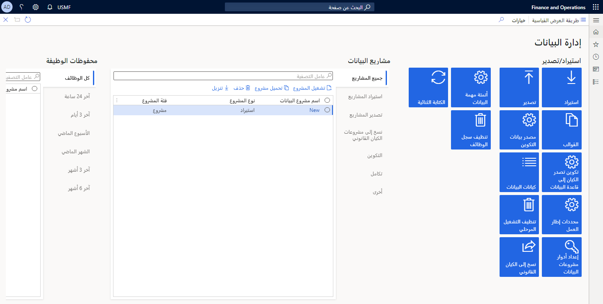
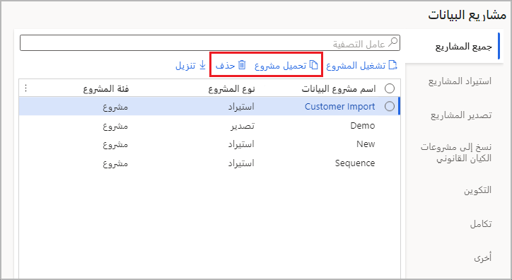
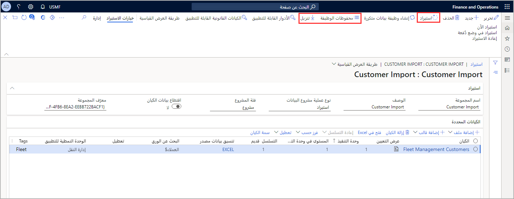
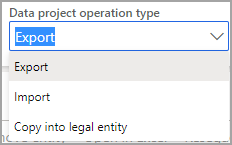
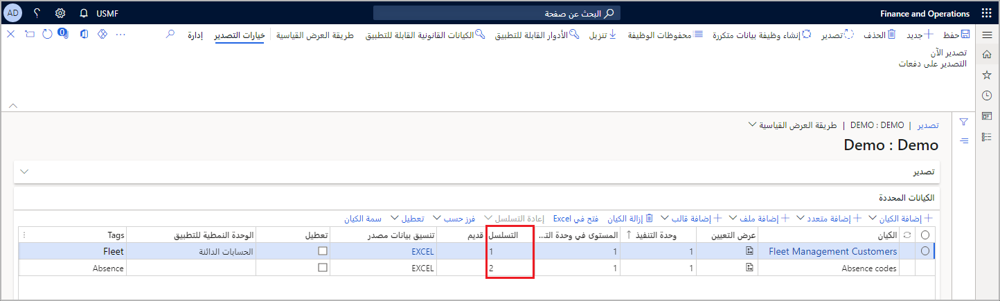
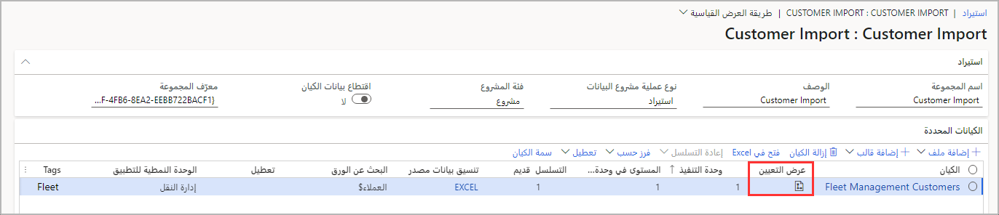
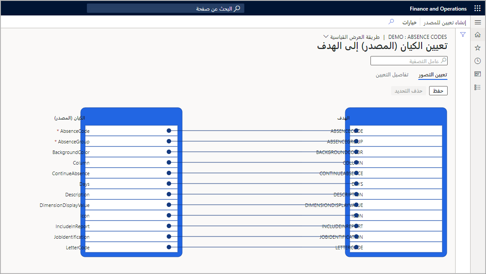
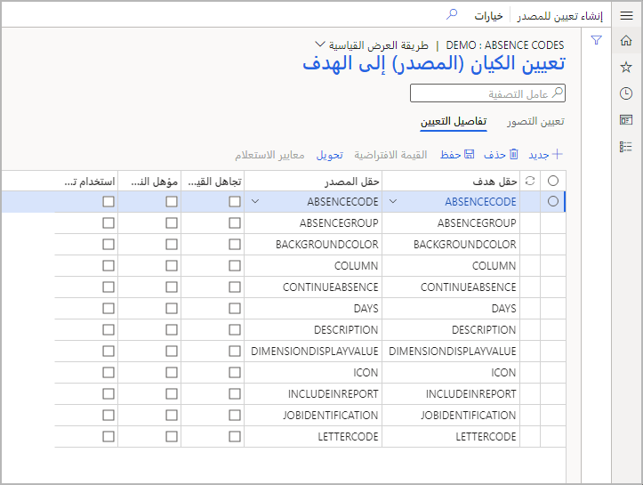
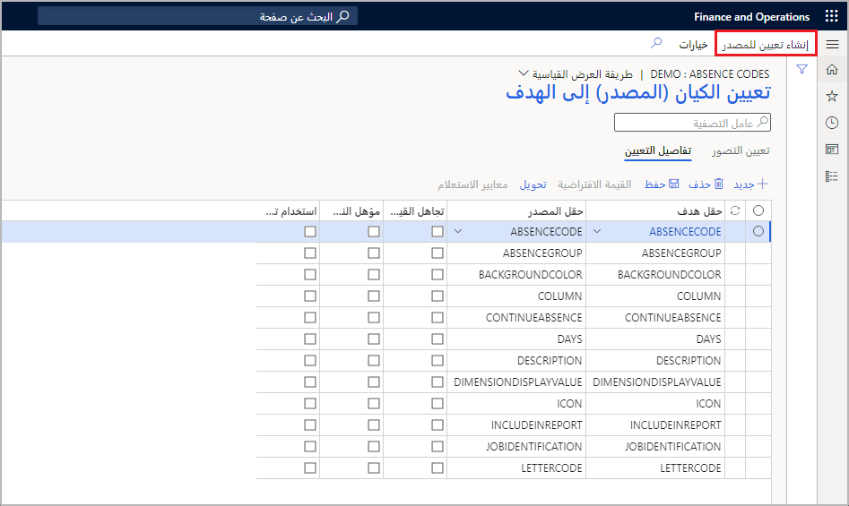

توضح هذه الوحدة طريقة العمل مع مساحة عمل **إدارة البيانات** في تطبيقات Finance and Operations. 

توفر مساحة عمل **إدارة البيانات** الوصول إلى المهام الهامة لإدارة البيانات. وتوفر أيضاً معلومات حول المشاريع ومهام تنفيذ المشروع. 

بعد إنشاء مشروع بيانات التكوين، يظهر في شبكة **مشاريع البيانات** الموجودة في مساحة عمل **إدارة البيانات**. 

بالنسبة لكل مشروع، يتم عرض نوع التكوين (استيراد أو تصدير) وفئة المشروع (المشروع أو التكوين أو التكامل أو غير ذلك). استخدم الخيارات الموجودة على يسار الشبكة للتصفية حسب المشروع المناسب. يتم مشاركة تعريف المشروع عبر الكيانات القانونية
 

لفتح مشروع، حدد المشروع، ثم حدد **تحميل المشروع** لفتح صفحة **الاستيراد** أو **التصدير**. استخدم زر **حذف** لحذف المشاريع المحددة. 
 

يمكنك أيضاً تنزيل تعريفات المشروع باستخدام زر **تنزيل**. استخدم **محفوظات الوظيفة** للحصول علي مزيد من التفاصيل حول المشروعات التي قمت بتشغيلها. استخدم عوامل تصفية نطاق البيانات للتصفية حسب التواريخ التي تم فيها تشغيل مشاريع البيانات. يمكنك عرض تفاصيل التنفيذ عن طريق تحديد وظيفة ثم استخدام قائمة **تفاصيل التنفيذ**.
  

بالنسبة لمهام التصدير، يمكنك أيضاً تنزيل البيانات من مساحة العمل باستخدام زر **صفحة التنزيل**. تكون المشاريع المتوفرة في مساحة عمل **إدارة البيانات** كما يلي:

- تصدير
- استيراد
- نسخ إلى الكيان القانوني

يعد خيار **كافة المشاريع** عامل تصفية لتحديد نوع المشروع في مساحة العمل للعمل معه.

## التسلسل 

يجب وضع نوعين من التسلسل في عين الاعتبار عند العمل مع كيانات البيانات.

- تسلسل كيانات البيانات داخل حزمة بيانات
- تسلسل ترتيب عمليات استيراد حزمة البيانات

## تسلسل كيانات البيانات داخل حزمة بيانات 

1.  عندما يضيف المستخدم كيانات البيانات إلى مشروع بيانات، يتم بشكل افتراضي تعيين تسلسل للترتيب الذي سيتم تحميل الكيانات فيه. سيتم تعيين الكيان الأول المضاف إلى المشروع كأول كيان يتم تحميله، وسيكون الكيان التالي المضاف ثانياً، وسيكون الكيان التالي ثالثاً، وهكذا.
2.  علي سبيل المثال، في حالة قيام مستخدم بإضافة كيانين في هذا الترتيب، **أكواد ضريبة المبيعات** و **مجموعات ضريبة المبيعات**، فسيتم تعيين **أكواد ضريبة المبيعات** على تسلسل كيان **1.1.1** وتعيين **أكواد ضريبة المبيعات** على تسلسل كيان 1.1.2. يشير مستوى التسلسل إلى أن الكيان الثاني لن يبدأ عملية الاستيراد حتى ينتهي المستوى الأول.
3.  لعرض تسلسل أو تحريره، حدد زر **تسلسل الكيان** (يتوفر فقط في طريقه العرض القياسية) في جزء الإجراءات الخاص بمشروع البيانات.
4.  في تسلسل كيان مجموعة التعريف، يمكنك عرض وحدات التنفيذ والتسلسل. يمكنك تغيير التسلسل عن طريق تحديد كيان البيانات في القائمة، وتعيين وحدة تنفيذ مختلفة أو تسلسل في المستوى، ثم تحديد **التحديث الذي تم تحديده**. بعد تحديد **تحديث المحدد**، سيتم تحريك الكيان لأعلى أو لأسفل في قائمة الكيان.

    

    لمتابعة المثال الوارد في الخطوة 2، لاستيراد أكواد ومجموعات ضريبة المبيعات بنجاح، يجب تنزيل أكواد ضريبة المبيعات والتفاصيل قبل استيراد مجموعات ضريبة المبيعات. توجد جميع أكواد ومجموعات ضريبة المبيعات في وحدة التنفيذ = 1، ولكن التسلسلات تكون بالترتيب الذي سيتم استيرادها به. يتم تضمين كيانات ضريبة المبيعات الأخرى ذات الصلة التي لا تعتمد على كيانات البيانات الأخرى التي يتم تحميلها في الحزمة. 

    على سبيل المثال، يتم تعيين كيان أرقام الإعفاء من ضريبة المبيعات في وحدة التنفيذ الخاصة به = 2. سيبدأ تحميل كيان البيانات هذا على الفور لأنه لا توجد تبعيات على الكيانات الأخرى التي يتم تحميلها قبله.

    يمكن أن تحدد تطبيقات Finance and Operations تسلسلات كيانات البيانات المحددة في مشروع عن طريق تحديد زر **التسلسل التلقائي**.

## عمليات استيراد حزمة بيانات التسلسل 

لتحميل البيانات بنجاح، من المهم تعيين الترتيب الصحيح لاستيراد حزم البيانات بسبب التبعيات الموجودة داخل وعبر الوحدات النمطية. يوجد تنسيق ترقيم مقترح تم إنشاؤه لحزم البيانات ضمن خدمات Lifecycle Services (LCS)، لذا يمكنك التعرف على حزم البيانات التي تحتاج إلى تحميلها أولاً. 

وقد يكون ذلك كما يلي:

- المقطع الأول: الوحدة النمطية
- المقطع الثاني: نوع البيانات (الإعداد، الرئيسية، الحركة)
- المقطع الثالث: رقم التسلسل

## التعيين 

عندما تعمل مع كيانات البيانات، فإن تعيين كيان إلى مصدر يكون تلقائياً. يمكن تجاوز التعيين التلقائي للحقول، إذا لزم الأمر.

لعرض كيفيه تعيين كيان ما، حدد لوحة الكيان في المشروع، ثم حدد **عرض التعيين**.
  

يوفر Data Management Framework طريقة عرض تعيين التصور (افتراضياً) وطريقة عرض تفاصيل التعيين. تحدد علامة النجمة الحمراء (*) أي حقول مطلوبة في الكيان. ويجب تعيين هذه الحقول حتى تتمكن من العمل مع الكيان. يمكن إلغاء تعيين الحقول الأخرى كما هو مطلوب عندما تعمل مع الكيان.

- لإلغاء تعيين حقل، قمّ بتمييز الحقل في أي من العمودين (**الكيان** أو **المصدر**)، حدد **حذف التحديد**، ثمّ حدد **حفظ**. بعد حفظ التغييرات، قم بإغلاق النموذج للرجوع إلى المشروع.

بعد الاستيراد، يمكنك أيضاً تحرير تعيين الحقل من المصدر إلى التشغيل المرحلي باستخدام نفس العملية.
 

## إعادة إنشاء تعيين 

إذا قمت بتوسيع كيان (الحقول المضافة) أو إذا كان التعيين التلقائي يبدو غير صحيح، فيمكن إعادة إنشاء تعيين الكيان في صفحة **التعيين**.

1.  للقيام بذلك، حدد **إنشاء تعيين المصدر**. ستظهر رسالة تسألك، "هل تريد إنشاء التعيين من الصفر؟"
2.  حدد **نعم** لإعادة إنشاء التعيين.

## إنشاء البيانات 

إذا كانت لديك حقول في الكيانات التي تريد أن يقوم النظام بإنشاء بيانات لها عند الاستيراد، بدلاً من توفير البيانات في الملف المصدر، يمكنك استخدام الوظيفة التي تم إنشاؤها تلقائياً في تفاصيل التعيين للكيان. يُرجى ملاحظة أن الصورة التالية تعرض مشروع التصدير؛ التالي، ولا يتوفر التعيين الذي تم إنشاؤه تلقائياً لأن كيانات بيانات تطبيقات Finance and Operations هي البيانات المصدر لمشروعك.
 

ومع ذلك، لاحظ أن في مشروع الاستيراد، يأتي مصدر البيانات من أنظمة أخرى، مثل تلك التطبيقات القديمة. تستخدم تطبيقات Finance and Operations منطق الأعمال لكل كيان بيانات، وتكتشف التبعيات، وتسلسل كيانات البيانات بناءً على علاقاتها وتبعياتها. 

على سبيل المثال، إذا كنت ترغب في استيراد معلومات العملاء وعنوان العميل، ولكن لم يتم استيراد معلومات العنوان مسبقاً باستخدام كيانات دفتر العناوين العمومي (GAB)، فيمكنك جعل الكيان ينشئ رقم الطرف تلقائياً عند الاستيراد وسيتم إنشاء معلومات دفتر العناوين العمومي. للوصول إلى هذه الوظيفة، قمّ بعرض تعيين الكيان، ثم حدد علامة التبويب **تفاصيل التعيين**. وحدد الحقول التي تريد إنشاءها تلقائياً. سيؤدي ذلك إلى تغيير حقل المصدر إلى **تلقائي**.
 

