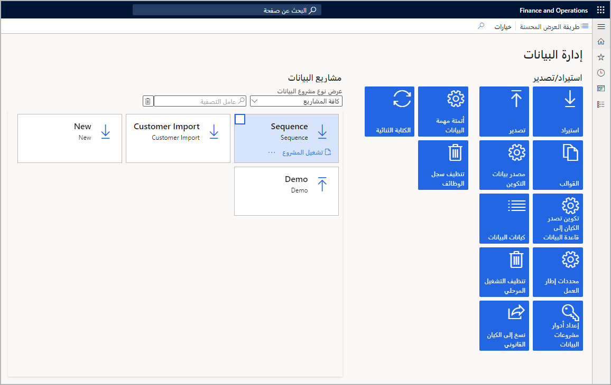
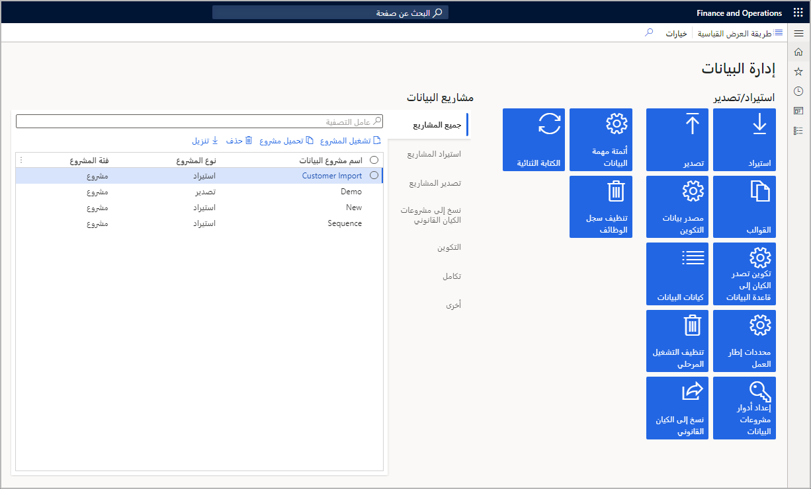

تتوفر طريقتا عرض للعمل داخل مشاريع إدارة البيانات، هما طريقة العرض القياسية والمحسنة. 

عندما تكون في مشروع سواءً كاستيراد أو تصدير، يتوفر الزر **تسلسل الكيانات** في طريقة العرض القياسية فقط. 

وتُظهر طريقتا العرض كلتاهما جميع الإطارات المتجانبة المتوفرة في إطار عمل إدارة البيانات. ولكن، تتيح طريقة العرض المحسنة معلومات أكثر تفصيلاً وتحكماً في المشروع أكثر من طريقة العرض القياسية.

تُظهر الصورة التالية الإطارات المتجانبة المتوفرة في طريقة العرض القياسية.
 

تُظهر الصورة التالية الإطارات المتجانبة المتوفرة في طريقة العرض المحسَّنة.

قبل إدارة استيراد البيانات وتصديرها، تحتاج إلى تكوين هذه الإطارات المتجانبة لإنشاء الوظائف وإدارتها وتشغيلها بنجاح لتنفيذ أنشطة إدارة البيانات.

