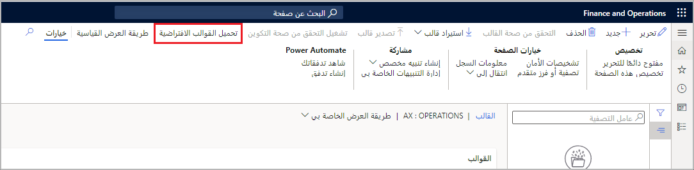
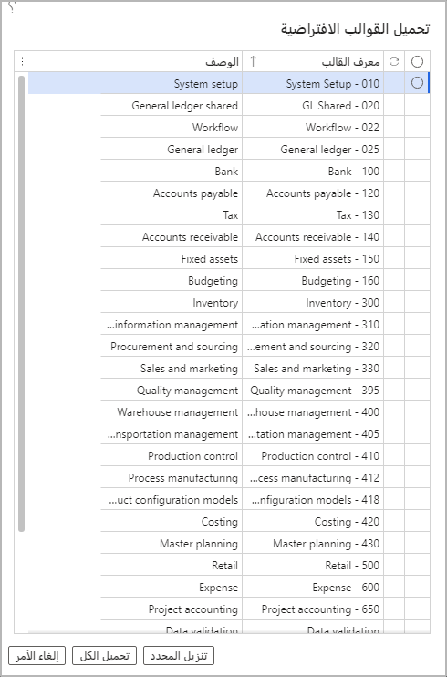
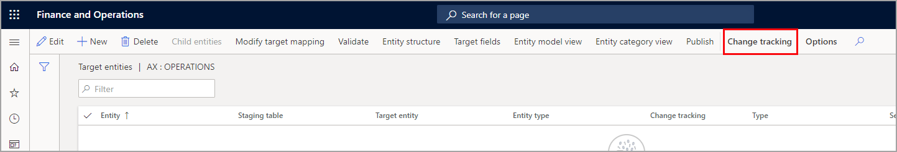

يتم تسليم القوالب الافتراضية مع كل إصدار جديد من تطبيقات Finance and Operations. يتمثل هدفنا طويل المدى في توفير القوالب في Lifecycle Services (LCS) بحيث يمكنك دفعها إلى مثيل من تطبيقات Finance and Operations. ومع ذلك، فبالنسبة للإصدارات الحالية، حدد لوحة **القوالب** الموجودة في مساحة عمل **إدارة البيانات**، ثم حدد **تحميل القوالب الافتراضية** لتحميل القوالب. لرؤية القائمة **تحميل القوالب الافتراضية**، يجب استخدام طريقه العرض المحسنة.

نوصي باستخدام طرق العرض المحسّنة للحصول على المزيد من الميزات والمرونة أثناء العمل مع مشاريعك.
 
بعد تحميل القوالب، يمكنك تغييرها لتناسب متطلبات عملك. إذا كنت ترغب في استرداد القوالب الافتراضية الأصلية، فيمكنك استخدام الزر **تحميل القوالب** لإعادة إضافتها مره أخرى إلى النظام الخاص بك. سيتم بعد ذلك استبدال القوالب بأحدث الإصدارات. إذا قمت بإجراء تغييرات على القوالب، فسيمكنك عمل نسخة من القوالب القديمة عن طريق تصديرها.
 
لاحظ أن وصول مسؤول النظام مطلوب لتحميل القوالب الافتراضية واستيراد القوالب. يساعد هذا المتطلب على ضمان تحميل جميع الكيانات بشكل صحيح في القالب.

بالنسبة لبيئة تطبيقات Finance and Operations الموزعة حديثاً، لا يتم تحميل القوالب الافتراضية. نوصي بتحديد الزر **تحميل القوالب الافتراضية** لعرض القوالب الافتراضية. 
 

 

عندما يظهر مربع الحوار **تحميل القوالب الافتراضية**، يمكنك تحديد قالب واحد أو عدة قوالب أو جميع القوالب ليتم تحميلها في البيئة الخاصة بك.
 

يتم حجز المستويات من 10 إلى 22 لكيانات النظام المشتركة بحيث تتم معالجة هذه الكيانات أولا. تستخدم جميع الأنظمة تقريباً كيانات دفتر الأستاذ العام الخاصة بالشركة. لذلك، يتم حجز المستوى 25 لتلك الكيانات. تمثل هذه المستويات الحد الأدنى من الإعداد الأساسي المطلوب لمعظم البيانات المشتركة في التكوين.

بعد اكتمال الإعداد الأساسي، يمكن تحميل العديد من الكيانات بالتوازي عبر جميع الوحدات النمطية. لا يلزم تحميل هذه الكيانات في مخازن حسب الوحدة النمطية. فبدلاً من ذلك، يمكنك إعداد نطاقات من التبعيات بين البيانات للكيانات المختلفة. تتم إضافة الكيانات التي ليس لها تبعيات إلى النطاق 30 في هذا المثال. تتم إضافة النطاق 40 للكيانات التي لها تبعية على الكيانات في النطاق 30. تتم متابعة نفس العملية للنطاقات من 50 إلى 90.

بعد تنظيم الكيانات الأساسية بحيث يمكن معالجتها بالتوازي، يتم تنظيم الكيانات المتبقية حسب الوحدة النمطية، بالترتيب الذي يجب معالجة الوحدات النمطية فيه. ومع ذلك، تشتمل العديد من الكيانات على عدة تبعيات، بعضها معقد. 

على سبيل المثال، قد يتطلب كيان ملفات تعريف ترحيل المورد كيانات موردين أو أصناف. على الرغم من أن كيان ملفات تعريف ترحيل المورد موجود في الوحدة النمطية للحسابات الدائنة، إلا أنه يجب معالجته بعد الوحدة النمطية لإدارة المنتج. في هذه الحالة، إذا كانت كيانات الموردين هي 1.130.10 وكانت كيانات العناصر 1.300.10، فيجب ترحيل كيان ملفات تعريف ترحيل المورد بحيث يكون بعد هذا التسلسل (على سبيل المثال، 1.310.20).

> [!NOTE]
> التسلسلات التي قمنا بتطبيقها هي إرشادات وليست متطلبات. لا توجد علاقة مطلوبة بين المستوى والوحدة النمطية. يمكنك إعادة ترتيب الكيانات إذا لم يعمل التسلسل لتنفيذ العملية الخاصة بك. لإضافة القوالب الخاصة بك إلى التكوين، يمكنك اتباع الإرشادات السابقة للمساعدة في ضمان دمج القالب بشكل صحيح في مشروع يستخدم القوالب الافتراضية. 

## القوالب التي لها نفس الكيان 

بعض الكيانات مطلوبة في أكثر من قالب واحد. على سبيل المثال، يجب أن يكون لديك شروط دفع في كل من قوالب الحسابات الدائنة والحسابات المدينة. ومع ذلك، فقد تحتاج فقط إلى قالب الحسابات المدينة. تمت إضافة الكيان إلى كل من القالبين للحالات التي تتطلب واحداً منهما فقط.

يمكن أن يتضمن مشروع البيانات مثيلاً واحداً فقط للكيان. إذا أضفت قالباً، وكان القالب يحتوي على كيان موجود بالفعل في مشروع بيانات، فإن الكيان الموجود في هذا القالب يستبدل الكيان الموجود حالياً في المشروع.

يمكنك استخدام هذه الإمكانية لتجاوز القوالب الافتراضية دون تغييرها. على سبيل المثال، لم يتم تعيين حقل العامل في مشروع البيانات الخاص بك، ولكن لديك قالب خاص بك يضيف عمالاً. في هذه الحالة، يمكنك إنشاء قالب يتضمن الكيانات التي تحتوي على حقل العامل. في هذا القالب، يمكنك تعيين حقل العامل. سيتم بعد ذلك استبدال أي كيانات في مشروع البيانات لم يتم تعيين الحقل لها.

## القوالب المدمجة 

لقد أنشأنا قوالب أكبر تغطي العديد من مناطق الوحدات النمطية. يمكنك استخدام القوالب الأكبر حجماً أو أي مجموعة من القوالب الأصغر لإنشاء مشروع بيانات. تتوفر القوالب المجمعة التالية:

- **النظام والمشاركة** – تتضمن إعداد النظام ودفتر العناوين العام ودفتر الأستاذ العام المشترك وسير العمل.
- **الماليات** -تتضمن دفتر الأستاذ العام والبنك والحسابات الدائنة والضريبة والحسابات المدينة والأصول الثابتة وإعداد الموازنة.
- **إدارة سلسلة التوريد** – تتضمن إدارة المخزون وإدارة المنتج والمشتريات والمبيعات والتسويق وإدارة المستودعات المحدودة والتحكم في الإنتاج والتكلفة.
- **إدارة المشروعات والمصروفات** - هذه القوالب غير مضمنة في قالب أكبر. ومع ذلك، فقد تم تصميمها بحيث يمكن دمجها بسهولة في مشروع يستخدم قوالب أخرى.
- **العاملون**- يتضمنون الكيانات اللازمة لإضافة العاملين وإعادة تعيين الكيانات حيث تمت إزالة تعيين العاملين.

## البيانات الرئيسية 

تتضمن العديد من القوالب الافتراضية كيانات للبيانات الرئيسية، مثل العملاء والموردين والمنتجات التي تم إصدارها. يتم تضمين هذه الكيانات للإشارة إلى التسلسل الصحيح للكيانات التي ستتطلبها بعد تحميل المعلمات والبيانات المرجعية. غالباً ما يتم تسلسل الكيانات الرئيسية في نطاقات الوحدة النمطية المرقمة 100 وما فوق. ستكون فئة الكيان لهذه الكيانات في الشبكة هي الفئة الرئيسية. إذا كنت لا تريد تضمين البيانات الرئيسية أو أي كيانات أخرى في التكوين الخاص بك، فقم بإزالة هذه الكيانات من مشروعك.

## تمكين تعقب التغييرات للكيانات 

يتيح تعقب التغييرات التصدير المتزايد للبيانات من تطبيقات Finance and Operations باستخدام إدارة البيانات. يتم تصدير السجلات التي تم تغييرها فقط أثناء التصدير التزايدي. لتمكين التصدير التزايدي، يجب تمكين تعقب التغييرات بالكيانات. 
 

إذا لم تقم بتمكين تعقب التغييرات على كيانٍ، فيمكنك فقط تمكين التصدير الكامل في كل مرة. من أجل حالات استخدام "إحضار قاعدة بياناتك الخاصة (BYOD)"، يمكن لتعقب التغييرات أيضاً تتبع عمليات الحذف، إذا كان الكيان يدعم ذلك.

لمزيد من المعلومات حول BYOD، راجع [إعداد البيانات للترحيل إلى تطبيقات Finance and Operations](https://docs.microsoft.com/learn/modules/prepare-data-migration-finance-operations/?azure-portal=true).

