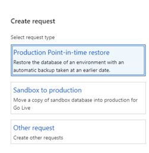
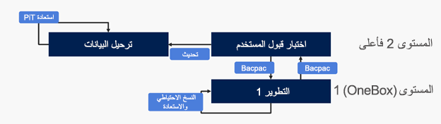

عمليات نقل قاعدة البيانات عبارة عن مجموعة من إجراءات الخدمة الذاتية التي يمكنك استخدامها كجزء من إدارة دورة حياة تطبيق البيانات (يشار إليها أيضاً باسم DataALM). توفر هذه الإجراءات عمليات هيكلية لسيناريوهات التنفيذ الشائعة مثل ترقية التكوين الذهبي والتصحيح/التشخيص واختبار تحديد القدرة والتحديث العام لأغراض التدريب.

> [!div class="mx-imgBorder"]
> 

من خلال عمليات نقل قاعدة البيانات، يمكنك:

- قم بتشغيل عملية نقل قاعدة البيانات من وإلى بيئات المستوى 2+ مباشرةً في Lifecycle Services لـ Microsoft Dynamics.
- إنشاء طلبات لعمليات قاعدة البيانات لبيئة التشغيل في Lifecycle Services.

## تحديث قاعدة البيانات
يمكنك استخدام Lifecycle Services لإجراء تحديث لقاعدة البيانات في بيئة اختبار قبول المستخدم (UAT). يتيح لك تحديث قاعدة البيانات نسخ قواعد البيانات الخاصة بالحركات والتقارير المالية الخاصة ببيئة التشغيل الخاصة بك إلى بيئة الاختبار المعزولة لاختبار قبول المستخدم (UAT) الهدف. إذا كانت لديك بيئة اختبار معزولة أخرى، فيمكنك أيضاً نسخ قواعد البيانات من تلك البيئة إلى بيئة UAT الهدف لبيئة الاختبار المعزولة.

> [!NOTE]
> لا يتم دعم نسخ بيانات الإنتاج إلى بيئة الاختبار المعزولة لغرض إعداد تقارير الإنتاج.

## تصدير قاعدة بيانات
يمكنك استخدام Lifecycle Services لتصدير قاعدة بيانات من بيئة اختبار قبول المستخدم (UAT) لبيئة الاختبار المعزولة إلى مكتبة الأصول. لن تكون البيئة متاحة لعمليات الصيانة الأخرى، مثل تحديث بيئة االختبار المعزولة أو توزيع الحزمة خلال هذا الوقت. ستكون البيئة المصدر قابلة للاستخدام من منظور مستخدم Dynamics.

## استيراد قاعدة البيانات
يمكنك استيراد قاعدة بيانات تم إعدادها من بيئة مطور إلى اختبار قبول المستخدم القياسي (UAT)، أو قاعدة بيانات تم تصديرها مسبقاً من بيئة UAT.

## استعادة النقطة الزمنية
يمكنك استخدام Lifecycle Services لإجراء استعادة النقطة الزمنية (PITR) لبيئة اختبار قبول المستخدم (UAT) لبيئة الاختبار المعزولة. تحتفظ Microsoft [بالنسخ الاحتياطية التلقائية](/azure/azure-sql/database/automated-backups-overview?tabs=single-database/?azure-portal=true) لقواعد بيانات الأعمال والتقارير المالية لمدة 28 يوماً لبيئات التشغيل و14 يوماً لبيئات الاختبار المعزولة.

## استعادة النقطة الزمنية لقاعدة بيانات التشغيل إلى بيئة الاختبار المعزولة
يمكنك استخدام Lifecycle Services لإجراء استعادة النقطة الزمنية (PITR) لقاعدة بيانات التشغيل إلى بيئة الاختبار المعزولة لاختبار قبول المستخدم (UAT). لتزويد العملاء بإمكانيات إدارة دورة حياة تطبيق البيانات (DataALM) التي لا تعتمد على العمليات البشرية أو اليدوية، قدم فريق Lifecycle Services إجراءات تحديث قاعدة البيانات تلقائياً لهذا الغرض.

## عمليات قاعدة البيانات بين المستوى 1 والمستوى 2+
يمكنك استخدام الخيارات التالية لنقل قواعد البيانات بين بيئات العميل/الشريك التي تتم إدارتها من المستوى 1 والمستوى 2:

- إجراء Bacpac: من SQL Server إلى Azure SQL أو من Azure SQL إلى SQL Server
- النسخ الاحتياطي/الاستعادة لخادم SQL Server بين بيئات بصندوق واحد (خادم SQL Server)

> [!div class="mx-imgBorder"]
> 

راجع [الصفحة الرئيسية لعمليات نقل قاعدة البيانات](/dynamics365/fin-ops-core/dev-itpro/database/dbmovement-operations/?azure-portal=true) لمعرفة المزيد حول عمليات نقل قاعدة البيانات 
