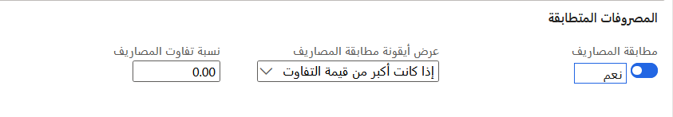

يمكنك استخدام مطابقة المصاريف الفواتير للمساعدة في التأكد من أن إجمالي مبالغ التكلفة لا ينحرف عن المبالغ المتوقعة بأكثر من نسبة التباين المقبولة. تتم مقارنة المبالغ الإجمالية لكل كود مصاريف ينطبق على الفاتورة وأمر الشراء في الصفحة **مقارنة قيم المصاريف - الفاتورة**.

يتم التحكم في مطابقة المصاريف للكيان القانوني عن طريق الخيار **مطابقة المصاريف** في صفحة **معلمات الحسابات الدائنة**. يمكنك إعداد النسب المئوية لتفاوت الفرق للمصاريف في الصفحة **الاختلافات في المصاريف**.

يتم إجراء مطابقة المصاريف فقط في أكواد المصاريف التي يتم فيها تحديد الخيار **مقارنة أمر الشراء وقيمة الفاتورة** في الصفحة **كود المصاريف**.

وتعتمد فواتير المورّد غالباً على إيصالات استلام المنتجات التي تمثل الشحنات الفعلية، بدلاً من أوامر الشراء. في بعض الأحيان لا تتوافق المبالغ المفوترة مع مبالغ أمر الشراء، وأحياناً لا تتطابق الكميات المشحونة مع الكميات المفوترة. يمكنك المساعدة في إدارة هذه المعلومات بالطرق التالية:

- إنشاء فاتورة مورد استناداً إلى إيصالات استلام المنتجات. يتم اقتراح إيصالات استلام المنتجات تلقائياً للفواتير، ويمكنك تحديد إيصالات استلام المنتجات المطلوب استخدامها. يمكنك أيضاً تحديد أصناف بند إيصال استلام منتجات محددة من أوامر شراء متعددة، إذا لزم الأمر.
- عرض فروق الكمية واعتمادها بين الكمية التي تمت فوترتها في الفاتورة والكمية المستلمة في إيصال استلام المنتجات. في حاله وجود اختلاف، يمكنك حفظ الفاتورة ومطابقتها فيما بعد بإيصال استلام منتجات مختلف، أو تغيير الكمية المفوترة لمطابقة الكمية المستلمة.
- أدخل مبالغ الفاتورة التي لم يتم تضمينها في أمر الشراء الأصلي، بحيث تتطابق معلومات الفاتورة مع الفاتورة التي استلمتها من المورد. يمكنك مقارنة المصاريف الخاصة بأوامر الشراء بالمصاريف الخاصة بالفواتير. وإذا لزم الأمر، يمكنك إضافة المصاريف إلى الفواتير وتخصيصها إلى بنود الفاتورة.
- عرض اختلافات مطابقة السعر والموافقة عليها بين صافي سعر وحده الفاتورة وصافي سعر وحدة أمر الشراء. يمكنك إعداد النسب المئوية لتفاوت السعر للكيانات القانونية والموردين والأصناف. إذا لم يكن سعر بند فاتورة المورد في تفاوت السعر المقبول، فيمكنك حفظ الفاتورة حتى يتم اعتمادها للترحيل، أو حتى تتلقى تصحيحاً من المورد.

