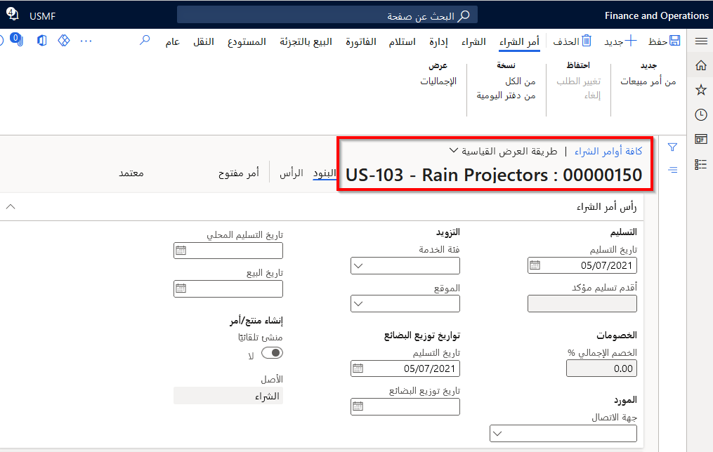
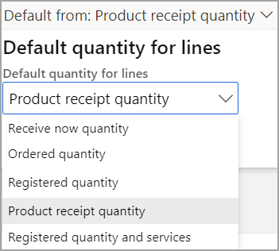
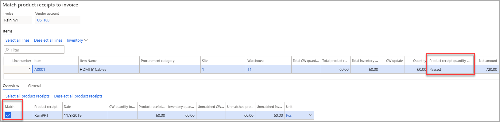
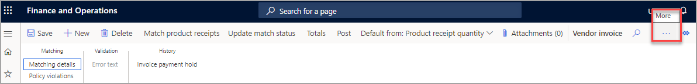

## السيناريو
عند استلام فاتورة من مورد بضائع أو خدمات في أمر شراء، قد تتطلب العمليات التجارية استلام البضائع أو الخدمات قبل اعتماد الفاتورة للدفع.
 
## قبل البدء 

في الصفحة **الحسابات الدائنة > إعداد >معلمات حسابات الدائنة**، حدد الخيار **التحقق من صحة الفاتورة** وتأكد من تحديد الخيار **تمكين التحقق من صحة مطابقة الفاتورة**، وتعيين الحقل **ترحيل فاتورة مع اختلافات** على **المطالبة بالاعتماد**، وتعيين حقل **سياسة مطابقه البند** إلى **مطابقة ثلاثية**.

## إنشاء أمر شراء 

1.  في الشركة، **USMF** انتقل إلى **الحسابات الدائنة > أوامر الشراء > كافة أوامر الشراء**.
2.  حدد **جديد‎**.
3.  في حقل **حساب المورد**، حدد زر القائمة المنسدلة لفتح البحث.
4.  في حقل **حساب المورد**، حدد **Rain Projectors US-103**.
5.  تحت علامة التبويب السريعة **عام**، في حقل **المستودع** حدد 11
6.  حدد **موافق**.
7.  دون ملاحظة عن **رقم أمر الشراء**، ستحتاج إلى ذلك لتمرين التالي. يتم عرض رقم أمر الشراء في أعلى يسار الصفحة، كما هو موضح أدناه.
        

8.  ضمن **بنود أمر الشراء**، حدد **إضافة بند**.
9.  في الحقل **رقم الصنف**، حدد A0001.
10. في حقل **الكمية**، أدخِل 60.
11. في جزء الإجراء، حدد علامة التبويب **شراء**.
12. حدد **تأكيد**، موجود ضمن القائمة الفرعية **الإجراءات**.

## ترحيل إيصال استلام 

1.  في جزء الإجراء، حدد **استلام**.
2.  حدد **إيصال استلام المنتجات**.
3.  في الحقل **إيصال استلام المنتجات**، اكتب **RainPR1**.
4.  حدد **موافق**.

## تسجيل فاتورة مورد ومطابقتها بإيصال استلام منتجات 

1.  في جزء الإجراء، حدد **فاتورة**.
2.  حدد **فاتورة**.
3.  ضمن **رأس فاتورة المورد**، في الحقل **الرقم**، اكتب **RainInv1**.
4.  في جزء الإجراء، حدد **الافتراضي من: كمية إيصال استلام المنتجات** لفتح القائمة المنسدلة.
     

5.  في الحقل **الكمية الافتراضية للبنود**، قم بتحديد **كمية إيصال استلام المنتجات**.
6.  حدد **موافق**.
7.  في الرسالة حول تغيير الإعداد، حدد **نعم**، في حالة تلقي الرسالة.
8.  في جزء الإجراء، حدد **مطابقة إيصالات استلام المنتجات**.
9.  التحقق من حالة **مطابقة إيصالات استلام المنتجات بالفاتورة**.
    

10. حدد **موافق**.
11. في جزء الإجراء، حدد **مراجعة** ملاحظة: قد تحتاج إلى تحديد موقع علامة التبويب مراجعة عن طريق تحديد علامة التبويب أكثر (...) إلى اليمين.
    

12. حدد **تفاصيل المطابقة**.
13. تحقق من النتائج.
14. **عدم** ترحيل الفاتورة.
15. قم بإغلاق كافة الصفحات.

