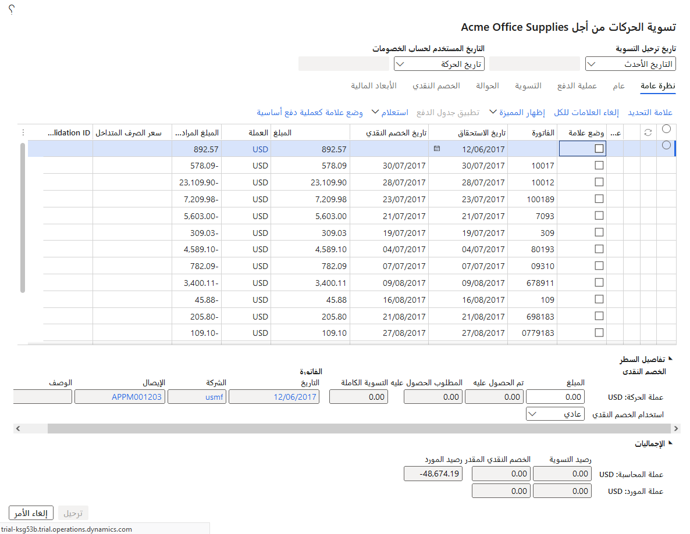
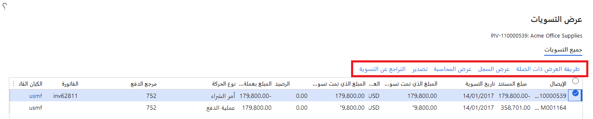
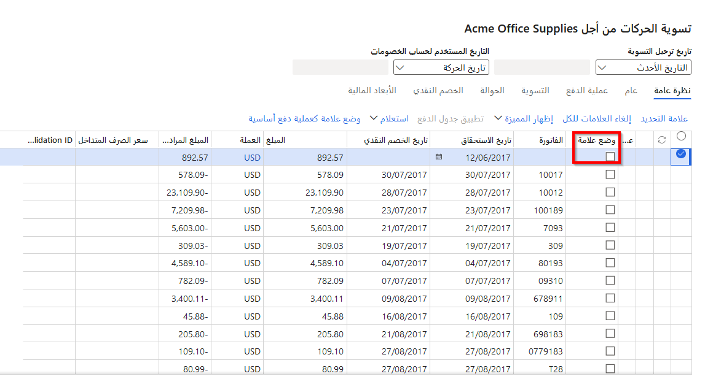
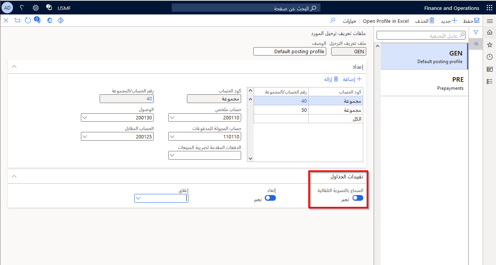

توضح هذه الوحدة كيفية إجراء التسوية وإلغائها في Finance.

## عرض التسويات 

يوفر زر **عرض التسويات** في جزء الإجراءات وصولاً سريعاً إلى محفوظات التسوية ومعلومات مفصلة حول حركة التسوية. يمكنك أيضاً مشاهدة الحركات الأخرى ذات الصلة بالحركة المحددة، إما لأنها كانت جزءاً من نفس التسوية أو لأنها مدفوعات تم إنشاؤها في دفتر يومية الدفع نفسه.

لعرض التسويات، اتبع هذا الإجراء:

1.  انتقل إلى **الحسابات الدائنة > الموردين > جميع الموردين**.
2.  حدد **المورد** الذي يستمل على الحركات، ثم في جزء الإجراءات، في علامة التبويب **المورد**، حدد **الحركات**.
3.  حدد حركة للبحث، عن طريق وضع علامة اختيار في العمود الأيسر، ثم في جزء الإجراء، حدد **تسوية** ثم **تسوية الحركات**.
 

يظهر مربع الحوار **تسوية الحركات** ويعرض الحركة المحددة وجميع المستندات التي تمت تسويتها مقابلها. مربع الحوار هذا مشابه لعرض محفوظات التسوية، ولكنه يتضمن كل المستندات ذات الصلة.

في مربع الحوار **عرض التسويات**، يمكنك تنفيذ مهام مختلفة. حدد إيصالاً واحداً أو أكثر، ثم حدد أحد الأزرار التالية:

- **عرض المرتبط** – إظهار جميع حركات دفتر اليومية للدفع التي تم إنشاؤها في دفتر يومية الدفع المرتبط بالمستند المحدد. بالإضافة إلى ذلك، يتم عرض جميع التسويات المتعلقة بهذه المدفوعات. أثناء عرض المدفوعات ذات الصلة، تتغير تسمية هذا الزر إلى **عرض التسويات**. حدد عرض التسويات لإظهار الحركات التي تم عرضها فقط عند فتح مربع الحوار **عرض التسويات**.
- **عرض المحفوظات** – إظهار محفوظات التسوية للإيصالات. 
- **عرض المحاسبة** – إظهار جميع الإيصالات المرتبطة بالمستندات المحددة. 
- **تصدير** – تصدير الإيصالات المحددة إلى Microsoft Excel.
- **تسوية الحركات** – يظهر هذا الزر فقط في حاله عدم تسويه المستند الأصلي الذي تم تحديده بالكامل. عند تحديد هذا الزر، يظهر مربع الحوار **تسوية الحركات**، حيث يمكنك تحديد الحركات للتسوية.
- **التراجع عن التسويات** – يظهر هذا الزر فقط إذا كان المستند الأصلي الذي تم تحديده قد تمت تسويته بالكامل. عند تحديد هذا الزر، يظهر مربع الحوار **التراجع عن التسويات**، حيث يمكنك التراجع عن التسويات التي تم إجراؤها لهذا المستند.

 

إذا تم إدخال دفعة وترحيلها، ولكن لم تتم تسويتها بفاتورة أو حركة أخرى، فيمكنك تسوية الدفعة والفاتورة بفتح صفحة **تسوية الحركات المفتوحة** من صفحة **المورد**.

عند تحديد الزر **تحديث**، تتم تسوية حركات الدفع والفاتورة التي تم تحديدها. إذا كانت حركات الدفع والفواتير في نفس الكيان القانوني، فستتغير حالة الحركات وفقاً للقواعد التالية:

- إذا لم تتم تسوية الفاتورة بالكامل، فإنها تظل مفتوحة.
- إذا كان المبلغ المدفوع أكبر من المبلغ المستحق، تتم تسوية الفاتورة وإغلاقها. تظل حركة الدفع للمورّد مفتوحة للمبلغ الذي تتجاوز به الدفعة المبلغ المستحق.
- إذا كان مبلغ الدفعة أقل من المبلغ المستحق، يتم خصم مبلغ الدفعة من المبلغ المستحق، وتظل الفاتورة مفتوحة. تتم تسوية حكة الدفع بالكامل ويتم إغلاقها.
- إذا كان المبلغ المدفوع يساوي المبلغ المستحق، يتم إغلاق حركات الدفع والفواتير.

## تسوية الفواتير والمدفوعات 

قم بتنفيذ الخطوات التالية لتسوية الفواتير مقابل المدفوعات أو إجراء تصحيحات لفتح الحركات.

1.  انتقل إلى **الحسابات الدائنة > الموردين > جميع الموردين**.
2.  حدد المورد الذي تريد تسوية حركاته المفتوحة.
3.  لتسوية حركات المورد المفتوحة، في **جزء الإجراءات**، حدد علامة التبويب **الفاتورة**، ثم حدد **تسوية الحركات**.
4.  في حقل تاريخ **ترحيل التسوية**، حدد ما إذا كنت تريد ترحيل حركات التسوية باستخدام تاريخ أحدث حركة أو تاريخ اليوم أو التاريخ الذي تحدده.
5.  *اختياري*: لتعيين إحدى الحركات كحركة دفع أساسية، حدد الحركة ثم حدد **وضع علامة على الدفع**. الغرض من الدفع الأساسي هو تسوية جميع الحركات الأخرى التي تم تحديدها. يتم استخدام تاريخ حركة الدفعة الأساسية في عمليات الخصومات النقدية وعمليات حساب أسعار الصرف. إذا تم تحديد دفعة أساسية، يمكن إدخال السعر المتداخل.
6.  حدد خانة الاختيار **وضع علامة** على الحركات المفتوحة الأخرى المراد تسويتها. تشير الأيقونة الحمراء إلى أن الحركة محددة بالفعل للتسوية.
7.  أدخل السعر المتداخل لكل حركة حددتها لتسويتها بحركة دفع أساسية في الخطوة 5.
8.  حدد **تحديث**. تتم تسوية الحركة المحددة مقابل بعضها البعض.

## تمكين التسوية التلقائية 

في بعض الحالات، يكون من الأنسب استخدام التسوية التلقائية للفواتير والمدفوعات، على سبيل المثال، إذا كان لدى الشركة الكثير من الموردين مع مدفوعات قليلة. 

قم بتنفيذ الخطوات التالية لتمكين التسوية التلقائية.

1.  انتقل إلى **الحسابات الدائنة > الإعداد > ملفات تعريف ترحيل الموردين**.
2.  حدد ملف تعريف ترحيل المورد ذي الصلة.
3.  حدد علامة التبويب السريعة **قيود الجداول**.
4.  حدد خانة الاختيار **السماح بالتسوية التلقائية**.
 

## إلغاء حركة مقفلة 

عندما تتعامل مع إلغاء التسويات، استخدم صفحة تحرير **حركة مقفلة** لتحرير الحركات المطبقة بالكامل أو التي تمت تسويتها الموجودة في التاريخ. 

يمكنك أيضاً استخدام إلغاء التسويات إذا لم يحترم البنك دفعة أو إذا استخدمت التاريخ أو مبلغ التسوية الخطأ. 

> [!NOTE]
> التسوية ليست حركة، ولكنها ارتباط بين الدفع والفاتورة. لاحظ أيضاً أن Finance يعتبر الفاتورة التي لم تتم تسويتها غير مدفوعة.

**السيناريو**

يقوم مدير المحاسبة في Adventure Works Cycles بمراجعة حركات الحسابات الدائنة والموافقة عليها.  إنه يدرك أنه تم دفع رسوم استشارة مرتين، ويريد إلغاء التسوية.

قم بتنفيذ الخطوات التالية لإلغاء حركة مقفلة.

1.  انتقل إلى **الحسابات الدائنة > الموردين > جميع الموردين**.
2.  حدد سجل مورد.
3.  في **جزء الإجراءات**، حدد علامة التبويب **الفاتورة**، ثم حدد **التراجع عن التسوية**.
4.  حدد خانة الاختيار **وضع علامة** لإلغاء الفاتورة أو الدفع المرتبط بالتسوية. يتم تحديد حقل **وضع العلامة** في الحركة الذي يقابل الحركة المميزة تلقائياً.
5.  حدد كيفية تحديد تاريخ ترحيل إلغاء التسوية المراد استخدامه.
    - **التاريخ الأخير** - استخدم تاريخ أحدث تسوية أصلية أو حدد تاريخ اليوم.
    - **التاريخ المحدد** - استخدم التاريخ الذي تحدده. يجب أن يكون التاريخ هو نفس تاريخ أحدث حركة متضمنة في التسوية أو بعد ذلك التاريخ.
8.  حدد الزر **إلغاء**. يقوم النظام بتغيير مبلغ التسوية وإجراء التصحيحات وتغيير الحالة. تعرض المحفوظات نظرة عامة على التسويات للإيصال الحالي.

