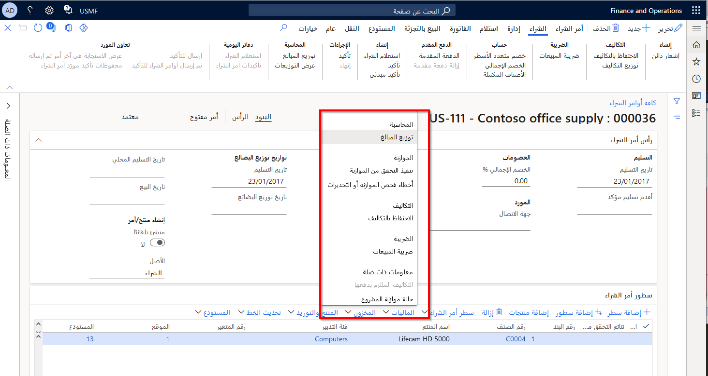
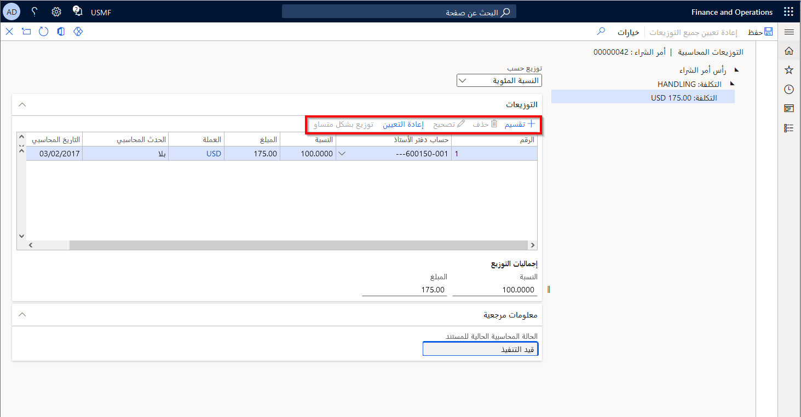

توضح هذه الوحدة كيفية توزيع الأموال باستخدام التوزيعات المحاسبية.

تُستخدم التوزيعات المحاسبية لتخصيص مبالغ نقدية لمستند مصدر إلى حسابات دفتر أستاذ محددة. التوزيعات المحاسبية هي إمكانية على مستوى البرنامج يتم استخدامها وتوسيعها بواسطة كل مستند مصدر، مثل أمر الشراء وفاتورة المورد وتقرير المصاريف وفاتورة النص الحر.
 
بشكل افتراضي، يتم إنشاء توزيع محاسبة افتراضي لكل بند مستند مصدر ومبلغ نقدي، ويتم تمكينه بشكل مشروط للتعديل.

تدعم بعض المستندات أيضاً المبالغ النقدية لمستند الرأس، مثل رسوم الطلبات والفواتير.

شاهد هذا الفيديو للتعرف على كيفية توزيع الرسوم التي يتم توزيعها من خلال **الحسابات الدائنة > أوامر الشراء > جميع أوامر الشراء**. في الفيديو، يتم عرض مثال على رسوم الشحن لأمر الشراء الذي سيتم توزيعه عبر وحدات عمل مختلفة في حساب دفتر الأستاذ نفسه. يمكن استخدام هذه العملية لتقسيم الرسوم عبر مختلف مراكز التكلفة والأقسام والأبعاد المالية الأخرى. 

 > [!VIDEO https://www.microsoft.com/videoplayer/embed/RE49vgK]  

توفر إمكانات التوزيع المحاسبية العامة الخيارات التالية لمعالجة التوزيعات المحاسبية. 

**عرض التوزيعات** – عرض التوزيعات المحاسبية لجميع البنود والمبالغ النقدية في المستند. لا يمكنك تعديل التوزيعات المحاسبية من طريقة العرض هذه.

**توزيع المبالغ** - عرض وتعديل التوزيعات المحاسبية لرأس أو سطر مستند فردي وأي سطور فرعية، مثل الضرائب أو الرسوم.

- بالنسبة لأعلى توزيعات المبالغ النقدية (التوزيعات الأصلية)، يمكن تحرير الأبعاد المالية والحساب الرئيسي مباشرةً في عنصر تحكم الإدخال المقسم في الشبكة. السعر الموسع هو مثال نموذجي لمثل هذا التوزيع الأصلي.

- تستند مبالغ التوزيع على مصطلح العملة للمستند. عادةً ما تكون هذه العملة هي عملة الحركة. يتم إنشاء مبالغ عملية المحاسبة والتقارير كجزء من محاسبة دفتر الأستاذ الفرعي.

- تعرض التوزيعات تاريخ المحاسبة وحدث المحاسبة. عادةً، يتم تعيين حدث المحاسبة على **بلا** حتى يتم ترحيل المستند/إدراجه في دفتر اليومية. وعند هذه النقطة، يصبح الحدث المحاسبي **أصلياً**. بعد ترحيل التوزيعات، لا يمكنك تعديل التوزيعات.
    

- يتم تمكين زر **تقسيم** للتوزيعات الأصلية. ينشئ التقسيم توزيعات محاسبية جديدة، ويمكن أن يستند التقسيم إلى النسبة المئوية أو المبلغ أو الكمية.

- يمكن استخدام الزر **التوزيع بالتساوي** جنباً إلى جنب مع التقسيم لتخصيص المبلغ بالتساوي عبر جميع التوزيعات تلقائيًا.

- يتم تمكين زر **إعادة تعيين** للتوزيعات الأصلية عند وجود أكثر من توزيع واحد. تؤدي إعادة التعيين إلى عكس أي تعديل يدوي للتوزيع عن طريق حذف جميع التوزيعات الحالية وإعادة إنشاء التوزيعات الافتراضية.

- أي توزيع فرعي، مثل الخصم والتكلفة وضريبة المبيعات، يتبع دائماً التوزيع الأصلي. يمكنك عرض العلاقة الأصلية/التابعة في **المرجع > معلومات الأصل**.

- الحساب الرئيسي والبعد المالي قابلان أيضاً للتحرير للعلاقات التابعة.

- تتبع الأبعاد المالية للتوزيعات المحاسبية نمطاً افتراضياً يمكن للمستند أن يمتد. 

- يمكن إنشاء توزيعات التباين في سيناريوهات المطابقة، مثل المطابقة بين فاتورة المورد وأمر الشراء. يمكنك عرض علاقات المطابقة بين التوزيع المحاسبي في **المرجع > معلومات المستند**.

- يظهر زر **تصحيح** ويتم تمكينه للمستندات التي تدعم التصحيحات. يؤدي التصحيح إلى إنشاء توزيعات جديدة. أولاً، يتم إنشاء التوزيعات التي تعكس التوزيعات الأصلية. لا يمكن تعديل هذه التوزيعات. بعد ذلك، يتم إنشاء توزيعات محاسبية صحيحة جديدة. يمكن تعديل هذه التوزيعات إذا كان من الممكن تعديل التوزيعات الأصلية.

- يتم تمكين الزر **تفاصيل المشروع** كملحق عندما يكون البند مرتبطاً بالمشروع. تسمح لك توزيعات محاسبة المشروع بتعديل التفاصيل مثل مصدر التمويل وخاصية البند.

- يمكنك عرض حالة محاسبة المستند الحالية في **المرجع** الحالة للمستند بأكمله وتشير إلى ما إذا كان المستند قيد المعالجة أو مكتمل.

إذا كانت فاتورة المورد تشير إلى أمر شراء، فيمكنك تقسيم وتعديل التوزيعات المحاسبية للبنود التي تحتوي على صنف غير مخزّن. إذا كان بند فاتورة المورد لا يشير إلى بند أمر الشراء، يمكنك أيضاً حذف توزيع محاسبي. لا يمكنك تقسيم أو حذف بنود التكاليف والضرائب وخصومات الخطوط. يمكنك تعديل حساب دفتر الأستاذ، لكن لا يمكنك تغيير المبالغ أو النسب المئوية.

إذا احتوى البند الأصلي على عنصر غير مخزّن وتم تقسيم التوزيعات المحاسبية، فسيتم تقسيم البند الفرعي تلقائيًا لمطابقة الأبعاد المالية للبند الأصلي. لا يمكن تقسيم التوزيعات المحاسبية للبند الفرعي أو حذفها بشكل إضافي، ولكن بناءً على إعداد البند الفرعي، يمكنك تعديل حساب دفتر الأستاذ للتوزيعات المحاسبية للبند الفرعي.

يوضح الفيديو كيفية توزيع خطوط الشحن عبر ثلاثة أقسام. يمكن إجراء هذه العملية على سطر ويمكن أن يتم توزيع المبالغ إما بالتساوي، أو النسبة المئوية، أو المبلغ. 
 
 > [!VIDEO https://www.microsoft.com/videoplayer/embed/RE49AuT] 

## توزيع الضرائب 

لا يمكن إنشاء التوزيعات المحاسبية للضرائب حتى يتم حساب الضرائب. لحساب ضريبة المبيعات، يجب عليك إكمال إحدى المهام التالية باستخدام صفحة **فاتورة المورد**:

- عرض إجمالي الفاتورة.
- عرض ضريبة المبيعات.
- عرض دفتر يومية دفتر الأستاذ الفرعي.
- عرض التوزيعات المحاسبية لفاتورة المورد الكاملة.
- وضع فاتورة المورد قيد الانتظار.
- ترحيل فاتورة المورد.